**CÔNG TY CỔ PHẦN XI MĂNG CẨM PHẢ**

**Phòng Công nghệ thông tin**

**TÀI LIỆU HƯỚNG DẪN SỬ DỤNG**

**PHẦN MỀM CÂN**

**Mã hiệu dự án:  XMCP-PMC**

**Mã hiệu tài liệu: PMC.HDSD**

**Quảng Ninh, 06/2026BẢNG GHI NHẬN THAY ĐỔI**

*A – Tạo mới, M – Sửa đổi, D – Xóa bỏ

| Ngày thay đổi | Vị trí thay đổi | A* M, D | Người tạo | Phiên bản cũ | Mô tả thay đổi | Phiên bản mới |
| --- | --- | --- | --- | --- | --- | --- |
| 11/06/2026 |  | A | Bùi Ngọc Chiến |  | Tạo mới tài liệu | V1.0 |
|  |  |  |  |  |  |  |
|  |  |  |  |  |  |  |
|  |  |  |  |  |  |  |
|  |  |  |  |  |  |  |
|  |  |  |  |  |  |  |
|  |  |  |  |  |  |  |
|  |  |  |  |  |  |  |
|  |  |  |  |  |  |  |
|  |  |  |  |  |  |  |
|  |  |  |  |  |  |  |
|  |  |  |  |  |  |  |
|  |  |  |  |  |  |  |
|  |  |  |  |  |  |  |
|  |  |  |  |  |  |  |
|  |  |  |  |  |  |  |

**HƯỚNG DẪN SỬ DỤNG PHẦN MỀM TRẠM CÂN**

# PHẦN 1. QUY TẮC

- **Số lượng thực xuất:**

- Với Rời/Xá: được tính bằng số Cân lần 2 - Cân lần 1.

- Với Bao:

- Mặc định bằng giá trị trên trường Số lượng cắt lệnh.

- Nếu xe ra không lấy đủ số lượng, tích vào checkbox K LẤY ĐỦ SỐ LƯỢNG (hỗ trợ xử lý ở cả màn Cân nội địa và màn Danh sách xe ra).

- Nếu xe ra lấy quá số lượng cắt lệnh, RA cắt lệnh hoặc tạo thêm cắt lệnh mới và dùng chức năng THÊM CẮT LỆNH

- **Xử lý quá tải:**

- Chỉ hỗ trợ xử lý quá tải với luồng cân nội địa.

- **In PC, PGN:**

- Không hỗ trợ in PC, PGN tổng luồng cân xuất khẩu.

- Vẫn hỗ trợ in PC, PGN cho chuyến xe lấy hàng xuất khẩu.

- Với phiếu cân, số lượng bản in/mỗi phiếu với loại là Rời/Xá mặc định là 4, với loại là Bao mặc định là 1.

# PHẦN 2. QUY TRÌNH NGHIỆP VỤ VẬN HÀNH CHI TIẾT

# 2.1 QUY TRÌNH CÂN NỘI ĐỊA (XE XUẤT HÀNG TIÊU CHUẨN)

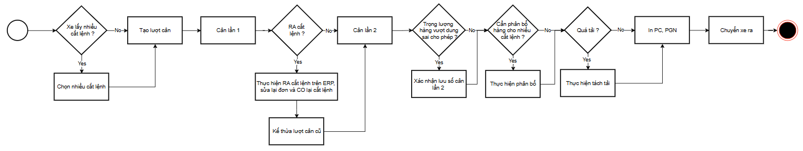

## 2.1.1 Các bước thực hiện

### A. THAO TÁC XE VÀO (CÂN LẦN 1)

- Bước 1: Trên Menu điều hướng bên trái, bấm vào Danh sách xe vào.

- Bước 2: Nhập biển số xe vào ô lọc Số PTVC: ở thanh công cụ phía trên và nhấn Enter.

- Bước 3: Click chọn dòng cắt lệnh cần cân trên lưới dữ liệu. Toàn bộ thông tin đăng ký phương tiện sẽ tự động nạp lên Form thông tin xe.

- Bước 4: Kiểm tra thông tin cắt lệnh. Nếu chưa có thông tin đăng kiểm và TTCP của xe thì nhập thêm. Nếu có rồi thì kiểm tra xem hạn đăng kiểm có bị báo đỏ k (hết hạn) thì nhập hạn mới vào.

- Bước 5: Tích chọn cột CHỌN trên lưới nếu muốn gộp nhiều đơn hàng vào cùng 1 lượt cân (1 xe lấy nhiều sản phẩm hoặc lấy cho nhiều NPP).

- Bước 6: Bấm nút CÂN NỘI ĐỊA ở góc dưới bên phải của Form nhập liệu. Giao diện tự động chuyển sang màn hình Cân nội địa.

- Bước 7: Chờ số cân hiển thị lớn ở bảng cân chuyển sang trạng thái "ỔN ĐỊNH" (màu xanh lá). Bấm nút CÂN LẦN 1 để ghi nhận khối lượng lần đầu của xe.

- Bước 8: Bấm nút LƯU ở bảng điều khiển để ghi nhận. Hệ thống sẽ chụp ảnh camera đầu xe làm minh chứng, lưu khối lượng cân lần 1 và chuyển trạng thái lượt cân thành Chờ cân lần 2.

### B. THAO TÁC XE RA (CÂN LẦN 2)

- Bước 1: Khi xe lấy hàng xong từ Nghiền xi quay lại bàn cân ra, nhân viên vào màn hình Cân nội địa.

- Bước 2: Tại lưới DANH SÁCH LƯỢT CÂN HOẠT ĐỘNG ở dưới cùng, click chọn dòng xe tương ứng biển số xe đang đỗ trên bàn cân (ở trạng thái Chờ cân lần 2).

- Bước 3: Quan sát camera xem xe đỗ đúng vị trí. Chờ số cân hiển thị lớn báo "ỔN ĐỊNH" (màu xanh lá).

- Bước 4: Bấm nút CÂN LẦN 2 để ghi nhận số cân lần 2.

- Bước 5: Bấm nút LƯU để lưu khối lượng cân lần 2. Hệ thống sẽ chụp ảnh camera, tự động tính toán và hiển thị khối lượng tịnh:

TL hàng (Net Weight) = |Cân lần 2 - Cân lần 1|

- Bước 6: Phân bổ sản lượng thực tế (Bắt buộc đối với xe gộp nhiều đơn hàng):

- Nếu xe chở gộp nhiều cắt lệnh, nút PHÂN BỔ sẽ sáng lên. Nhân viên bắt buộc bấm nút này.

- Trong hộp thoại PHÂN BỔ THỰC GIAO, bấm nút THEO KẾ HOẠCH để hệ thống tự chia tỉ lệ, hoặc tự nhập khối lượng phân bổ bằng tay vào cột KL THỰC (KG) của từng dòng đơn.

- Hoặc tích vào checbox ƯU TIÊN để ưu tiên phân bổ hết KL vào dòng cắt lệnh đó trước, rồi mới phân bổ lượng còn lại vào cắt lệnh còn lại.

- Lưu ý quan trọng: Tổng khối lượng phân bổ của tất cả các dòng phải bằng chính xác 100% TL hàng của xe. Bấm XÁC NHẬN để lưu và đóng hộp thoại.

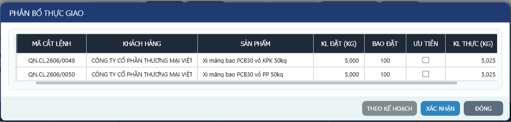

- Bước 7: Đối chiếu Dung sai hàng bao (chỉ áp dụng đối với hàng đóng bao):

- Nếu khối lượng thực cân vượt quá khối lượng kế hoạch cộng với dung sai cho phép (Số bao x 0.5 kg), hệ thống hiển thị cảnh báo. Nhân viên trạm cân thông báo cho Nghiền xi biết để có kế hoạch điều chỉnh máy, sau đó nhấn nút VẪN LƯU để bỏ qua cảnh báo dung sai. Hoặc yêu cầu vào Nghiền xi kiểm tra lại nếu vượt dung sai quá nhiều.

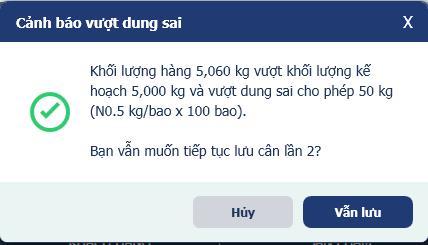

- Bước 8: Bấm nút IN PC, IN PGN để in chứng từ giao cho tài xế.

- Bước 9: Bấm nút CHUYỂN XE RA. Lượt cân chuyển trạng thái thành Đã hoàn tất, xe biến mất khỏi màn hình cân chính và chuyển sang Danh sách xe ra.

## Trường hợp cần xử lý

- Trường hợp 1: Đã cân lần 1 và phải RA cắt lệnh (đổi sản phẩm, đổi số lượng, đổi biển số xe, đổi thị trường,...).

- Thực hiện RA cắt lệnh trên ERP, lúc này trên phần mềm cân lượt cân đó vẫn còn ở lưới dữ liệu DANH SÁCH LƯỢT CÂN HOẠT ĐỘNG nhưng ở lưới CHI TIẾT CẮT LỆNH không còn cắt lệnh đó nữa.

- Thực hiện sửa đăng ký phương tiện nếu cần, sai đó CO lại cắt lệnh. Lúc này cắt lệnh đó ở màn Danh sách xe ra, tiến hành nhấn nút CÂN NỘI ĐỊA, hệ thống hiển thị modal xác nhận dùng lại cân lần 1, nhấn nút ĐỒNG Ý nếu dùng lại dữ liệu cân lần 1, nhấn nút KHÔNG để tạo lượt cân mới.

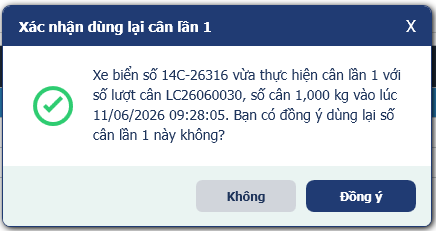

- Trường hợp 2: Xe đã cân lần 1 rồi nhưng xe muốn lấy thêm hàng của cắt lệnh khác nữa.

- Thực hiện CO cắt lệnh mà xe muốn lấy thêm trên ERP, khi này cắt lệnh mới này sẽ hiển thị ở màn Danh sách xe vào.

- Ở màn Cân nội địa, chọn cắt lệnh mà xe muốn lấy thêm hàng, sau đó nhấn nút THÊM CẮT LỆNH. Tại modal Thêm cắt lệnh vào lượt cân, tích vào checkbox ở cột Chọn của đúng cắt lệnh muốn thêm vào lượt cân. Sau đó nhấn nút XÁC NHẬN. Lúc này ở màn Cân nội địa, lượt cân đó sẽ bao gồm cắt lệnh vừa thêm.

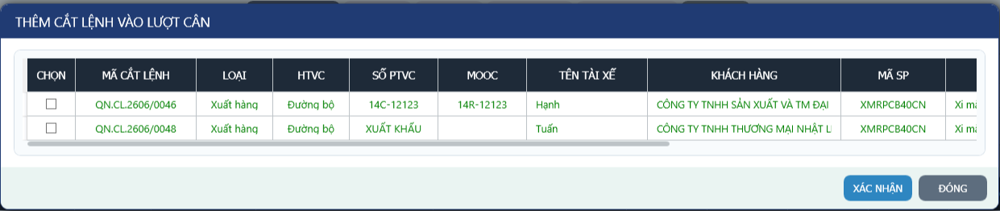

- Trường hợp 3 (với Loại: Bao): Xe thông báo không lấy đủ số lượng.

- Nếu xe ra không lấy đủ số lượng, tích vào checkbox K LẤY ĐỦ SỐ LƯỢNG (ở màn Cân nội địa và màn Danh sách xe ra). Mục đích để đảm điền đúng trọng lượng hàng vào trường SL thực xuất trên màn Cắt lệnh chứ không lấy giá trị mặc định là số lượng cắt lệnh

- Trường hợp 4: Xe vào không lấy hàng.

- Vẫn thực hiện cân đủ 2 lần, sau đó tích checkbox K LẤY HÀNG, rồi nhấn nút CHUYỂN XE RA.

- Trường hợp 5: Xử lý quá tải

- Khi số cân lần 2 > TTCP 10% của xe, hệ thống hiển thị nút TÁCH TẢI để xử lý quá tải và tách tải.

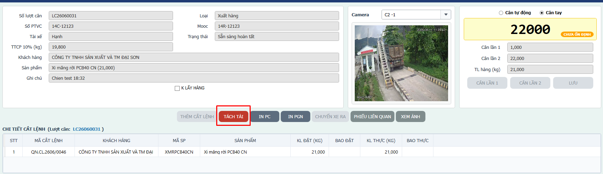

- Tại modal TÁCH TẢI, hệ thống tự động gợi ý số lượng của từng phiếu theo tỉ lệ ngẫu nhiên. Nhấn nút XÁC NHẬN TÁCH TẢI nếu đồng ý tách tải, nhấn nút KHÔNG TÁCH TẢI nếu không muốn tách tải.

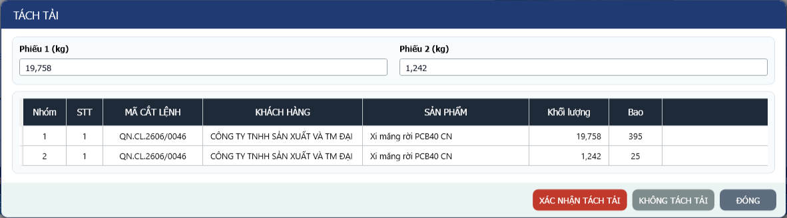

# QUY TRÌNH CÂN HÀNG NHẬP

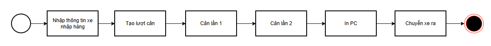

## 2.2.1 Các bước thực hiện

- Bước 1: Trên Menu điều hướng bên trái, bấm vào Danh sách xe vào.

- Bước 2: Click chọn nút LÀM MỚI để đưa Form thông tin xe phía trên về trạng thái tạo mới.

- Bước 3: Tại ô Loại, chọn Nhập hàng.

- Bước 4: Nhập biển số xe vào ô gợi ý Số PTVC. Hệ thống sẽ tự động điền các thông tin mooc, tài xế, hạn đăng kiểm và TTCP nếu xe đã từng cân tại trạm.

- Bước 5: Nhập thông tin khách hàng như mã khách hàng, tên khách hàng, mã sản phẩm, tên sản phẩm, và SL đặt.

- Bước 6: Bấm nút CÂN NỘI ĐỊA để tạo lượt cân và chuyển sang màn hình Cân nội địa.

- Bước 7: Cho xe đầy hàng đỗ lên bàn cân. Chờ số cân báo "ỔN ĐỊNH". Bấm nút CÂN LẦN 1 để lấy số cân, sau đó bấm nút LƯU để lưu lại.

- Bước 8: Sau khi xe xuống hàng, cho xe rỗng quay lại đỗ lên bàn cân. Click chọn xe từ lưới DANH SÁCH LƯỢT CÂN HOẠT ĐỘNG ở phía dưới.

- Bước 9: Chờ số cân báo "ỔN ĐỊNH". Bấm nút CÂN LẦN 2 để lấy số cân, sau đó bấm nút LƯU để lưu.

- Bước 10: Hệ thống tự động tính khối lượng hàng nhập thực tế:

TL hàng (Net Weight) = |Cân lần 1 - Cân lần 2|

- Bước 11: Bấm nút IN PC để in Phiếu cân, và bấm CHUYỂN XE RA để hoàn tất và giải phóng xe khỏi trạm.

# QUY TRÌNH CÂN XUẤT KHẨU

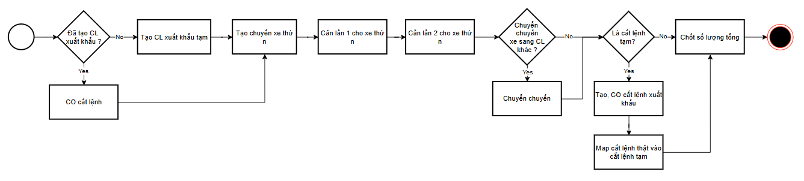

## 2.3.1 Các bước thực hiện

- Bước 1: Trên Menu điều hướng bên trái, bấm vào Danh sách xe vào.

- Bước 2: Nhập biển số xe vào ô lọc Số PTVC ở thanh header và nhấn Enter.

- Bước 3: Click chọn dòng cắt lệnh xuất khẩu trên lưới dữ liệu.

- Bước 4: Bấm nút CÂN XUẤT KHẨU ở góc dưới bên phải của Form nhập liệu. Giao diện tự động chuyển sang màn hình Cân xuất khẩu.

- Bước 5: Trên Menu điều hướng bên trái, bấm vào Cân xuất khẩu.

- Bước 6: Click chọn đơn cắt lệnh xuất khẩu lớn đang hoạt động tại lưới DANH SÁCH CẮT LỆNH XUẤT KHẨU ở phía trên, hiển thị thông tin chi tiết về sản lượng kế hoạch, lũy kế đã lấy và sản lượng còn lại.

- Lưu ý quan trọng: Mặc định lưới này ẩn các cắt lệnh đã chốt tổng và đã Hoàn thành xuất hàng. Khi cần tra cứu/đối chiếu lại các cắt lệnh đã hoàn thành ERP, tích checkbox ĐÃ HOÀN THÀNH ở cùng dòng tiêu đề DANH SÁCH CẮT LỆNH XUẤT KHẨU. Hệ thống sẽ hiển thị thêm các cắt lệnh đã chốt tổng và có trạng thái ERP hoàn thành. Các cắt lệnh này chỉ dùng để xem lại, không cho tạo thêm chuyến xe hoặc cân tiếp.

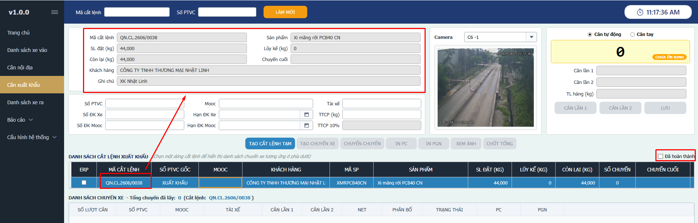

- Bước 7: Thực hiện nhập thông tin xe vào lấy hàng xuất khẩu, sau đó nhấn nút TẠO CHUYẾN XE để tạo chuyến xe lấy hàng cho đơn xuất khẩu

- Lưu ý quan trọng: Có thể tạo nhiều chuyến xe và thực hiện cân lần 1 (cân xác xe) cho các chuyến xe đó để khi xe đó vào lấy lượt tiếp theo không cần cân xác nữa.

- Bước 8: Thực hiện cân lần 1, cân lần 2 cho các chuyến xe vào lấy hàng

- Bước 9: Sau khi đã lấy đủ số lượng cho đơn xuất khẩu, thực hiện nhấn nút CHỐT TỔNG để xác nhận hoàn thành đơn hàng

- Lưu ý quan trọng: Để lấy được số lượng thực xuất của đơn xuất khẩu từ cân lên ERP, cần thực hiện chốt tổng đơn xuất khẩu đó.

- Cảnh báo vượt sản lượng còn lại: Nếu khối lượng tịnh của chuyến xe làm cho sản lượng còn lại của đơn xuất khẩu bị âm, hệ thống hiển thị cảnh báo. Nhân viên kiểm tra kỹ, nếu không có sai sót thì nhấn Xác nhận đồng ý.

- **Trường hợp xuất khẩu chưa tạo cắt lệnh thật từ ERP:**

- Bấm nút TẠO CẮT LỆNH TẠM trên thanh công cụ phía trên.

- Hệ thống sẽ tự động tạo một cắt lệnh tạm với mã hiển thị có định dạng CL-TAM-####.

- Sử dụng cắt lệnh tạm này để bắt đầu vận hành cân các chuyến xe con bình thường.

- Khi cắt lệnh thật xuất hiện, nhấp chọn đơn cắt lệnh thật ở màn hình Danh sách xe vào và bấm CÂN XUẤT KHẨU.

- Hệ thống phát hiện có các cắt lệnh tạm đang hoạt động và hiển thị bảng đối chiếu map.

- Click chọn cắt lệnh tạm tương ứng và bấm Map Cắt lệnh. Hệ thống sẽ tự động chuyển toàn bộ các chuyến xe con đã cân từ cắt lệnh tạm sang cắt lệnh thật và cập nhật sản lượng lũy kế.

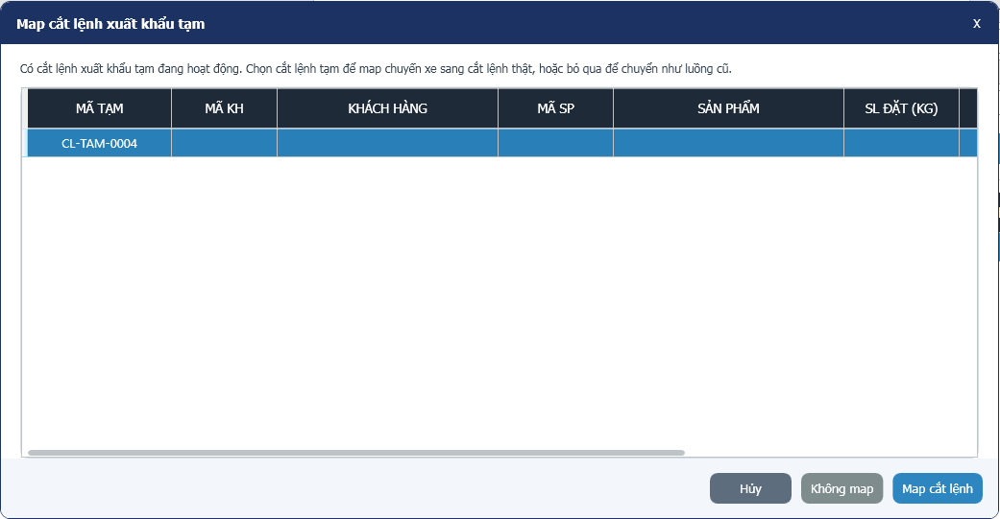

### 2.3.2. CHUYỂN CHUYẾN XE CON

Sử dụng khi một xe con đã lấy hàng xong nhưng cần chuyển sản lượng sang một đơn hàng xuất khẩu lớn khác:

- Bước 1: Chọn chuyến xe con cần chuyển trên lưới DANH SÁCH CHUYẾN XE phía dưới cùng.

- Bước 2: Bấm nút CHUYỂN CHUYẾN.

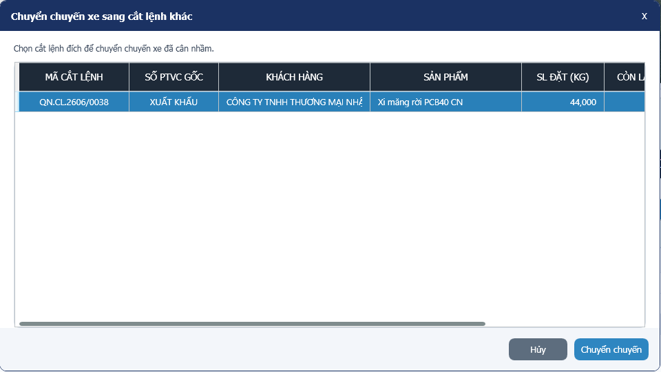

- Bước 3: Chọn đơn cắt lệnh xuất khẩu lớn đích trong danh sách xổ xuống của hộp thoại.

- Bước 4: Bấm CHUYỂN. Hệ thống tự động dời dữ liệu chuyến xe sang đơn đích và tính toán lại lũy kế sản lượng của cả 2 đơn.

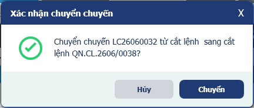

### 2.3.3. CHỐT TỔNG SẢN LƯỢNG ĐƠN HÀNG XUẤT KHẨU

- Bước 1: Khi tàu/sà lan đã bốc đủ sản lượng kế hoạch, click chọn đơn cắt lệnh cha xuất khẩu lớn ở lưới phía trên.

- Bước 2: Bấm nút CHỐT TỔNG.

- Bước 3: Xác nhận hộp thoại cảnh báo: "Bạn có chắc chắn muốn chốt tổng sản lượng cho đơn xuất khẩu này? Sau khi chốt sẽ không thể tạo thêm chuyến xe con mới."

- Bước 4: Hệ thống khóa trạng thái đơn hàng thành Đã hoàn tất, cập nhật tổng sản lượng thực xuất và tự động đẩy dữ liệu chốt về ERP.

# PHẦN 3. CẤU HÌNH HỆ THỐNG

### 3.1. CẬP NHẬT HỆ THỐNG

(Mục đích: Sử dụng khi đội phát triển thông báo có phiên bản mới).

- Bước 1: Trên Menu điều hướng bên trái, bấm vào Cấu hình hệ thống > Cập nhật ứng dụng.

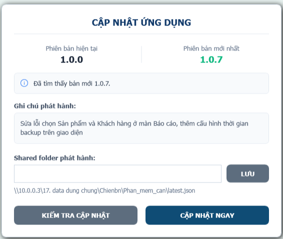

- Bước 2: Nhấn nút KIỂM TRA CẬP NHẬT.

- Bước 3: Nhấn nút CẬP NHẬT NGAY. Phần mềm tự động đóng và chạy tiến trình (khoảng 3 phút), sau đó hiện màn Đăng nhập. Lúc này phần mềm đã được cập nhật lên phiên bản mới nhất.

### 3.2. THAM SỐ HỆ THỐNG

- (Dung sai cho 1 bao (kg/bao): Số kg cho phép lệch tối đa trên 1 bao.

- Tỉ lệ tách tải tối đa (%): Là tỉ lệ tối đa để tách số cân cho phiếu đủ tải.)

- Bước 1: Trên Menu điều hướng bên trái, bấm vào Cấu hình hệ thống > Tham số hệ thống.

- Bước 2: Cập các tham sô sang giá trị khác rồi nhấn nút LƯU THAY ĐỔI.

### 3.3. DANH MỤC XE, DANH MỤC KHÁCH HÀNG, DANH MỤC SẢN PHẨM

- (Mục đích: Quản lý dữ liệu master về xe, khách hàng, sản phẩm)

- Bước 1: Trên Menu điều hướng bên trái, bấm vào Cấu hình hệ thống > Danh mục xe.

- Bước 2: Nhập biển số xe vào trường Biển số xe và nhấn nút TÌM KIẾM.

- Bước 3: Trên lưới dữ liệu, chọn 1 bản ghi và sửa các thông tin trên form

- Bước 4: Nhấn nút LƯU để lưu lại thay đổi

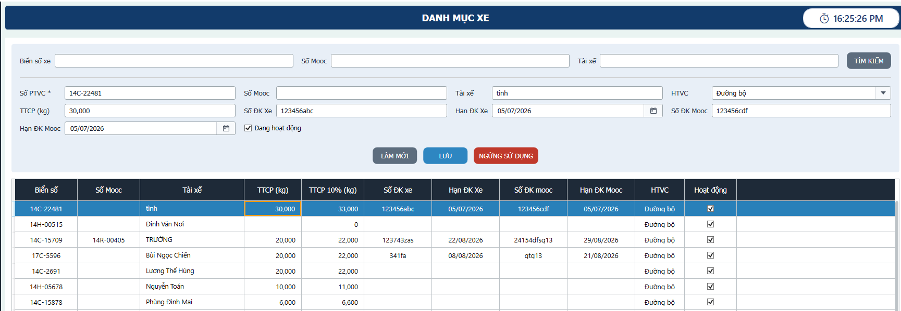

### 3.4. QUẢN LÝ TÀI KHOẢN

- Bước 1: Trên Menu điều hướng bên trái, bấm vào Cấu hình hệ thống > Quản lý tài khoản.

- Bước 2: Để cập nhật thông tin tài khoản, thực hiện tìm kiếm và chọn tài khoản muốn đổi thông tin. Sau đó đổi thông tin của tài khoản và nhấn nút LƯU để lưu thay đổi.

- Bước 3: Để tạo mới tài khoản, nhập đẩy đủ thông tin cần thiết và nhấn nút TẠO MỚI.

- Bước 4: Để khóa/mở khóa tài khoản, chọn 1 tài khoản và nhấn nút NGỪNG HOẠT ĐỘNG/KÍCH HOẠT LẠI.

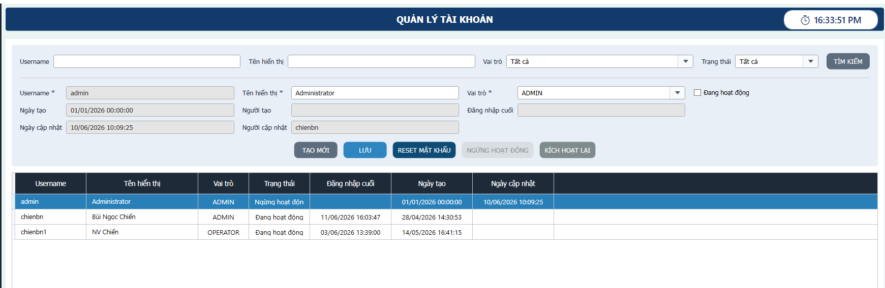

# PHẦN 4. BÁO CÁO

### 4.1. BÁO CÁO XUẤT HÀNG

- Bước 1: Trên Menu điều hướng bên trái, bấm vào Báo cáo > Báo cáo xuất.

- Bước 2: Nhấn nút XUẤT BÁO CÁO.

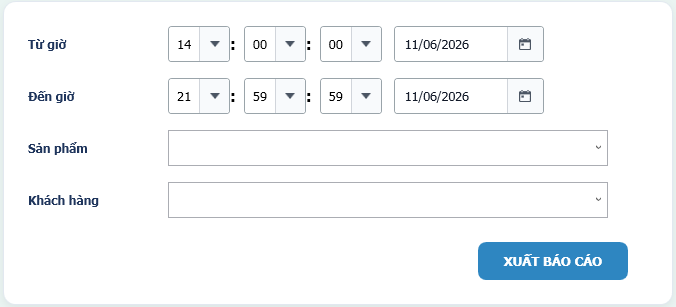

### 4.2. BÁO CÁO NHẬP HÀNG

- Bước 1: Trên Menu điều hướng bên trái, bấm vào Báo cáo > Báo cáo nhập.

- Bước 2: Nhấn nút XUẤT BÁO CÁO.

