# Tài liệu Đặc tả Yêu cầu Phần mềm (SRS) - Hệ thống Trạm Cân (WeightStation)

## Thông tin Tài liệu

| Trường | Giá trị |
|-------|-------|
| Tên Dự án | WeightStation (Ứng dụng Trạm cân) |
| Phiên bản Tài liệu | 1.3 |
| Ngày tạo | 07/06/2026 |
| Tác giả | Antigravity AI |
| Trạng thái | Đang được duyệt |

## Lịch sử Thay đổi

| Phiên bản | Ngày | Tác giả | Mô tả thay đổi |
|---------|------|--------|-------------|
| 1.0 | 07/06/2026 | Antigravity AI | Bản thảo đầu tiên dựa trên tài liệu tham khảo cũ. |
| 1.1 | 07/06/2026 | Antigravity AI | Cập nhật toàn diện dựa trên rà soát mã nguồn C# thực tế. |
| 1.2 | 07/06/2026 | Antigravity AI | Cập nhật đồng bộ với tài liệu Yêu cầu Kinh doanh (BRD) mới: Việt hóa thuật ngữ, bổ sung hiển thị camera thời gian thực để giám sát đỗ xe, và phân tách quy trình cân nội địa / cân xuất khẩu. |
| 1.3 | 07/06/2026 | Codex | Cập nhật công thức KPI Dashboard: xe chờ cân phải tính cả cắt lệnh đang ở trạng thái `REGISTERED` + `IN_YARD` nhưng chưa phát sinh lượt cân, không chỉ dựa trên `weighing_sessions`. |

---

# 1. Giới thiệu (Introduction)

## 1.1 Mục đích (Purpose)
Tài liệu Đặc tả Yêu cầu Phần mềm (SRS) này mô tả toàn bộ các yêu cầu chức năng, phi chức năng, kiến trúc dữ liệu và các ràng buộc kỹ thuật của ứng dụng trạm cân **WeightStation (StationApp)**. 
Tài liệu này được biên soạn nhằm phục vụ các đối tượng:
- Đội ngũ phát triển phần mềm (C# .NET / WPF / SQL Server).
- Đội ngũ kiểm thử chất lượng (QA/QC).
- Các đối tác tích hợp hệ thống (ERP Team).
- Khách hàng và các bên liên quan trực tiếp đến việc vận hành trạm cân.

## 1.2 Phạm vi (Scope)
### 1.2.1 Tên Sản phẩm
Ứng dụng Trạm cân Cục bộ - **StationApp** (chạy trên Windows Desktop) kết hợp với Hệ thống máy chủ tập trung **Central Server (CentralApi)**.

### 1.2.2 Mô tả Sản phẩm
WeightStation là giải pháp phần mềm quản lý trạm cân xe vận tải (Inbound/Outbound) sử dụng C# .NET và WPF làm nền tảng UI, SQL Server Express làm cơ sở dữ liệu nội bộ tại máy trạm, kết hợp cơ chế đồng bộ hóa ngoại tuyến (ưu tiên cục bộ (ưu tiên cục bộ (offline-first)) sync) với cơ sở dữ liệu máy chủ tập trung SQL Server qua RESTful Web API.
Phần mềm kết nối trực tiếp với:
- Thiết bị đầu đọc cân điện tử (Scale Indicator) thông qua giao tiếp cổng nối tiếp Serial COM (RS-232/RS-485).
- Các Camera IP giám sát trạm cân qua giao thức mạng RTSP để chụp ảnh xe lúc cân lần 1 và lần 2.

### 1.2.3 Mục tiêu
- **Quản lý Vận hành Trơn tru**: Hỗ trợ việc cân xe nhanh chóng theo mô hình Phiên cân (Weighing Session) cho phép gộp nhiều đơn hàng hoặc nhà phân phối trong một lần cân vật lý.
- **Bảo toàn Dữ liệu**: Thiết kế theo cơ chế ưu tiên cục bộ (ưu tiên cục bộ (offline-first)) đảm bảo hệ thống trạm cân hoạt động bình thường, không mất mát dữ liệu ngay cả khi kết nối mạng với máy chủ bị gián đoạn. Tự động đồng bộ hóa lại khi có mạng.
- **Tự động Sao lưu**: Cơ chế tự động sao lưu cơ sở dữ liệu cục bộ hàng ngày giúp đảm bảo an toàn thông tin, phòng chống sự cố hỏng hóc ổ đĩa hay lỗi dữ liệu tại máy trạm.
- **Chống gian lận & Nhật ký kiểm toán**: Ghi lại lịch sử in ấn, thay đổi trạng thái cân, chụp ảnh biển số trước/sau xe và lưu trữ telemetry hiệu năng của ứng dụng.

### 1.2.4 Lợi ích
- Tối ưu hóa thời gian cân xe tại hiện trường trạm cân, giảm thiểu ùn tắc.
- Minh bạch hóa dữ liệu cân với hình ảnh trực quan và cơ chế kiểm soát sai lệch (Tolerance).
- Tự động hóa quá trình nhận dữ liệu đăng ký phương tiện từ ERP và đẩy kết quả cân thực tế ngược lại ERP một cách chính xác.

## 1.3 Định nghĩa và Thuật ngữ (Definitions, Acronyms, and Abbreviations)

| Thuật ngữ | Định nghĩa |
|------|------------|
| **SRS** | Đặc tả Yêu cầu Phần mềm (Software Requirements Specification) |
| **WPF** | Công nghệ giao diện đồ họa Windows Presentation Foundation |
| **Đầu hiển thị cân** | Bộ chỉ thị cân (Scale Indicator - đầu đọc số cân điện tử kết nối qua cổng nối tiếp COM) |
| **Đơn cắt lệnh** | Đơn hàng được phê duyệt xuất/nhập (Cut Order - tương ứng với thông tin đăng ký phương tiện gốc từ ERP) |
| **Phiên cân** | Lượt cân vật lý thực tế của xe (Weighing Session - 1 lần cân vào, 1 lần cân ra) |
| **Dòng chi tiết phiên cân** | Dòng chi tiết đơn hàng được gán trong một phiên cân (Weighing Session Line) |
| **Phiếu cân tổng hợp hợp hợp** | Chứng từ cân tổng hợp cấp phiên cân (Weigh Ticket) |
| **Phiếu giao nhận** | Phiếu giao nhận hàng hóa cấp dòng chi tiết (Delivery Ticket) |
| **Phân quyền theo vai trò** | Kiểm soát truy cập dựa trên vai trò của người dùng (RBAC - Role-Based Access Control) |
| **TTCP** | Tải trọng cho phép của phương tiện theo đăng kiểm giao thông |
| **Hàng đợi đồng bộ** | Cơ chế hàng đợi gửi dữ liệu thay đổi cục bộ lên máy chủ một cách tuần tự và an toàn (Outbox Sync) |
| **Cơ chế chống trùng lặp** | Đảm bảo một yêu cầu trùng lặp gửi lên máy chủ chỉ được xử lý đúng một lần duy nhất (Idempotency) |

## 1.4 Tài liệu Tham khảo (References)
1. Mã nguồn C# dự án (các lớp Entity, Configurations, UseCases, Services, Workers).
2. `docs/PHASE-0-ARCHITECTURE-BLUEPRINT.md` - Tài liệu thiết kế kiến trúc ban đầu.
3. `docs/PLAN-weighing-session.md` - Thiết kế nghiệp vụ chi tiết mô hình Phiên cân (Weighing Session).
4. `SRSdocs/ExportScaleLargeOrder_ImplementationPlan.md` - Kế hoạch triển khai luồng cân xuất khẩu đơn lớn.
5. `SRSdocs/ReissueCutOrder_ReuseWeighingSession_SRS.md` - Đặc tả nghiệp vụ cấp lại đơn cắt lệnh và kế thừa phiên cân cũ.

## 1.5 Tổng quan Tài liệu (Overview)
Tài liệu này bao gồm các phần chính sau:
- **Phần 1**: Giới thiệu tổng quan về tài liệu và dự án.
- **Phần 2**: Thiết kế Cơ sở dữ liệu Cục bộ (Local Database Design) đặc tả sơ đồ thực thể ERD và cấu hình chi tiết các bảng.
- **Phần 3**: Mô tả Tổng quan (Overall Description) về bối cảnh, mô hình hoạt động, đặc điểm người dùng và các ràng buộc hệ thống.
- **Phần 4**: Đặc tả chi tiết các yêu cầu chức năng (mã FR-XXX) và phi chức năng (mã NFR-XXX) bám sát nghiệp vụ và mã nguồn.
- **Phần 5**: Các Phụ lục (Máy trạng thái, Ma trận truy xuất yêu cầu, và Bàn giao phê duyệt).

---

# 2. Thiết kế Cơ sở dữ liệu Cục bộ (Local Database Design)

Để đảm bảo khả năng hoạt động độc lập ngoại tuyến (ưu tiên cục bộ (offline-first)) trong thời gian dài (tối thiểu 30 ngày), trạm cân sử dụng cơ sở dữ liệu SQL Server Express cục bộ tại máy trạm. Thiết kế dữ liệu bao gồm các bảng nghiệp vụ giao dịch, danh mục dữ liệu gốc (Master Data) và các bảng quản trị hệ thống.

## 2.1 Sơ đồ Mối quan hệ Thực thể (ERD - Entity Relationship Diagram)

Sơ đồ dưới đây thể hiện mối quan hệ logic giữa các thực thể chính trong cơ sở dữ liệu trạm cân:

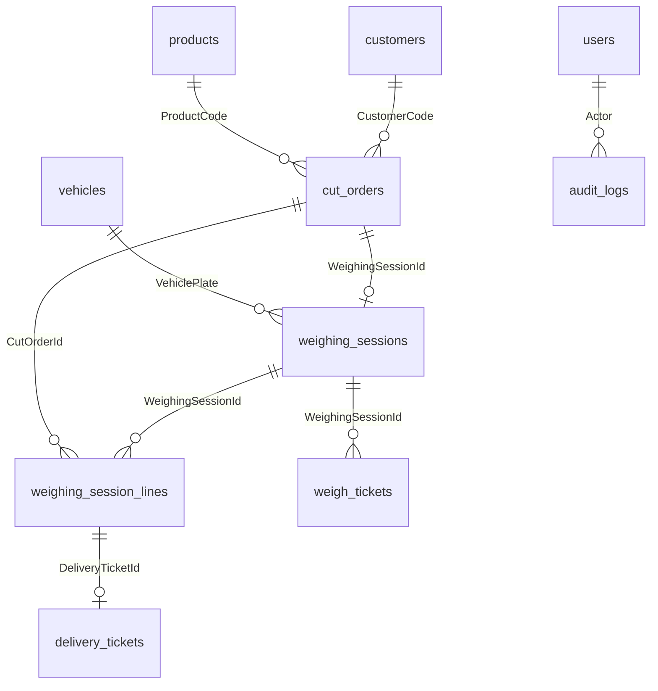
```mermaid
erDiagram
    cut_orders ||--o| weighing_sessions : "WeighingSessionId"
    weighing_sessions ||--o{ weighing_session_lines : "WeighingSessionId"
    cut_orders ||--o{ weighing_session_lines : "CutOrderId"
    weighing_sessions ||--o{ weigh_tickets : "WeighingSessionId"
    weighing_session_lines ||--o| delivery_tickets : "DeliveryTicketId"
    
    vehicles ||--o{ weighing_sessions : "VehiclePlate"
    customers ||--o{ cut_orders : "CustomerCode"
    products ||--o{ cut_orders : "ProductCode"
    
    users ||--o{ audit_logs : "Actor"
```

---

## 2.2 Chi tiết Lược đồ các Bảng Cơ sở dữ liệu

Dưới đây là đặc tả chi tiết cấu trúc các bảng dữ liệu cục bộ được trích xuất từ Entity Configurations và mã nguồn thực tế. Các enum được lưu dưới dạng chuỗi (`nvarchar`) theo cấu hình `.HasConversion<string>()` ngoại trừ các trường hợp được chú thích cụ thể.

### 2.2.1 Bảng `cut_orders` (Thông tin Đơn cắt lệnh / Đăng ký từ ERP hoặc Tạo tay)
Bảng này lưu trữ thông tin đăng ký phương tiện, sản phẩm xuất/nhập, tải trọng kế hoạch đồng bộ từ hệ thống ERP hoặc được tạo thủ công tại trạm cân.

| Tên cột (Column Name) | Kiểu dữ liệu (Data Type) | Khóa/Ràng buộc (Constraints) | Mô tả chức năng (Description) |
| :--- | :--- | :--- | :--- |
| `Id` | `uniqueidentifier` | PK, NOT NULL | Khóa chính của bản ghi. |
| `ErpCutOrderId` | `nvarchar(50)` | UNIQUE, NULL | Mã cắt lệnh giao hàng từ ERP. Có ràng buộc duy nhất trên bản ghi hoạt động. |
| `ErpRegistrationCode` | `nvarchar(100)` | NULL | Mã đăng ký phương tiện gốc từ ERP. |
| `CutOrderSource` | `nvarchar(20)` | NOT NULL | Nguồn gốc đơn hàng (`ERP` hoặc `MANUAL`). |
| `CutOrderStatus` | `nvarchar(30)` | NOT NULL | Trạng thái đơn (`REGISTERED`, `IN_SESSION`, `LOADING_IN_PROGRESS`, `COMPLETED`, `CANCELLED`). |
| `TransactionType` | `nvarchar(20)` | NOT NULL | Loại giao dịch (`OUTBOUND` - Xuất hàng / `INBOUND` - Nhập hàng). |
| `TransportMethod` | `nvarchar(20)` | NULL | Phương thức vận chuyển (`ROAD` - Đường bộ / `WATERWAY` - Đường thủy). |
| `VehiclePlate` | `nvarchar(30)` | NOT NULL | Biển số xe kéo/đầu xe. |
| `MoocNumber` | `nvarchar(30)` | NULL | Biển số mooc xe kéo. |
| `ReceiverName` | `nvarchar(100)` | NULL | Tên tài xế hoặc người nhận hàng thực tế. |
| `ReceiverIdNo` | `nvarchar(50)` | NULL | Số giấy tờ tùy thân của tài xế. |
| `CustomerCode` | `nvarchar(50)` | NULL | Mã khách hàng/Nhà phân phối (NPP). |
| `CustomerName` | `nvarchar(255)` | NULL | Tên khách hàng/Nhà phân phối (NPP). |
| `ProductCode` | `nvarchar(50)` | NULL | Mã sản phẩm/vật tư. |
| `ProductName` | `nvarchar(255)` | NULL | Tên sản phẩm/vật tư đầy đủ. |
| `ProductType` | `nvarchar(30)` | NULL | Phân loại sản phẩm (`Bao` - Hàng đóng bao / `Rời` - Hàng xá, xi măng rời). |
| `OrderCode` | `nvarchar(100)` | NULL | Mã số đơn đặt hàng. |
| `LotNo` | `nvarchar(100)` | NULL | Số lô hàng sản xuất. |
| `PlannedWeight` | `decimal(18,3)` | NULL | Khối lượng hàng hóa kế hoạch đăng ký (kg). |
| `BagCount` | `int` | NULL | Số lượng bao dự kiến (chỉ đối với đơn hàng bao). |
| `ProcessingStage` | `nvarchar(30)` | NOT NULL | Giai đoạn vận hành (`IN_YARD` - Chờ cân / `WEIGHING` - Đang cân / `OUT_YARD` - Đã ra). |
| `WeighingSessionId` | `uniqueidentifier` | FK, NULL | ID liên kết tới phiên cân đang hoạt động (`weighing_sessions`). |
| `CurrentPrimaryWeighTicketId` | `uniqueidentifier` | FK, NULL | ID liên kết tới phiếu cân tổng hợp chính hiện tại. |
| `CurrentPrimaryDeliveryTicketId` | `uniqueidentifier` | FK, NULL | ID liên kết tới phiếu giao nhận chính hiện tại. |
| `IsExportScale` | `bit` | NOT NULL, DEFAULT 0 | Cờ xác định đơn thuộc luồng Cân xuất khẩu đơn hàng lớn. |
| `ExportFinalizedWeight` | `decimal(18,3)` | NULL | Tổng khối lượng tịnh đã chốt của đơn xuất khẩu lớn. |
| `ExportFinalizedAt` | `datetime2` | NULL | Thời điểm chốt sản lượng đơn xuất khẩu. |
| `ExportFinalizedBy` | `nvarchar(100)` | NULL | Tài khoản thực hiện chốt đơn xuất khẩu. |
| `SyncStatus` | `nvarchar(20)` | NOT NULL | Trạng thái đồng bộ (`SYNC_QUEUED`, `SYNC_SUCCESS`, `SYNC_FAILED`). |
| `IdempotencyKey` | `uniqueidentifier` | NOT NULL | Khóa chống trùng lặp dữ liệu khi gửi lên Server. |
| `CreatedAt`, `CreatedBy`, `UpdatedAt`, `UpdatedBy` | Nhiều kiểu | Audit Fields | Trường thông tin kiểm toán ghi nhận người tạo, thời gian tạo và cập nhật. |

### 2.2.2 Bảng `weighing_sessions` (Phiên cân thực tế)
Bảng này lưu trữ thông tin của một phiên cân vật lý đầy đủ của một xe gồm cân lần 1, cân lần 2 và khối lượng tịnh thực tế.

| Tên cột (Column Name) | Kiểu dữ liệu (Data Type) | Khóa/Ràng buộc (Constraints) | Mô tả chức năng (Description) |
| :--- | :--- | :--- | :--- |
| `Id` | `uniqueidentifier` | PK, NOT NULL | Khóa chính của phiên cân. |
| `SessionNo` | `nvarchar(50)` | UNIQUE, NOT NULL | Số phiên cân duy nhất sinh tự động theo quy tắc định dạng. |
| `TransactionType` | `nvarchar(30)` | NOT NULL | Loại giao dịch (`OUTBOUND`/`INBOUND`). |
| `VehiclePlate` | `nvarchar(30)` | NOT NULL | Biển số xe thực tế lúc cân. |
| `MoocNumber` | `nvarchar(30)` | NULL | Biển số mooc thực tế lúc cân. |
| `DriverName` | `nvarchar(150)` | NULL | Tên tài xế thực tế khai báo tại trạm cân. |
| `SessionStatus` | `nvarchar(30)` | NOT NULL | Trạng thái phiên cân (`PENDING_WEIGHT1`, `PENDING_WEIGHT2`, `ALLOCATION_PENDING`, `READY_TO_COMPLETE`, `COMPLETED`, `CANCELLED`). |
| `Weight1` | `decimal(18,3)` | NULL | Giá trị khối lượng cân lần 1 (kg). |
| `Weight1Time` | `datetime2` | NULL | Thời điểm lưu cân lần 1. |
| `Weight2` | `decimal(18,3)` | NULL | Giá trị khối lượng cân lần 2 (kg). |
| `Weight2Time` | `datetime2` | NULL | Thời điểm lưu cân lần 2. |
| `NetWeight` | `decimal(18,3)` | NULL | Khối lượng tịnh tính toán: `NetWeight = |Weight1 - Weight2|` (kg). |
| `Ttcp10WeightSnapshot` | `decimal(18,3)` | NULL | Snapshot tải trọng cho phép (TTCP) + 10% của xe tại thời điểm cân. |
| `IsOverweight` | `bit` | NOT NULL, DEFAULT 0 | Cờ xác định phiên cân bị quá tải trọng đăng kiểm. |
| `OverweightAmount` | `decimal(18,3)` | NOT NULL, DEFAULT 0 | Khối lượng vượt quá tải trọng cho phép (kg). |
| `OverweightResolutionStatus` | `nvarchar(30)` | NOT NULL | Trạng thái giải quyết quá tải (`NOT_APPLICABLE`, `PENDING`, `SPLIT_CONFIRMED`, `NO_SPLIT_CONFIRMED`). |
| `OverweightResolvedAt` | `datetime2` | NULL | Thời điểm phê duyệt xử lý quá tải. |
| `OverweightResolvedBy` | `nvarchar(100)` | NULL | Quản trị viên thực hiện phê duyệt quá tải. |
| `HasPrintedMasterWeighTicket` | `bit` | NOT NULL, DEFAULT 0 | Cờ xác định đã thực hiện in phiếu cân tổng hợp chính. |
| `UseActualWeightForBaggedCutOrders` | `bit` | NOT NULL, DEFAULT 0 | Cờ xác định sử dụng khối lượng tịnh thực tế cho đơn hàng bao thay vì tính theo bao. |
| `SyncStatus` | `nvarchar(30)` | NOT NULL | Trạng thái đồng bộ lên Server. |
| `CreatedAt`, `CreatedBy`, `UpdatedAt`, `UpdatedBy` | Nhiều kiểu | Audit Fields | Trường thông tin kiểm toán ghi nhận người tạo, thời gian tạo và cập nhật. |

### 2.2.3 Bảng `weighing_session_lines` (Dòng chi tiết của Phiên cân)
Bảng này đóng vai trò trung gian liên kết gộp nhiều đơn cắt lệnh khác nhau vào cùng một phiên cân xe vật lý.

| Tên cột (Column Name) | Kiểu dữ liệu (Data Type) | Khóa/Ràng buộc (Constraints) | Mô tả chức năng (Description) |
| :--- | :--- | :--- | :--- |
| `Id` | `uniqueidentifier` | PK, NOT NULL | Khóa chính của dòng chi tiết. |
| `WeighingSessionId` | `uniqueidentifier` | FK, NOT NULL | Khóa ngoại liên kết bảng `weighing_sessions`. |
| `CutOrderId` | `uniqueidentifier` | FK, NOT NULL | Khóa ngoại liên kết bảng `cut_orders`. |
| `SequenceNo` | `int` | NOT NULL | Thứ tự sắp xếp các dòng đơn trong một phiên cân. |
| `CustomerCode` | `nvarchar(50)` | NULL | Mã khách hàng/nhà phân phối. |
| `CustomerName` | `nvarchar(255)` | NULL | Tên khách hàng/nhà phân phối đầy đủ. |
| `ProductCode` | `nvarchar(50)` | NULL | Mã sản phẩm. |
| `ProductName` | `nvarchar(255)` | NULL | Tên sản phẩm. |
| `PlannedWeight` | `decimal(18,3)` | NULL | Khối lượng kế hoạch đăng ký ban đầu (kg). |
| `ActualAllocatedWeight` | `decimal(18,3)` | NULL | Khối lượng thực giao được phân bổ sau cân lần 2 (kg). |
| `ActualAllocatedBagCount` | `int` | NULL | Số lượng bao thực tế được phân bổ cho dòng này. |
| `LineStatus` | `nvarchar(30)` | NOT NULL | Trạng thái dòng đơn trong phiên cân (`PENDING`, `ALLOCATED`, `PRINTED`, `CANCELLED`). |
| `HasPrintedDeliveryTicket` | `bit` | NOT NULL, DEFAULT 0 | Cờ xác định đã in Phiếu giao nhận (PGN) cho dòng đơn này. |
| `DeliveryTicketId` | `uniqueidentifier` | FK, NULL | ID liên kết tới chứng từ Phiếu giao nhận tương ứng được sinh ra. |
| `SyncStatus` | `nvarchar(30)` | NOT NULL | Trạng thái đồng bộ lên Server. |
| `CreatedAt`, `CreatedBy`, `UpdatedAt`, `UpdatedBy` | Nhiều kiểu | Audit Fields | Trường thông tin kiểm toán ghi nhận người tạo, thời gian tạo và cập nhật. |

### 2.2.4 Bảng `weigh_tickets` (Chứng từ Phiếu cân tổng hợp hợp cấp Phiên cân)
Bảng này lưu trữ thông tin chứng từ in ấn phiếu cân tổng hợp cấp phiên cân (bao gồm cả các phiếu cân con được tách/sinh ra).

| Tên cột (Column Name) | Kiểu dữ liệu (Data Type) | Khóa/Ràng buộc (Constraints) | Mô tả chức năng (Description) |
| :--- | :--- | :--- | :--- |
| `Id` | `uniqueidentifier` | PK, NOT NULL | Khóa chính của phiếu cân. |
| `WeighingSessionId` | `uniqueidentifier` | FK, NULL | ID phiên cân liên quan (nếu được sinh ra từ một phiên cân). |
| `CutOrderId` | `uniqueidentifier` | FK, NOT NULL | ID đơn cắt lệnh liên quan. |
| `TicketNo` | `nvarchar(20)` | UNIQUE, NOT NULL | Số phiếu cân sinh tự động (Unique). |
| `VehiclePlate` | `nvarchar(30)` | NOT NULL | Biển số xe đầu/kéo. |
| `MoocNumber` | `nvarchar(30)` | NULL | Biển số mooc xe kéo. |
| `DriverName` | `nvarchar(100)` | NULL | Tên tài xế. |
| `CustomerCode` | `nvarchar(50)` | NULL | Mã khách hàng. |
| `CustomerName` | `nvarchar(255)` | NULL | Tên khách hàng đầy đủ. |
| `ProductCode` | `nvarchar(50)` | NULL | Mã sản phẩm. |
| `ProductName` | `nvarchar(255)` | NULL | Tên sản phẩm. |
| `PlannedWeight` | `decimal(18,3)` | NULL | Khối lượng kế hoạch đăng ký (kg). |
| `BagCount` | `int` | NULL | Số bao dự kiến. |
| `Weight1` | `decimal(18,3)` | NULL | Khối lượng cân lần 1 (kg). |
| `Weight1Time` | `datetime2` | NULL | Thời điểm cân lần 1. |
| `Weight1User` | `nvarchar(100)` | NULL | Người thực hiện lưu cân lần 1. |
| `Weight1IsStable` | `bit` | NOT NULL | Cờ xác định số cân lần 1 ổn định tại thời điểm lưu. |
| `Weight1Mode` | `nvarchar(20)` | NULL | Chế độ cân lần 1 (`AUTO` - Tự động từ cổng COM / `MANUAL` - Admin nhập tay). |
| `Weight2` | `decimal(18,3)` | NULL | Khối lượng cân lần 2 (kg). |
| `Weight2Time` | `datetime2` | NULL | Thời điểm cân lần 2. |
| `Weight2User` | `nvarchar(100)` | NULL | Người thực hiện lưu cân lần 2. |
| `Weight2IsStable` | `bit` | NOT NULL | Cờ xác định số cân lần 2 ổn định. |
| `Weight2Mode` | `nvarchar(20)` | NULL | Chế độ cân lần 2 (`AUTO` - Tự động / `MANUAL` - Admin nhập tay). |
| `NetWeight` | `decimal(18,3)` | NULL | Khối lượng tịnh thực xuất/nhập ghi nhận trên phiếu (kg). |
| `Ttcp10WeightSnapshot` | `decimal(18,3)` | NULL | Snapshot tải trọng cho phép (TTCP + 10%) tại thời điểm cân. |
| `VehicleRegistrationNoSnapshot` | `nvarchar(50)` | NULL | Số đăng kiểm xe ghi nhận trên phiếu. |
| `MoocRegistrationNoSnapshot` | `nvarchar(50)` | NULL | Số đăng kiểm mooc ghi nhận trên phiếu. |
| `RecordRole` | `nvarchar(20)` | NOT NULL | Vai trò bản ghi phiếu cân (`MASTER_SESSION` - Phiếu tổng phiên / `CUT_ORDER_DERIVED` - Phiếu con / `SPLIT_DERIVED` - Phiếu tách tải). |
| `IsPrimaryDisplay` | `bit` | NOT NULL | Xác định phiếu hiển thị chính trên danh sách. |
| `IsPrinted` | `bit` | NOT NULL, DEFAULT 0 | Trạng thái đã in ấn ra giấy. |
| `LastPrintedAt` | `datetime2` | NULL | Thời điểm in ấn gần nhất. |
| `SplitGroupId` | `uniqueidentifier` | NULL | ID nhóm tách tải (dùng chung cho các phiếu được tách ra từ một phiên cân quá tải). |
| `SplitSequence` | `tinyint` | NULL | Thứ tự phiếu trong nhóm tách tải. |
| `SyncStatus` | `nvarchar(20)` | NOT NULL | Trạng thái đồng bộ dữ liệu. |
| `CreatedAt`, `CreatedBy`, `UpdatedAt`, `UpdatedBy` | Nhiều kiểu | Audit Fields | Trường thông tin kiểm toán ghi nhận người tạo, thời gian tạo và cập nhật. |

### 2.2.5 Bảng `delivery_tickets` (Phiếu giao nhận cấp Dòng chi tiết)
Bảng này lưu trữ thông tin chứng từ in ấn Phiếu Giao Nhận (PGN) cấp dòng chi tiết trong phiên cân để tài xế cầm đi giao/nhận hàng.

| Tên cột (Column Name) | Kiểu dữ liệu (Data Type) | Khóa/Ràng buộc (Constraints) | Mô tả chức năng (Description) |
| :--- | :--- | :--- | :--- |
| `Id` | `uniqueidentifier` | PK, NOT NULL | Khóa chính của phiếu giao nhận. |
| `CutOrderId` | `uniqueidentifier` | FK, NOT NULL | Khóa ngoại liên kết bảng `cut_orders`. |
| `WeighingSessionId` | `uniqueidentifier` | FK, NULL | Khóa ngoại liên kết bảng `weighing_sessions`. |
| `WeighingSessionLineId` | `uniqueidentifier` | FK, NULL | Khóa ngoại liên kết bảng `weighing_session_lines`. |
| `DeliveryNo` | `nvarchar(30)` | UNIQUE, NOT NULL | Số phiếu giao nhận sinh duy nhất tự động. |
| `ErpCutOrderId` | `nvarchar(50)` | NOT NULL | Mã đơn cắt lệnh từ ERP. |
| `CustomerCode` | `nvarchar(50)` | NULL | Mã khách hàng nhận. |
| `ProductCode` | `nvarchar(50)` | NULL | Mã sản phẩm/vật tư. |
| `AllocatedWeight` | `decimal(18,3)` | NULL | Khối lượng tịnh được phân bổ thực tế cho đơn hàng (kg). |
| `AllocatedBagCount` | `int` | NULL | Số lượng bao thực xuất phân bổ thực tế. |
| `RecordRole` | `nvarchar(20)` | NOT NULL | Vai trò chứng từ (`NORMAL` - Phiếu thường / `MASTER` - Phiếu gộp nhiều đơn / `SPLIT_DERIVED` - Phiếu tách quá tải). |
| `IsPrinted` | `bit` | NOT NULL, DEFAULT 0 | Trạng thái đã in ấn phiếu. |
| `LastPrintedAt` | `datetime2` | NULL | Thời điểm in ấn gần nhất. |
| `SplitGroupId` | `uniqueidentifier` | NULL | ID liên kết nhóm tách quá tải. |
| `SplitSequence` | `tinyint` | NULL | Thứ tự trong nhóm tách quá tải. |
| `SyncStatus` | `int` | NOT NULL | Trạng thái đồng bộ (lưu dưới dạng giá trị số `int`). |
| `CreatedAt`, `CreatedBy`, `UpdatedAt`, `UpdatedBy` | Nhiều kiểu | Audit Fields | Trường thông tin kiểm toán ghi nhận người tạo, thời gian tạo và cập nhật. |

### 2.2.6 Bảng `vehicles` (Danh mục Phương tiện Vận tải)
Bảng danh mục dữ liệu gốc (Master Data) lưu trữ thông tin các xe, mooc vận tải đăng ký vào/ra nhà máy phục vụ kiểm soát đăng kiểm và tải trọng cho phép.

| Tên cột (Column Name) | Kiểu dữ liệu (Data Type) | Khóa/Ràng buộc (Constraints) | Mô tả chức năng (Description) |
| :--- | :--- | :--- | :--- |
| `Id` | `uniqueidentifier` | PK, NOT NULL | Khóa chính của phương tiện. |
| `VehiclePlate` | `nvarchar(30)` | NOT NULL | Biển số đầu xe/xe đơn (Unique kết hợp MoocNumber). |
| `MoocNumber` | `nvarchar(30)` | NOT NULL, DEFAULT "" | Biển số mooc đi kèm (Unique kết hợp VehiclePlate). |
| `DriverName` | `nvarchar(100)` | NULL | Tên tài xế mặc định của phương tiện. |
| `TransportMethod` | `nvarchar(20)` | NULL | Phương thức vận chuyển (`ROAD`/`WATERWAY`). |
| `TtcpWeight` | `decimal(18,3)` | NULL | Tải trọng cho phép (TTCP) thiết kế theo đăng kiểm của xe (kg). |
| `VehicleRegistrationNo` | `nvarchar(50)` | NULL | Số chứng nhận kiểm định an toàn kỹ thuật (số đăng kiểm) đầu xe. |
| `MoocRegistrationNo` | `nvarchar(50)` | NULL | Số đăng kiểm mooc kéo. |
| `IsActive` | `bit` | NOT NULL, DEFAULT 1 | Cờ trạng thái hoạt động của phương tiện. |
| `CreatedBy` | `nvarchar(100)` | NOT NULL | Người tạo xe. |
| `UpdatedBy` | `nvarchar(100)` | NULL | Người cập nhật thông tin xe gần nhất. |
| `CreatedAt`, `UpdatedAt` | `datetime2` | NOT NULL | Thời gian tạo và cập nhật dữ liệu. |

### 2.2.7 Bảng `customers` (Danh mục Khách hàng)
Bảng danh mục dữ liệu gốc lưu trữ thông tin khách hàng và nhà phân phối phục vụ hiển thị và chọn nhanh khi cân.

| Tên cột (Column Name) | Kiểu dữ liệu (Data Type) | Khóa/Ràng buộc (Constraints) | Mô tả chức năng (Description) |
| :--- | :--- | :--- | :--- |
| `Id` | `uniqueidentifier` | PK, NOT NULL | Khóa chính của khách hàng. |
| `CustomerCode` | `nvarchar(50)` | UNIQUE, NOT NULL | Mã khách hàng/NPP duy nhất. |
| `CustomerName` | `nvarchar(255)` | NOT NULL | Tên khách hàng/NPP đầy đủ. |
| `CreatedBy` | `nvarchar(100)` | NOT NULL | Người tạo. |
| `UpdatedBy` | `nvarchar(100)` | NULL | Người cập nhật gần nhất. |
| `CreatedAt`, `UpdatedAt` | `datetime2` | NOT NULL | Thời gian tạo và cập nhật dữ liệu. |

### 2.2.8 Bảng `products` (Danh mục Sản phẩm)
Bảng danh mục dữ liệu gốc lưu trữ thông tin các mặt hàng, sản phẩm của nhà máy.

| Tên cột (Column Name) | Kiểu dữ liệu (Data Type) | Khóa/Ràng buộc (Constraints) | Mô tả chức năng (Description) |
| :--- | :--- | :--- | :--- |
| `Id` | `uniqueidentifier` | PK, NOT NULL | Khóa chính của sản phẩm. |
| `ProductCode` | `nvarchar(50)` | UNIQUE, NOT NULL | Mã sản phẩm duy nhất. |
| `ProductName` | `nvarchar(255)` | NOT NULL | Tên sản phẩm đầy đủ. |
| `ProductType` | `nvarchar(30)` | NULL | Loại sản phẩm (`Bao` / `Rời` / `Hàng nhập`). |
| `CreatedBy` | `nvarchar(100)` | NOT NULL | Người tạo. |
| `UpdatedBy` | `nvarchar(100)` | NULL | Người cập nhật gần nhất. |
| `CreatedAt`, `UpdatedAt` | `datetime2` | NOT NULL | Thời gian tạo và cập nhật dữ liệu. |

### 2.2.9 Bảng `users` (Tài khoản Người dùng)
Bảng lưu trữ thông tin tài khoản người dùng tại trạm cân để xác thực đăng nhập và phân quyền.

| Tên cột (Column Name) | Kiểu dữ liệu (Data Type) | Khóa/Ràng buộc (Constraints) | Mô tả chức năng (Description) |
| :--- | :--- | :--- | :--- |
| `Id` | `uniqueidentifier` | PK, NOT NULL | Khóa chính người dùng. |
| `Username` | `nvarchar(100)` | UNIQUE, NOT NULL | Tên đăng nhập hệ thống. |
| `DisplayName` | `nvarchar(150)` | NOT NULL | Tên hiển thị của cán bộ trạm cân. |
| `RoleCode` | `nvarchar(30)` | NOT NULL | Vai trò người dùng (`ADMIN` - Quản trị viên / `OPERATOR` - Nhân viên cân). |
| `PasswordHash` | `nvarchar(255)` | NULL | Chuỗi băm mật khẩu bảo mật (băm bằng BCrypt). |
| `IsActive` | `bit` | NOT NULL, DEFAULT 1 | Trạng thái hoạt động của tài khoản. |
| `LastLoginAt` | `datetime2` | NULL | Thời gian đăng nhập cuối cùng vào hệ thống. |
| `CreatedBy` | `nvarchar(100)` | NULL | Người tạo tài khoản. |
| `UpdatedBy` | `nvarchar(100)` | NULL | Người cập nhật tài khoản gần nhất. |
| `CreatedAt`, `UpdatedAt` | `datetime2` | NOT NULL | Thời gian tạo và cập nhật tài khoản. |

### 2.2.10 Bảng `app_config` (Cấu hình Hệ thống)
Bảng lưu trữ các tham số cấu hình của ứng dụng máy trạm (cổng COM, RTSP Camera, đường dẫn backup...).

| Tên cột (Column Name) | Kiểu dữ liệu (Data Type) | Khóa/Ràng buộc (Constraints) | Mô tả chức năng (Description) |
| :--- | :--- | :--- | :--- |
| `ConfigKey` | `nvarchar(100)` | PK, NOT NULL | Từ khóa cấu hình duy nhất. |
| `ConfigValue` | `nvarchar(1000)` | NULL | Giá trị cấu hình tương ứng. |
| `CreatedBy` | `nvarchar(100)` | NOT NULL, DEFAULT 'SYSTEM' | Người tạo cấu hình. |
| `UpdatedBy` | `nvarchar(100)` | NULL | Người cập nhật cấu hình. |
| `CreatedAt`, `UpdatedAt` | `datetime2` | NOT NULL | Thời gian tạo và cập nhật cấu hình. |

### 2.2.11 Bảng `audit_logs` (Nhật ký Kiểm toán)
Bảng ghi nhận nhật ký vận hành đối với tất cả các thao tác nhạy cảm tại trạm cân để phục vụ hậu kiểm chống gian lận.

| Tên cột (Column Name) | Kiểu dữ liệu (Data Type) | Khóa/Ràng buộc (Constraints) | Mô tả chức năng (Description) |
| :--- | :--- | :--- | :--- |
| `Id` | `uniqueidentifier` | PK, NOT NULL | Khóa chính của bản ghi nhật ký. |
| `Actor` | `nvarchar(100)` | NOT NULL | Tài khoản thực hiện hành động (Username). |
| `Action` | `nvarchar(100)` | NOT NULL | Loại hành động thực hiện (ví dụ: `ManualWeigh` - Cân tay, `BypassTolerance` - Bỏ qua dung sai, `UpdateConfig` - Sửa cấu hình, `DeleteSession` - Hủy phiên). |
| `EntityType` | `nvarchar(50)` | NOT NULL | Tên thực thể/bảng bị tác động. |
| `EntityId` | `uniqueidentifier` | NOT NULL | ID thực thể/bản ghi bị tác động. |
| `CreatedAt` | `datetime2` | NOT NULL | Thời gian ghi nhận nhật ký kiểm toán. |

### 2.2.12 Bảng `print_template_profiles` (Cấu hình Phôi in ấn)
Bảng lưu trữ các thiết lập mẫu phôi in ấn, máy in mặc định và căn chỉnh lề (offset) của từng chứng từ.

| Tên cột (Column Name) | Kiểu dữ liệu (Data Type) | Khóa/Ràng buộc (Constraints) | Mô tả chức năng (Description) |
| :--- | :--- | :--- | :--- |
| `Id` | `uniqueidentifier` | PK, NOT NULL | Khóa chính của cấu hình phôi in. |
| `TemplateKind` | `nvarchar(30)` | NOT NULL | Loại mẫu in (`WeighTicket`/`DeliveryTicket`). |
| `ProfileKey` | `nvarchar(100)` | NOT NULL | Khóa định danh phôi (Unique kết hợp TemplateKind). |
| `DisplayName` | `nvarchar(150)` | NOT NULL | Tên phôi in hiển thị trên giao diện. |
| `IsDefault` | `bit` | NOT NULL | Xác định phôi in mặc định của hệ thống. |
| `OffsetXmm` | `decimal(18,3)` | NULL | Tọa độ dịch chuyển lề ngang khi in (mm). |
| `OffsetYmm` | `decimal(18,3)` | NULL | Tọa độ dịch chuyển lề dọc khi in (mm). |
| `TemplateVersion` | `int` | NOT NULL | Phiên bản cấu trúc phôi in. |
| `LayoutJson` | `nvarchar(max)` | NOT NULL | Chuỗi JSON mô tả chi tiết layout in ấn động. |
| `CreatedBy` | `nvarchar(100)` | NOT NULL | Người tạo. |
| `UpdatedBy` | `nvarchar(100)` | NOT NULL | Người cập nhật. |
| `CreatedAt`, `UpdatedAt` | `datetime2` | NOT NULL | Thời gian tạo và cập nhật. |

### 2.2.13 Bảng `sync_outbox` (Hàng đợi Đồng bộ Ngoại tuyến)
Bảng lưu trữ hàng đợi Outbox chứa các sự thay đổi dữ liệu nghiệp vụ cục bộ cần đồng bộ tuần tự lên Server trung tâm.

| Tên cột (Column Name) | Kiểu dữ liệu (Data Type) | Khóa/Ràng buộc (Constraints) | Mô tả chức năng (Description) |
| :--- | :--- | :--- | :--- |
| `Id` | `uniqueidentifier` | PK, NOT NULL | Khóa chính của thông điệp đồng bộ. |
| `AggregateId` | `uniqueidentifier` | NOT NULL | ID thực thể giao dịch bị thay đổi cần đồng bộ. |
| `AggregateType` | `nvarchar(50)` | NOT NULL | Loại thực thể bị thay đổi (`WeighingSession`, `DeliveryTicket`...). |
| `PayloadJson` | `nvarchar(max)` | NOT NULL | Chuỗi JSON chứa toàn bộ dữ liệu cần đẩy lên Server. |
| `IdempotencyKey` | `uniqueidentifier` | NOT NULL | Khóa Idempotency tránh trùng lặp dữ liệu trên Server. |
| `Status` | `nvarchar(20)` | NOT NULL | Trạng thái đồng bộ (`SYNC_QUEUED`, `SYNC_SUCCESS`, `SYNC_FAILED`). |
| `RetryCount` | `int` | NOT NULL, DEFAULT 0 | Số lần thử lại gửi dữ liệu khi lỗi kết nối mạng. |
| `LastError` | `nvarchar(1000)` | NULL | Chi tiết thông tin lỗi mạng hoặc API gặp phải gần nhất. |
| `CreatedAt` | `datetime2` | NOT NULL | Thời gian tạo thông điệp đồng bộ. |

---

# 3. Mô tả Tổng quan (Overall Description)

## 3.1 Bối cảnh Sản phẩm (Product Perspective)

### 3.1.1 Bối cảnh Hệ thống (System Context)
StationApp hoạt động như một ứng dụng Client dày (Thick Client) chạy tại máy trạm địa phương. Hệ thống đồng bộ dữ liệu hai chiều với Central Server theo mô hình ưu tiên cục bộ (ưu tiên cục bộ (offline-first)):

```
+-----------------------------------------------------------+
|                        Central Server                     |
|            (SQL Server Central DB + ASP.NET API)          |
+-----------------------------------------------------------+
                              ^
                              | RESTful Web API (HTTPS)
                              v
+-----------------------------------------------------------+
|                          StationApp                       |
|           (WPF Client App + SQL Server Express Local)      |
+-----------------------------------------------------------+
      |                                               |
      | Serial COM (RS-232)                           | RTSP Protocol
      v                                               v
+------------------+                          +------------------+
| Scale Indicator  |                          |    IP Cameras    |
| (Đầu đọc cân)    |                          |  (Chụp ảnh xe)   |
+------------------+                          +------------------+
```

### 3.1.2 Giao diện Hệ thống (System Interfaces)
- **Central API Sync Interface**: Kết nối đẩy dữ liệu phiếu cân lên server qua phương thức POST `/api/weigh-tickets` kèm header `Idempotency-Key`. Lấy danh sách cắt lệnh ERP mới qua GET `/api/stations/{stationCode}/weigh-tickets/changes?since={cursor}`.

### 3.1.3 Giao diện Người dùng (User Interfaces)
Giao diện WPF tuân thủ hệ thống thiết kế nhất quán, bao gồm:
- **Màn hình Danh sách xe vào (Incoming Vehicle List)**: Quản lý hàng đợi xe chờ cân, tạo đơn cắt lệnh nhập hàng thủ công.
- **Màn hình Lập phiếu cân (Weighing Operation)**: Giao diện chính thực hiện cân lần 1/2, lưu trữ khối lượng, phân bổ khối lượng tịnh và in ấn.
- **Màn hình Danh sách xe ra (Outgoing Vehicle List)**: Xem các xe đã hoàn thành cân ra, in lại phiếu.
- **Màn hình Cân xuất khẩu (Export Scale weighing)**: Giao diện chuyên dụng cho đơn hàng xuất khẩu lớn chạy nhiều chuyến.
- **Màn hình Cấu hình & Chẩn đoán**: Cài đặt thông số thiết bị cân, camera, in ấn, tài khoản, sao lưu và đồng bộ.

### 3.1.4 Giao diện Phần cứng (Hardware Interfaces)
- **Thiết bị cân (Thiết bị cân (Scale Device))**: Kết nối qua cổng COM nối tiếp. Hỗ trợ nhiều parser đầu đọc như `YaohuaWeightFrameParser`, `ConfigurableWeightFrameParser`. Yêu cầu cấu hình các thuộc tính cổng COM: Port Name, Baud Rate, Data Bits, Parity, Stop Bits.
- **IP Camera**: Hỗ trợ tối đa 2 camera IP cho mỗi trạm cân. Kết nối qua địa chỉ URL RTSP phát luồng video trực tiếp và kích hoạt chụp ảnh nhanh khi lưu cân lần 1/2.

### 3.1.5 Giao diện Phần mềm (Software Interfaces)
- **Hệ điều hành**: Windows 10/11 64-bit.
- **Cơ sở dữ liệu cục bộ**: SQL Server Express 2016 trở lên.
- **Bộ máy in**: Hỗ trợ trình điều khiển máy in Windows để in biểu mẫu phiếu cân tổng hợp và phiếu giao nhận (PGN).

### 3.1.6 Giao diện Mạng và Truyền thông (Communications Interfaces)
- Giao thức HTTPS bảo mật cho giao tiếp Web API.
- Định dạng dữ liệu: JSON payload.
- Cơ chế kiểm soát idempotency qua UUID được sinh ra duy nhất cho mỗi bản ghi nghiệp vụ.

## 3.2 Các Chức năng chính của Sản phẩm (Product Functions)
1. **Quản lý Đăng ký Phương tiện (Đơn cắt lệnh/Đăng ký xe)**: Đồng bộ danh sách từ ERP xuống máy trạm hoặc tạo thủ công (đặc biệt đối với luồng Nhập hàng (Inbound)).
2. **Vận hành Lượt cân (Weighing Session)**: Gom nhiều cắt lệnh có cùng biển số xe vào một phiên cân. Thực hiện cân vào (Weight 1), cân ra (Weight 2) và tính toán trọng lượng tịnh thực tế (Net Weight).
3. **Phân bổ trọng lượng thực tế (Weight Allocation)**: Khi một lượt xe cân nhiều đơn, Operator phân bổ tổng Net Weight của xe cho từng dòng cắt lệnh chi tiết.
4. **Chụp ảnh Giám sát**: Tự động chụp ảnh từ camera và gán kèm phiên cân khi lưu kết quả cân.
5. **In ấn Chứng từ**: In Phiếu cân tổng hợp hợp hợp (cấp Phiên cân) và in Phiếu giao nhận (PGN - cấp Line).
6. **Xử lý Quá tải (Overweight Handling)**: Cảnh báo hoặc kích hoạt quy trình tách phiên cân khi khối lượng tịnh (Net Weight) vượt quá kế hoạch hoặc quá tải trọng cho phép (TTCP) của xe.
7. **Cân xuất khẩu đơn lớn (Export Scale)**: Cho phép một đơn cắt lệnh xuất khẩu khối lượng lớn cân qua nhiều chuyến xe riêng biệt và chốt tổng sản lượng sau cùng.
8. **Đồng bộ hóa Tự động**: Tự động đưa các thay đổi nghiệp vụ vào hàng đợi đồng bộ (sync_outbox) để đồng bộ hóa lên máy chủ, hỗ trợ hoàn toàn việc chạy ngoại tuyến (offline).
9. **Tự động & Thủ công Sao lưu dữ liệu cục bộ (local)**: Hỗ trợ tác vụ chạy ngầm tự động sao lưu dữ liệu cục bộ (local) hàng ngày lúc 3:00 AM, duy trì tệp sao lưu trong vòng 10 ngày (tự động xóa tệp cũ hơn) và hỗ trợ Quản trị viên (Admin) kích hoạt sao lưu thủ công tức thì từ giao diện cấu hình.

## 3.3 Đặc điểm Người dùng (User Characteristics)
Hệ thống phân chia thành 2 vai trò người dùng chính theo phân quyền thực tế trong mã nguồn (`StationRoles.cs` và `StationAuthorization.cs`):
- **OPERATOR (Nhân viên cân)**: Thao tác cân xe tự động, phân bổ khối lượng, in ấn chứng từ và hủy phiên cân (Session) nếu có sự cố. Nhân viên cân (Operator) chỉ được phép dùng chế độ cân tự động (không được sử dụng chế độ cân tay nhập số thủ công), có quyền bỏ qua (bypass) dung sai hàng bao khi lưu cân lần 2, và không có quyền truy cập vào các chức năng cấu hình hệ thống.
- **ADMIN (Quản trị viên)**: Quyền hạn cao nhất trên hệ thống. Quản trị viên (Admin) có đầy đủ quyền hạn của Nhân viên cân (Operator), cộng thêm các quyền: phê duyệt cân tay (nhập khối lượng thủ công), quản trị tài khoản người dùng, cấu hình thiết bị cân cổng COM, cấu hình RTSP camera, cấu hình biểu mẫu in ấn, quản lý danh mục, cấu hình và thực hiện sao lưu/phục hồi dữ liệu cục bộ (local), và truy xuất nhật ký hệ thống (Nhật ký kiểm toán (Nhật ký kiểm toán (Audit Logs))).

## 3.4 Ràng buộc Hệ thống (Constraints)
- **Không dùng màu tím/vàng (Purple/Violet Hex Codes)**: Hệ thống giao diện tuân thủ quy tắc thẩm mỹ hiện đại, không sử dụng các màu sắc bị cấm để đảm bảo trải nghiệm chuyên nghiệp.
- **Ràng buộc Net Weight**: Giá trị Net Weight thực tế của phiếu cân không được nhỏ hơn 0. Nếu là Outbound, Net Weight = |Weight 2 - Weight 1|.
- **Quy trình in ấn linh hoạt**: Việc in ấn chứng từ (Phiếu cân, Phiếu giao nhận) có thể được thực hiện bất cứ lúc nào (trước hoặc sau khi cho xe ra) và không chặn quy trình hoàn tất phiên cân hoặc chuyển xe ra khỏi bãi cân. Hệ thống lưu trạng thái in (`IsPrinted`, `HasPrintedMasterWeighTicket`, `HasPrintedDeliveryTicket`) phục vụ cho việc đối chiếu và kiểm toán.

## 3.5 Giả định và Phụ thuộc (Assumptions and Dependencies)
- Giả định rằng máy tính tại trạm cân chạy liên tục và đầu đọc cân luôn truyền dữ liệu dạng chuỗi liên tục qua cổng COM khi hoạt động.
- Hệ thống phụ thuộc vào sự ổn định của SQL Server Express cục bộ. Mọi lỗi cơ sở dữ liệu cục bộ (local) sẽ làm dừng hoạt động cân của trạm.

---

# 4. Đặc tả Chi tiết các Phân hệ và Thiết kế Giao diện (Module Specifications & UI Design)

Chương này đặc tả chi tiết giao diện người dùng (UI), các hình ảnh chụp thực tế từ ứng dụng trạm cân đang chạy, danh sách các phần tử giao diện (Control), bindings với ViewModel và các nghiệp vụ xử lý chi tiết (validation, event handler, truy vấn CSDL liên quan) cho từng phân hệ và màn hình con. Điều này giúp lập trình viên WPF và đội ngũ phát triển dễ dàng đối chiếu, triển khai mã nguồn và tái hiện ứng dụng chính xác 100%.

---

## 4.1 Phân hệ Đăng nhập và Trang chủ (Login & Dashboard Module)

### 4.1.1 Giao diện Đăng nhập (LoginWindow.xaml)

Màn hình xuất hiện khi khởi chạy ứng dụng trạm cân. Màn hình được thiết kế tối giản, tập trung vào ô nhập liệu chính, có màu sắc tương phản cao và hiển thị phiên bản ứng dụng rõ ràng ở góc dưới.

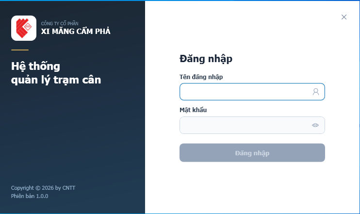

#### Danh sách Phần tử Giao diện Chính (LoginWindow.xaml)
| Mã phần tử | Loại Control | Tên / Binding | Mô tả chức năng |
| :--- | :--- | :--- | :--- |
| UI-LGN-TXT-USER | `TextBox` | `Username` | Nhập tên đăng nhập của nhân viên/quản trị viên. |
| UI-LGN-TXT-PASS | `PasswordBox` | (Xử lý qua Code-behind / `Password`) | Nhập mật khẩu. |
| UI-LGN-BTN-SUBMIT | `Button` | `LoginCommand` | Nút đăng nhập, mặc định kích hoạt khi nhấn phím `Enter`. |
| UI-LGN-TXT-VER | `TextBlock` | `AppVersion` | Hiển thị phiên bản ứng dụng hiện tại (Ví dụ: `1.0.5`). |

#### Các Yêu cầu Chức năng Nghiệp vụ liên quan (FR-AUTH)
- **FR-AUTH-001 (Đăng nhập)**: Nhân viên cân nhập `Username` và `Password`. Hệ thống thực hiện băm mật khẩu và đối chiếu với bản ghi trong bảng `users` cục bộ.
- **FR-AUTH-002 (Phân quyền RBAC)**: Sau khi đăng nhập thành công, phiên làm việc sẽ lưu giữ vai trò người dùng trong `StationAuthorization`:
  - **ADMIN (Quản trị viên)**: Quyền truy cập đầy đủ, bao gồm cấu hình thiết bị cân cổng COM, cấu hình RTSP camera, cấu hình phôi in, sao lưu dữ liệu cục bộ (local), tạo và quản lý tài khoản người dùng, và thực hiện cân tay (MANUAL - tự nhập số cân).
  - **OPERATOR (Nhân viên cân)**: Chỉ được phép thực hiện cân tự động (AUTO - đọc từ cổng COM), gộp đơn, in phiếu cân/giao nhận và bỏ qua (bypass) dung sai hàng bao (được ghi lại nhật ký kiểm toán).

---

### 4.1.2 Giao diện Trang chủ/Dashboard (DashboardView.xaml)

Màn hình hiển thị ngay sau khi người dùng đăng nhập thành công. Đây là trung tâm giám sát nhanh tình trạng hoạt động của trạm cân, hiển thị sản lượng cân trong ngày và kết nối phần cứng.

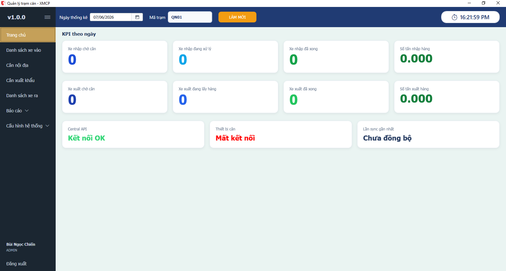

#### Danh sách Phần tử Giao diện Chính (DashboardView.xaml)
| Mã phần tử | Loại Control | Tên / Binding | Mô tả chức năng |
| :--- | :--- | :--- | :--- |
| UI-DSB-CARD-TOTAL | `Border/TextBlock` | `TotalVehiclesToday` | Số lượng lượt xe đã qua trạm cân trong ngày hiện tại. |
| UI-DSB-CARD-NET-IN | `Border/TextBlock` | `TotalInboundWeightToday` | Tổng sản lượng nhập hàng tịnh trong ngày (kg). |
| UI-DSB-CARD-NET-OUT | `Border/TextBlock` | `TotalOutboundWeightToday` | Tổng sản lượng xuất hàng tịnh trong ngày (kg). |
| UI-DSB-TXT-COM | `TextBlock` | `ScaleConnectionStatus` | Trạng thái kết nối đầu cân COM (Xanh: Connected / Đỏ: Disconnected). |
| UI-DSB-TXT-CAM1 | `TextBlock` | `Camera1ConnectionStatus` | Trạng thái hoạt động camera IP giám sát số 1. |
| UI-DSB-TXT-CAM2 | `TextBlock` | `Camera2ConnectionStatus` | Trạng thái hoạt động camera IP giám sát số 2. |
| UI-DSB-TXT-API | `TextBlock` | `CentralApiStatus` | Trạng thái kết nối API với Central Server trung tâm. |
| UI-DSB-TXT-BACKUP | `TextBlock` | `LastBackupTime` | Thời gian hoàn tất sao lưu cơ sở dữ liệu cục bộ gần nhất. |
| UI-DSB-TXT-SYNC | `TextBlock` | `OutboxPendingCount` | Số lượng bản ghi nghiệp vụ đang chờ đồng bộ trong Outbox. |

- **Tải số liệu thống kê**: DashboardViewModel truy vấn dữ liệu theo ngày được chọn trên giao diện (mặc định là ngày hiện tại `DateTime.Today`) để tính toán các chỉ số KPI vận hành cho cả hai chiều Nhập (Inbound) và Xuất (Outbound): số xe chờ cân, số xe đang xử lý, số xe hoàn thành và tổng sản lượng thực tế.
- **Quy tắc tính xe chờ cân**: KPI `Xe nhập chờ cân` và `Xe xuất chờ cân` phải bao gồm cả:
  - Các cắt lệnh trong bảng `cut_orders` chưa phát sinh lượt cân, thỏa điều kiện `CutOrderStatus = REGISTERED`, `ProcessingStage = IN_YARD`, `WeighingSessionId IS NULL`, không bị xóa/hủy và `CreatedAt` thuộc ngày thống kê.
  - Các lượt cân trong bảng `weighing_sessions` đã được tạo nhưng chưa lưu cân lần 1, thỏa điều kiện `SessionStatus = PENDING_WEIGHT1`, không bị xóa/hủy và `CreatedAt` thuộc ngày thống kê.
- **Quy tắc tính xe đang xử lý**: KPI đang xử lý lấy từ các lượt cân `weighing_sessions` trong ngày. Với cân xuất khẩu, trạng thái đang xử lý gồm `PENDING_WEIGHT2` và `ALLOCATION_PENDING`. Với cân nội địa/nhập hàng, trạng thái đang xử lý gồm `PENDING_WEIGHT2`, `ALLOCATION_PENDING` và `READY_TO_COMPLETE`.
- **Quy tắc tính xe hoàn thành**: KPI hoàn thành lấy từ các lượt cân đã hoàn tất trong ngày theo thời điểm `Weight2Time ?? CreatedAt`. Với cân xuất khẩu, `READY_TO_COMPLETE` hoặc `COMPLETED` được coi là đã xong vì luồng xuất khẩu không bắt buộc chuyển xe ra. Với cân nội địa/nhập hàng, chỉ `COMPLETED` được coi là đã xong.
- **Quy tắc tính sản lượng**: Tổng sản lượng nhập/xuất trong ngày không tính các lượt `IsNoLoad = true`. Sản lượng xuất ưu tiên tổng `ActualAllocatedWeight` của `weighing_session_lines`; nếu không có dữ liệu line hợp lệ thì fallback về `weighing_sessions.NetWeight`.
- **Giám sát thiết bị thời gian thực**: Sử dụng dịch vụ `IScaleDevice` và `ICameraPreviewService` định kỳ ping/check trạng thái kết nối phần cứng. Cập nhật màu sắc chỉ báo (Xanh lá = OK, Cam = Đang kết nối, Đỏ = Lỗi).

---

## 4.2 Phân hệ Danh sách xe vào và Quản lý Đăng ký (Incoming Queue & Registration)

### 4.2.1 Giao diện Danh sách xe chờ (IncomingVehicleListView.xaml)

Hiển thị danh sách phương tiện đã được duyệt và đồng bộ từ ERP hoặc các đăng ký thủ công đang ở trong bãi trạm cân chờ thực hiện cân lần 1. Màn hình bao gồm bộ lọc tìm kiếm ở phía trên, lưới danh sách xe chờ ở phía dưới và một biểu mẫu (Form) chi tiết phương tiện/cắt lệnh bên phải cho phép sửa đổi hoặc tạo mới đơn cân lẻ thủ công.

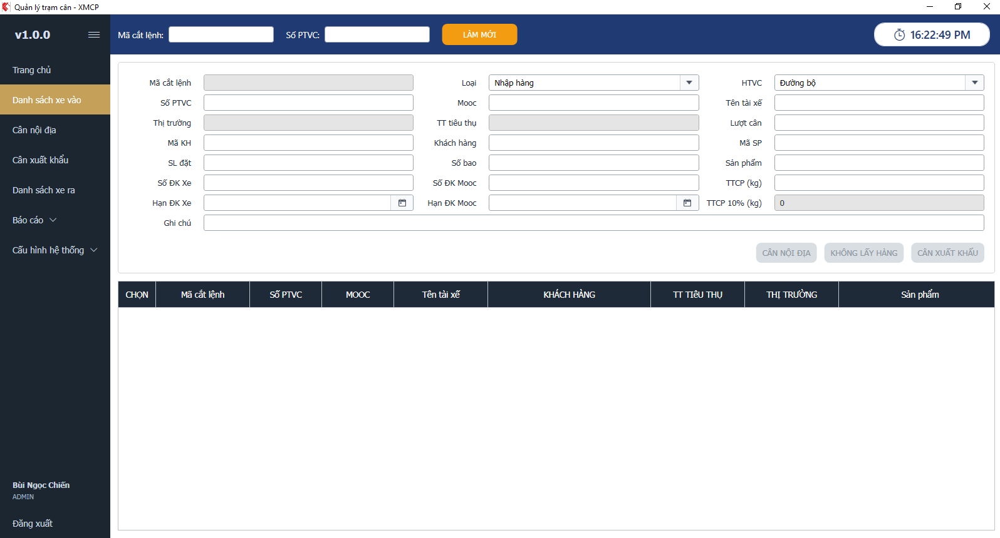

#### Danh sách Phần tử Giao diện Chính (IncomingVehicleListView.xaml)

##### A. Thanh công cụ & Tìm kiếm phía trên
| Mã phần tử | Loại Control | Tên / Binding | Mô tả chức năng |
| :--- | :--- | :--- | :--- |
| UI-INC-TXT-SEARCMD | `TextBox` | `SearchErpCutOrderId` | Nhập mã đơn hàng/cắt lệnh ERP để tìm kiếm nhanh. Nhấn Enter để thực hiện. |
| UI-INC-TXT-SEARCHBS | `AutocompleteTextBox` | `SearchVehiclePlateInput` | Trường biển số xe tìm kiếm hỗ trợ tự động gợi ý. Nhấn Enter để thực hiện. |
| UI-INC-BTN-REFRESH | `Button` | `RefreshCommand` | Tải lại danh sách xe chờ từ cơ sở dữ liệu cục bộ và đưa Form về trạng thái tạo mới. |

##### B. Form Chi tiết Phương tiện / Đăng ký (Cột thông tin bên phải/phía trên lưới)
| Mã phần tử | Loại Control | Tên / Binding | Mô tả chức năng |
| :--- | :--- | :--- | :--- |
| UI-INC-FORM-TXT-ID | `TextBox` | `FormErpCutOrderId` | Hiển thị mã cắt lệnh ERP (Chỉ đọc). |
| UI-INC-FORM-TXT-TYPE | `ComboBox` | `FormTransactionType` | Lựa chọn loại giao dịch: *Nhập hàng* (Inbound) hoặc *Xuất hàng* (Outbound). |
| UI-INC-FORM-TXT-VEHICLE | `AutocompleteTextBox` | `FormVehiclePlateInput` | Nhập biển số xe. Hỗ trợ tự động gợi ý từ danh mục xe và tự động điền thông tin mooc, tài xế, TTCP, số/hạn đăng kiểm liên quan. |
| UI-INC-FORM-TXT-MOOC | `AutocompleteTextBox` | `FormMoocInput` | Nhập biển số mooc. Hỗ trợ tự động gợi ý và tự động điền hạn đăng kiểm mooc. |
| UI-INC-FORM-COM-HTVC | `ComboBox` | `FormTransportMethod` | Lựa chọn hình thức vận chuyển: *Đường bộ* (ROAD) hoặc *Đường thủy* (WATERWAY). |
| UI-INC-FORM-TXT-MARKET | `TextBox` | `FormMarket` | Hiển thị thị trường tiêu thụ của cắt lệnh (Chỉ đọc). |
| UI-INC-FORM-TXT-PLACE | `TextBox` | `FormConsumptionPlace` | Hiển thị trung tâm/nơi tiêu thụ của cắt lệnh (Chỉ đọc). |
| UI-INC-FORM-TXT-SESSION | `TextBox` | `FormAttachSessionNo` | Nhập mã lượt cân cũ để sử dụng lại số cân lần 1 (Carry Forward Weight 1) trong vòng 24 giờ. |
| UI-INC-FORM-TXT-CUSTCODE | `TextBox` | `FormCustomerCode` | Nhập mã khách hàng. Khi thay đổi và mất focus sẽ tự động tìm kiếm tên khách hàng. |
| UI-INC-FORM-TXT-CUSTOMER | `AutocompleteTextBox` | `FormCustomerInput` | Nhập tên khách hàng. Hỗ trợ tự động gợi ý từ danh mục khách hàng cục bộ. |
| UI-INC-FORM-TXT-PRODCODE | `AutocompleteTextBox` | `FormProductCodeInput` | Nhập mã sản phẩm. Hỗ trợ tự động gợi ý và tự động phát hiện sản phẩm có phải hàng bao hay không để bật/tắt ô Số bao. |
| UI-INC-FORM-TXT-PRODUCT | `AutocompleteTextBox` | `FormProductNameInput` | Nhập tên sản phẩm. Hỗ trợ tự động gợi ý từ danh mục sản phẩm cục bộ. |
| UI-INC-FORM-TXT-PLANW | `TextBox` | `FormPlannedWeight` | Nhập khối lượng kế hoạch đặt hàng (kg). |
| UI-INC-FORM-TXT-BAGS | `TextBox` | `FormBagCount` | Nhập số lượng bao kế hoạch (chỉ hiển thị và bắt buộc khi sản phẩm là hàng bao). |
| UI-INC-FORM-TXT-REGNO | `TextBox` | `VehicleRegistrationNo` | Nhập số đăng kiểm của xe. |
| UI-INC-FORM-TXT-MOOCREG | `TextBox` | `MoocRegistrationNo` | Nhập số đăng kiểm của mooc. |
| UI-INC-FORM-TXT-TTCP | `TextBox` | `TtcpWeight` | Nhập trọng tải thiết kế cho phép (TTCP) của xe (kg). |
| UI-INC-FORM-DP-REGEXP | `DatePicker` | `VehicleRegistrationExpiry` | Chọn ngày hết hạn đăng kiểm xe. Chữ và viền sẽ chuyển sang màu đỏ cảnh báo nếu đã hết hạn so với ngày hiện tại. |
| UI-INC-FORM-DP-MOOCEXP | `DatePicker` | `MoocRegistrationExpiry` | Chọn ngày hết hạn đăng kiểm mooc. Chữ và viền sẽ chuyển sang màu đỏ cảnh báo nếu đã hết hạn so với ngày hiện tại. |
| UI-INC-FORM-TXT-TTCP10 | `TextBox` | `DisplayTtcp10PercentKg` | Hiển thị tải trọng tối đa cho phép lưu hành (bằng TTCP + 10% dung sai) (Chỉ đọc). |
| UI-INC-FORM-TXT-DRIVER | `AutocompleteTextBox` | `FormDriverInput` | Nhập tên tài xế/người đại diện. Hỗ trợ tự động gợi ý từ danh mục tài xế đã cân tại trạm. |
| UI-INC-FORM-TXT-NOTES | `TextBox` | `FormNotes` | Nhập ghi chú cho lượt cân (Tối đa 500 ký tự). |
| UI-INC-FORM-BTN-SAVE | `Button` | `SaveDetailCommand` | Thực hiện lưu các thay đổi thông tin cắt lệnh (Chỉ hiển thị khi đang sửa đổi đơn hàng có sẵn). |
| UI-INC-FORM-BTN-START | `Button` | `ConfirmEnterWeighingCommand` | Thực hiện xác nhận và tạo phiên cân, mở màn hình Vận hành cân chính (`WeighingView`). |
| UI-INC-FORM-BTN-NOLOAD | `Button` | `MarkNoLoadCommand` | Chuyển thẳng xe sang danh sách xe ra theo diện không lấy hàng (Cân không tải), bỏ qua các bước cân. |
| UI-INC-FORM-BTN-EXPORT | `Button` | `TransitionToExportScaleCommand` | Chuyển đổi cắt lệnh xuất hàng được chọn sang luồng cân xuất khẩu cộng dồn sản lượng lớn. |

##### C. Lưới danh sách xe chờ phía dưới
| Mã phần tử | Loại Control | Tên / Binding | Mô tả chức năng |
| :--- | :--- | :--- | :--- |
| UI-INC-GRID-CHOOSE | `CheckBox` | `IsSelected` | Chọn một hoặc nhiều dòng cắt lệnh để gộp chuyến cân xe vào. |
| UI-INC-GRID-DATA | `DataGrid` | `ItemsSource={Binding Vehicles}` | Hiển thị danh sách chi tiết các cắt lệnh đăng ký đang chờ thực hiện cân lần 1. |

#### Các Yêu cầu Chức năng Nghiệp vụ liên quan (FR-WEIGH-001)

##### 1. Thời điểm nạp dữ liệu (Data Loading Triggers)
Hệ thống tự động thực hiện truy vấn và nạp dữ liệu vào lưới danh sách xe chờ trong các trường hợp sau:
- **Khi truy cập màn hình**: Khi người dùng nhấn chọn chức năng "Xe Chờ Vào" từ Menu chính, hệ thống sẽ gọi phương thức `InitializeAsync()` để nạp dữ liệu lần đầu.
- **Khi nhân viên cân nhấn nút "Tải lại"**: Để làm mới danh sách dữ liệu thực tế tại trạm.
- **Khi thực hiện tìm kiếm**: Nhập thông tin bộ lọc vào ô tìm kiếm Mã đơn hàng hoặc Biển số xe và nhấn phím **Enter** trên bàn phím.
- **Logic truy vấn dữ liệu**: Truy vấn thông qua repository `ICutOrderRepository.GetIncomingListAsync()` để lấy ra các bản ghi trong bảng `cut_orders` có trạng thái xử lý `ProcessingStage = 'IN_YARD'` và trạng thái cắt lệnh `CutOrderStatus = 'REGISTERED'` (loại bỏ các bản ghi đã xóa hoặc đã bị hủy).
- **Xem chi tiết**: Khi người dùng nhấp chọn một dòng trên lưới dữ liệu, hệ thống tự động tắt chế độ tạo mới (`IsCreateMode = false`) và nạp chi tiết thông tin của cắt lệnh đó lên các trường nhập liệu của Form bên phải để chỉnh sửa.

##### 2. Chức năng chi tiết của các nút bấm trên Form
- **Nút "Tải lại" (`RefreshCommand`)**: Thiết lập Form về chế độ tạo mới đơn cân lẻ thủ công (`IsCreateMode = true`), xóa sạch toàn bộ các trường nhập liệu hiện tại và tải lại danh sách xe chờ từ database cục bộ.
- **Nút "Lưu thay đổi" (`SaveDetailCommand`)**: 
  - Chỉ hiển thị khi nhân viên chọn sửa đổi thông tin của một đăng ký có sẵn trên lưới.
  - Tiến hành kiểm tra tính hợp lệ của dữ liệu (Validate): Biển số xe, tên tài xế, tên khách hàng, mã/tên sản phẩm, khối lượng kế hoạch không được để trống hoặc nhỏ hơn hoặc bằng 0. Nếu sản phẩm là hàng bao, trường số lượng bao phải được nhập.
  - Gọi `UpdateIncomingRegistrationUseCase` để cập nhật các thông tin thay đổi trực tiếp vào bảng `cut_orders` trong cơ sở dữ liệu cục bộ.
- **Nút "Xác nhận vào cân" (`ConfirmEnterWeighingCommand`)**:
  - Cho phép tạo phiên cân mới cho một hoặc nhiều cắt lệnh được chọn gộp chung trên xe (phải cùng biển số xe).
  - **Kiểm tra đăng kiểm bắt buộc**: Hệ thống kiểm tra hạn đăng kiểm xe và mooc của các phương tiện được chọn. Nếu có bất kỳ hạn đăng kiểm nào nhỏ hơn ngày hiện tại (đã hết hạn), hệ thống sẽ chặn đứng và hiển thị thông báo lỗi cảnh báo màu đỏ trên giao diện, không cho phép tạo phiên cân và vào bàn cân.
  - **Hộp thoại chọn đại diện**: Nếu nhân viên chọn gộp nhiều dòng cắt lệnh có sự sai lệch thông tin biển số xe, mooc, hoặc tài xế, hệ thống sẽ tự động hiển thị hộp thoại `VehicleRepresentativeSelectionDialogWindow` yêu cầu nhân viên chọn ra một cắt lệnh làm đại diện thông tin xe chính cho chuyến đi.
  - **Dùng lại số cân lần 1 (Carry Forward Weight 1)**: Nếu nhân viên điền mã số lượt cân cũ vào ô `Lượt cân` (`FormAttachSessionNo`), hệ thống sẽ kiểm tra trong bảng `weighing_sessions`. Nếu tìm thấy lượt cân cũ và thời gian cân lần 1 của lượt đó chưa quá 24 giờ kể từ thời điểm hiện tại:
    - Hiển thị hộp thoại xác nhận: *"Xe biển số [BSX] vừa thực hiện cân lần 1 với số lượt cân [Mã], số cân [Khối lượng] kg vào lúc [Giờ]. Bạn có đồng ý dùng lại số cân lần 1 này không?"*.
    - Nếu nhân viên đồng ý: Hệ thống gọi `AppendCutOrdersToWeighingSessionUseCase` để gộp các cắt lệnh mới được chọn vào phiên cân cũ đó, kế thừa khối lượng cân lần 1 và tự động nhảy sang trạng thái sẵn sàng cân lần 2 (`ALLOCATION_PENDING` hoặc `PENDING_WEIGHT2`), sau đó điều hướng người dùng thẳng tới màn hình cân chính.
    - Nếu không đồng ý hoặc không nhập mã lượt cân cũ: Hệ thống gọi `CreateWeighingSessionUseCase` để khởi tạo một phiên cân mới hoàn toàn với trạng thái `PENDING_WEIGHT1` và điều hướng sang màn hình cân.
- **Nút "Không lấy hàng" (`MarkNoLoadCommand`)**:
  - Được sử dụng khi phương tiện đã đăng ký vào bãi nhưng vì lý do nào đó không thực hiện lấy hàng/nhập hàng và cần giải phóng xe ra ngoài.
  - Sau khi nhân viên cân xác nhận hộp thoại cảnh báo, hệ thống gọi `MarkRegistrationsNoLoadUseCase` để tự động tạo một phiên cân mới đánh dấu cờ không tải (`IsNoLoad = true`), chuyển trạng thái cắt lệnh thành `COMPLETED` và tự động đẩy xe trực tiếp sang danh sách xe ra (`OutgoingVehicleListView`) để làm thủ tục cho xe ra khỏi trạm cân mà không cần đi qua quy trình cân 2 lần thông thường.
- **Nút "Cân xuất khẩu" (`TransitionToExportScaleCommand`)**:
  - Chỉ sáng khi nhân viên chọn duy nhất một dòng cắt lệnh có loại giao dịch xuất hàng (`OUTBOUND`) và trạng thái chờ xe vào (`REGISTERED`).
  - Gọi `TransitionToExportScaleUseCase` để chuyển đổi trạng thái của cắt lệnh cha sang luồng cân xuất khẩu lũy kế cộng dồn, sau đó điều hướng nhân viên sang giao diện Cân xuất khẩu (`ExportWeighingView`).

##### 3. Cơ chế tự động gợi ý (Autocomplete Suggestions) và Điền dữ liệu tự động (Auto-fill)
Hệ thống tích hợp bộ gõ gợi ý thông minh thông qua việc lắng nghe sự kiện nhập liệu của người dùng trên các `AutocompleteTextBox`:
- **Gợi ý tự động (Autocomplete)**: Khi nhân viên gõ tối thiểu 1 ký tự đối với biển số xe/mooc/mã sản phẩm, hoặc 2 ký tự đối với tên tài xế/khách hàng/tên sản phẩm, hệ thống sẽ gọi `IAutocompleteService.SearchAsync` bất đồng bộ để tìm kiếm các bản ghi khớp trong danh mục cục bộ và hiển thị danh sách gợi ý xổ xuống ngay dưới ô nhập liệu.
- **Tự động điền thông tin (Auto-fill)**:
  - **Khi chọn biển số xe**: Hệ thống tự động truy vấn danh mục xe cục bộ để lấy ra mooc gần nhất, tài xế gần nhất gắn liền với xe đó để tự động điền vào Form. Đồng thời tự động điền số đăng kiểm xe, số đăng kiểm mooc, trọng tải thiết kế cho phép (`TtcpWeight`), hạn đăng kiểm xe, hạn đăng kiểm mooc vào Form để nhân viên cân không cần nhập tay lại.
  - **Khi chọn Mooc**: Tự động điền số đăng kiểm mooc và ngày hết hạn đăng kiểm mooc tương ứng.
  - **Khi chọn Khách hàng / Sản phẩm**: Điền đồng thời cả Mã và Tên khách hàng/sản phẩm vào các trường tương ứng khi chọn một trong hai trường.
  - **Tự động đồng bộ tên khách hàng qua mã**: Khi nhân viên gõ thủ công mã khách hàng vào ô `Mã KH` (`FormCustomerCode`) rồi di chuyển tiêu điểm ra ngoài (Lost Focus), hệ thống sẽ chạy tiến trình ngầm `SyncCustomerByCodeAsync` để tự động kiểm tra mã trong danh mục khách hàng và điền tên khách hàng tương ứng lên Form.
  - **Tự động cấu hình loại sản phẩm**: Khi thay đổi mã sản phẩm (`FormProductCode`), hệ thống tự động gọi `SyncProductTypeAsync` để xác định sản phẩm là hàng bao (`Bagged`) hay hàng rời (`Bulk`). Nếu là hàng rời, hệ thống sẽ ẩn ô nhập "Số bao kế hoạch" (`FormBagCount`) và gán giá trị NULL. Nếu là hàng bao, hệ thống tự động hiển thị ô nhập và đặt mặc định cờ kiểm tra hàng bao để bắt buộc nhập số bao khi lưu.

##### 4. Tự động cập nhật Danh mục gốc (Auto-update Master Data)
- Khi nhân viên trạm cân bấm nút "Xác nhận vào cân" để bắt đầu quy trình cân xe, hệ thống sẽ tiến hành kiểm tra và đối chiếu các thông tin phương tiện, khách hàng, sản phẩm, tài xế hiện có trên Form với cơ sở dữ liệu danh mục gốc của trạm cân.
- Nếu phát hiện thông tin nhập vào chưa từng tồn tại (ví dụ xe mới vào trạm lần đầu, khách hàng mới) hoặc có sự thay đổi (nhân viên sửa đổi ngày hết hạn đăng kiểm xe/mooc mới, cập nhật lại trọng tải thiết kế cho phép `TtcpWeight` mới của phương tiện, hoặc thay đổi thông tin người đại diện xe), hệ thống sẽ tự động gọi dịch vụ `EnsureInboundMasterDataUseCase` trong tiến trình lưu.
- Dịch vụ này sẽ tự động thêm mới hoặc cập nhật thông tin đã thay đổi vào các bảng danh mục gốc tương ứng (`vehicles`, `customers`, `products`) ở cơ sở dữ liệu cục bộ. Điều này đảm bảo dữ liệu danh mục luôn được cập nhật mới nhất một cách tự động và sẵn sàng gợi ý chính xác cho các lượt cân tiếp theo mà không đòi hỏi nhân viên phải vào phân hệ cấu hình để khai báo trước.


---

## 4.3 Phân hệ Quy trình Cân Nội địa Tiêu chuẩn (Standard Domestic Weighing Module)

### 4.3.1 Giao diện Vận hành Cân chính (WeighingView.xaml)

Màn hình làm việc chính của nhân viên cân khi thực hiện cân xe nội địa 2 lần (cân vào, cân ra), hiển thị video trực tiếp từ camera, số cân thời gian thực cỡ lớn và bảng lưới gộp/phân bổ đơn hàng.

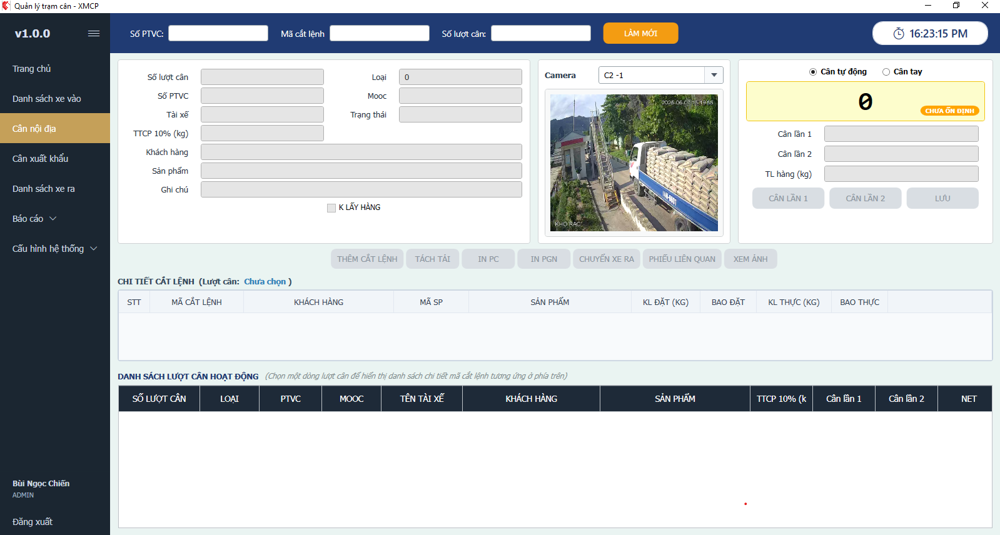

#### Danh sách Phần tử Giao diện Chính (WeighingView.xaml)

##### A. Thanh công cụ Tìm kiếm phía trên (Header Search Bar)
| Mã phần tử | Loại Control | Tên / Binding | Mô tả chức năng |
| :--- | :--- | :--- | :--- |
| UI-WGH-HDR-TXT-PLATE | `TextBox` | `SearchVehiclePlate` | Nhập biển số xe tìm kiếm nhanh phiên cân dở dang. Nhấn Enter để lọc. |
| UI-WGH-HDR-TXT-CUTORDER | `TextBox` | `SearchErpCutOrderId` | Nhập mã cắt lệnh ERP tìm kiếm nhanh phiên cân dở dang. Nhấn Enter để lọc. |
| UI-WGH-HDR-TXT-SESSION | `TextBox` | `SearchSessionNo` | Nhập mã số lượt cân/phiên cân để tìm kiếm nhanh. Nhấn Enter để lọc. |
| UI-WGH-HDR-BTN-REFRESH | `Button` | `RefreshCommand` | Làm sạch các bộ lọc tìm kiếm và tải lại toàn bộ danh sách phiên cân dở dang từ CSDL cục bộ. |

##### B. Lưới danh sách phiên cân dở dang (Bên trái giao diện)
| Mã phần tử | Loại Control | Tên / Binding | Mô tả chức năng |
| :--- | :--- | :--- | :--- |
| UI-WGH-GRID-SESS | `DataGrid` | `ItemsSource={Binding Sessions}` | Hiển thị danh sách các phiên cân chưa hoàn thành (ở trạng thái `PENDING_WEIGHT1` hoặc `PENDING_WEIGHT2`) đang hoạt động tại trạm. |

##### C. Bảng thông tin hiển thị chung (Giữa giao diện)
| Mã phần tử | Loại Control | Tên / Binding | Mô tả chức năng |
| :--- | :--- | :--- | :--- |
| UI-WGH-TXT-SESSNO | `TextBox` | `SessionNo` | Hiển thị mã số lượt cân hiện tại (Chỉ đọc). |
| UI-WGH-TXT-TYPE | `TextBox` | `TransactionType` | Hiển thị loại giao dịch: *Nhập hàng* (Inbound) / *Xuất hàng* (Outbound) (Chỉ đọc). |
| UI-WGH-TXT-PLATE | `TextBox` | `VehiclePlate` | Hiển thị biển số xe đang cân (Chỉ đọc). |
| UI-WGH-TXT-MOOC | `TextBox` | `MoocNumber` | Hiển thị biển số mooc đi kèm (Chỉ đọc). |
| UI-WGH-TXT-DRIVER | `TextBox` | `DriverName` | Hiển thị tên tài xế (Chỉ đọc). |
| UI-WGH-TXT-STATUS | `TextBox` | `SessionStatusText` | Hiển thị trạng thái phiên cân hiện tại (Chỉ đọc). |
| UI-WGH-TXT-TTCP10 | `TextBox` | `Ttcp10WeightSnapshot` | Hiển thị tải trọng tối đa thiết kế cho phép của xe (bằng TTCP + 10% dung sai) (Chỉ đọc). |
| UI-WGH-TXT-CUSTOMER | `TextBox` | `CustomerSummary` | Hiển thị tóm tắt tên các khách hàng gộp của chuyến xe hiện tại (Chỉ đọc). |
| UI-WGH-TXT-PRODUCT | `TextBox` | `ProductSummary` | Hiển thị tóm tắt tên các sản phẩm gộp của chuyến xe hiện tại (Chỉ đọc). |
| UI-WGH-TXT-NOTES | `TextBox` | `NotesSummary` | Hiển thị tóm tắt các ghi chú của đơn hàng (Chỉ đọc). |

##### D. Khu vực vận hành đầu cân & camera (Bên phải giao diện)
| Mã phần tử | Loại Control | Tên / Binding | Mô tả chức năng |
| :--- | :--- | :--- | :--- |
| UI-WGH-TXT-LWEIGHT | `TextBox` | `CurrentWeight` | Hiển thị số cân từ thiết bị đọc. Chỉ Quản trị viên (ADMIN) được nhập số thủ công bằng tay khi chọn chế độ "Cân Tay". |
| UI-WGH-RDO-AUTO | `RadioButton` | `IsAutoMode` | Lựa chọn chế độ đọc cân tự động (AUTO) qua cổng COM của thiết bị cân. |
| UI-WGH-RDO-MANUAL | `RadioButton` | `IsManualMode` | Lựa chọn chế độ nhập số cân bằng tay (Chỉ khả dụng cho vai trò ADMIN). |
| UI-WGH-TXT-STABLE | `TextBlock` | `StabilityText` | Trạng thái ổn định số cân đọc về (`ỔN ĐỊNH` hoặc `DAO ĐỘNG`). |
| UI-WGH-IMG-CAM | `Image` | `CameraPreviewSource` | Hiển thị luồng RTSP thời gian thực để kiểm soát vị trí đỗ xe của xe. |

##### E. Các nút chức năng vận hành chính
| Mã phần tử | Loại Control | Tên / Binding | Mô tả chức năng |
| :--- | :--- | :--- | :--- |
| UI-WGH-BTN-W1 | `Button` | `CaptureWeight1Command` | Lấy giá trị cân lần 1 khi xe cân vào trạm, cập nhật `Weight1` và chụp ảnh camera. |
| UI-WGH-BTN-W2 | `Button` | `CaptureWeight2Command` | Lấy giá trị cân lần 2 khi xe cân ra trạm, cập nhật `Weight2` và chụp ảnh camera. |
| UI-WGH-BTN-SAVE | `Button` | `SaveCapturedWeightCommand` | Ghi nhận số cân, đối chiếu dung sai hàng bao, yêu cầu chọn tài xế thực tế đại diện và lưu phiên cân. |
| UI-WGH-BTN-ALLOC | `Button` | `OpenAllocationCommand` | Mở màn hình/dialog phân bổ khối lượng tịnh cho các đơn hàng gộp trên xe. |
| UI-WGH-BTN-APPEND | `Button` | `OpenAppendCutOrdersCommand` | Mở hộp thoại gộp thêm cắt lệnh đang chờ trong bãi vào phiên cân này. |
| UI-WGH-BTN-SPLIT | `Button` | `ShowOverweightHandlingCommand` | Mở hộp thoại xử lý quá tải tải trọng thiết kế của xe (Tách tải). |
| UI-WGH-BTN-INPC | `Button` | `PrintWeighTicketCommand` | In phiếu cân tổng hợp của phiên cân (chứng từ Master). |
| UI-WGH-BTN-INPGN | `Button` | `PrintDeliveryTicketCommand` | In các phiếu giao nhận chi tiết cho từng đơn hàng (chứng từ Line). |
| UI-WGH-BTN-OUT | `Button` | `MoveToOutYardCommand` | Hoàn tất phiên cân, đổi trạng thái đơn cắt lệnh thành `COMPLETED` và cho xe ra. |
| UI-WGH-CHK-NOLOAD | `CheckBox` | `IsNoLoadMarked` | Đánh dấu phiên cân không tải (chỉ đi qua bàn cân để kiểm tra, không xuất/nhập hàng). |
| UI-WGH-CHK-ACTUAL | `CheckBox` | `UseActualWeightForBaggedCutOrders` | Cho phép sử dụng khối lượng tịnh thực tế cho đơn hàng bao thay vì quy đổi theo số lượng bao. |

##### F. Lưới chi tiết đơn hàng gộp
| Mã phần tử | Loại Control | Tên / Binding | Mô tả chức năng |
| :--- | :--- | :--- | :--- |
| UI-WGH-GRID-LINES | `DataGrid` | `ItemsSource={Binding SessionLines}` | Lưới hiển thị chi tiết các đơn hàng được gộp trên chuyến xe hiện tại. |

#### Các Yêu cầu Chức năng Nghiệp vụ liên quan (FR-WEIGH-002, 003 & FR-ALLOC-001)

##### 1. Thứ tự thao tác với các Lưới dữ liệu (Grids Interaction Flow)
Để thực hiện quy trình cân xe nội địa, nhân viên trạm cân tuân thủ thứ tự tương tác với các lưới dữ liệu như sau:
- **Bước 1: Lưới phiên cân dở dang (UI-WGH-GRID-SESS - Sessions Grid)**: Đây là điểm bắt đầu. Nhân viên nhấp chọn một dòng phiên cân đang làm việc (ví dụ ở trạng thái `PENDING_WEIGHT1` khi xe vào hoặc `PENDING_WEIGHT2` khi xe ra). Hệ thống sẽ tự động gọi phương thức `LoadSelectedSessionAsync` để nạp toàn bộ thông tin chung của xe (biển số, mooc, tài xế, trọng lượng lần 1,...) lên Form hiển thị chung và đồng thời truy vấn nạp các đơn hàng gộp chi tiết của xe đó vào Lưới chi tiết đơn hàng.
- **Bước 2: Lưới chi tiết đơn hàng gộp (UI-WGH-GRID-LINES - SessionLines Grid)**: Hiển thị danh sách các đơn hàng con được gộp chung trên xe đó. Nhân viên cân có thể:
  - Xem thông tin chi tiết và ghi chú của từng cắt lệnh.
  - Bấm nút **"Thêm cắt lệnh"** để gộp thêm các đơn hàng đăng ký khác đang ở trong bãi vào chuyến xe này.
  - Sau khi lấy số cân lần 2 (cân ra) thành công, nếu xe gộp nhiều đơn hàng (lưới có từ 2 dòng trở lên), nhân viên bắt buộc click chọn lưới này và nhấn nút **"Phân Bổ"** để chia khối lượng tịnh thực tế cho từng đơn hàng trước khi cho xe ra.

##### 2. Chế độ Cân Tự động và Cân Tay (COM Auto Mode vs Manual Key-in)
Hệ thống hỗ trợ 2 chế độ ghi nhận trọng lượng từ bàn cân:
- **Cân tự động (Auto Mode - `IsAutoMode = true`)**:
  - Đây là chế độ vận hành tiêu chuẩn. Hệ thống kích hoạt một bộ hẹn giờ timer chạy ngầm (`_scaleUiTimer` mỗi 120ms) để liên tục giao tiếp và nhận dữ liệu trọng lượng thực tế từ thiết bị đầu cân thông qua cổng COM vật lý (`IScaleDevice`).
  - Hệ thống tự động phân tích chuỗi dữ liệu đầu cân truyền về để cập nhật liên tục lên ô hiển thị trọng lượng cỡ lớn và xác định độ ổn định của cân.
  - **Ràng buộc an toàn**: Nút lấy cân ("Lấy Cân 1", "Lấy Cân 2") chỉ khả dụng và cho phép bấm khi đầu cân trả về trạng thái ổn định (`StabilityText = "ỔN ĐỊNH"`). Nếu cân đang dao động (`StabilityText = "DAO ĐỘNG"`), nút bấm sẽ bị vô hiệu hóa để tránh nhân viên ghi nhận sai số do xe chưa dừng hẳn.
- **Cân tay (Manual Mode - `IsManualMode = true`)**:
  - Chế độ này bị khóa mặc định và **chỉ khả dụng đối với người dùng có vai trò quản trị viên (ADMIN)** (`CanUseManualWeighing`). Nhân viên cân thông thường (Operator) không có quyền kích hoạt chế độ này.
  - Khi bật chế độ cân tay, ô nhập trọng lượng (`CurrentWeight`) sẽ được mở khóa cho phép Admin nhập trực tiếp giá trị cân bằng số từ bàn phím. Toàn bộ tiến trình đọc tự động từ cổng COM và kiểm tra ổn định sẽ bị tạm dừng.
  - Chế độ này chỉ được dùng trong trường hợp đầu cân gặp sự cố phần cứng, hỏng cáp hoặc mất kết nối cổng COM để tránh tắc nghẽn giao thông trạm cân. Mọi lượt lấy cân bằng tay sẽ tự động được gán cờ `WeightMode = MANUAL` và ghi nhận tài khoản thực hiện vào nhật ký hệ thống để phục vụ công tác thanh tra.

##### 3. Quy trình Cân 2 lần & Kiểm soát Dung sai hàng bao
- **Cân lần 1 (Weight 1)**: Xe đỗ lên cân, nhân viên kiểm tra camera đỗ đúng vị trí. Bấm "Lấy Cân 1" để ghi nhận trọng lượng xe. Hệ thống tự động chụp ảnh từ camera trạm `C2` (với đơn nội địa) lưu vào bảng `weighing_session_images` cục bộ, đồng thời khởi tạo phiên cân (`weighing_sessions`) và dòng phiếu cân Master (`weigh_tickets` với `RecordRole = MasterSession`) ở trạng thái `PENDING_WEIGHT2`.
- **Cân lần 2 & Tính khối lượng tịnh (Weight 2)**: Khi xe quay lại cân ra, nhân viên bấm "Lấy Cân 2" để ghi nhận trọng lượng. Hệ thống tự động tính khối lượng tịnh: `NetWeight = |Weight1 - Weight2|`.
- **Đối chiếu Dung sai hàng bao**: Đối với sản phẩm hàng bao, hệ thống tự động đối chiếu tổng khối lượng thực tế cân được so với khối lượng kế hoạch. Ngưỡng dung sai cho phép được tính bằng: `Dung sai = Số bao kế hoạch * tolerance_kg_per_bag` (trong đó `tolerance_kg_per_bag` được cấu hình trong bảng `app_config`, mặc định là `1.75 kg/bao`). Nếu khối lượng thực cân vượt quá khối lượng kế hoạch cộng với dung sai cho phép, giao diện sẽ hiển thị hộp thoại cảnh báo vượt dung sai. Hệ thống không chặn cứng thao tác lưu; nhân viên cân có thể xác nhận để tiếp tục lưu số cân (tương đương kích hoạt tham số `BypassTolerance = true` khi gọi UseCase). Hệ thống sẽ tự động ghi nhận tài khoản thực hiện lưu trong trường `UpdatedBy` của phiên cân và `Weight2User` của phiếu cân để phục vụ hậu kiểm.

##### 4. Chức năng Thêm cắt lệnh (Append Cut Orders)
- Cho phép nhân viên trạm cân chủ động gộp thêm các đơn đăng ký khác đang ở trong bãi vào cùng chuyến xe đang cân (cả khi xe đã hoàn thành cân lần 1).
- Khi nhân viên nhấn nút **"Thêm cắt lệnh"**, hệ thống mở một Pop-up nạp danh sách các đơn hàng đăng ký chờ (`cut_orders` có trạng thái `REGISTERED` và `IN_YARD`) từ cơ sở dữ liệu cục bộ.
- **Ràng buộc kiểm tra**:
  - Hệ thống tự động lọc chỉ hiển thị các đơn có cùng loại giao dịch (Nhập hàng hoặc Xuất hàng) với phiên cân hiện tại và chưa từng được gộp vào phiên cân này.
  - Nếu nhân viên tích chọn đơn hàng có thông tin biển số xe hoặc mooc khác với biển số xe/mooc của phiên cân hiện tại, hệ thống sẽ tự động hiển thị dòng thông báo cảnh báo lệch thông tin phương tiện (`AppendCutOrdersWarningMessage`) ở dưới cùng hộp thoại để nhân viên kiểm tra lại.
  - Khi nhân viên nhấn Xác nhận, hệ thống gọi `AppendCutOrdersToWeighingSessionUseCase` để cập nhật chèn thêm dòng chi tiết mới vào bảng `weighing_session_lines` của phiên cân.

##### 5. Chức năng Phân bổ Khối lượng (Allocation)
- Khi thực hiện cân lần 2 (cân ra) cho xe gộp nhiều đơn hàng, sau khi có khối lượng tịnh `NetWeight`, nhân viên bắt buộc bấm nút **"Phân Bổ"** để mở hộp thoại phân bổ khối lượng thực tế.
- Trong hộp thoại, nhân viên có thể bấm nút **"Phân bổ theo kế hoạch"** để hệ thống tự động tính toán chia khối lượng tịnh tỉ lệ theo sản lượng đăng ký kế hoạch của từng dòng đơn, hoặc tự nhập số lượng phân bổ (`ActualAllocatedWeight`) bằng tay cho từng dòng.
- **Ràng buộc kiểm tra (Validation)**:
  - Tổng khối lượng phân bổ của tất cả các dòng phải **bằng chính xác 100%** khối lượng tịnh `NetWeight` của xe. Nếu có sự sai lệch (dù chỉ 1 kg), hệ thống sẽ chặn không cho lưu phân bổ.
  - Với sản phẩm hàng bao, số bao quy đổi thực tế sẽ được tính toán tự động bằng: `Round(ActualAllocatedWeight / 50)`.
  - Hệ thống hỗ trợ cờ chọn dòng ưu tiên phân bổ (`IsPriority`). Dòng được chọn ưu tiên sẽ nhận khối lượng tịnh phân bổ sau cùng để tự động bù trừ phần chênh lệch làm tròn số bao, đảm bảo tổng khối lượng khớp tuyệt đối.
  - Khi lưu thành công, hệ thống gọi `AllocateWeighingSessionUseCase` cập nhật bảng `weighing_session_lines` và sinh ra các phiếu cân con tương ứng.

##### 6. Chức năng Tách tải xử lý quá tải (Split Overweight Ticket)
- Đối với giao dịch xuất hàng (`OUTBOUND`), khi xe cân lần 2 có khối lượng tịnh thực tế vượt quá tải trọng thiết kế tối đa cho phép lưu hành của xe (vượt quá 110% tải trọng thiết kế của xe `Ttcp10WeightSnapshot`), hệ thống phát hiện trạng thái quá tải và mở khóa nút **"Xử lý quá tải"**.
- Nhân viên bấm nút này để mở hộp thoại xử lý quá tải với 3 phương án lựa chọn:
  1. **Tách tải tự động (Auto Split)**: Hệ thống sử dụng dịch vụ `WeighingSessionOverweightService` đề xuất phương án chia khối lượng tịnh của chuyến xe thành **2 phiếu cân con độc lập** (Phiếu Master và Phiếu SplitDerived), sao cho trọng lượng mỗi phiếu đều nhỏ hơn giới hạn cho phép. Tỉ lệ tách được tính toán tự động kết hợp với một hệ số ngẫu nhiên nhỏ (`RandomSplitFactor` từ `0.0001` đến `0.0025`) để đảm bảo tính tự nhiên và hợp lệ pháp lý.
  2. **Tách tải tùy chỉnh tay (Manual Split)**: Người vận hành tích chọn chế độ tùy chỉnh tay, tự nhập khối lượng mong muốn cho Phiếu cân 1 (`OverweightSplitTicket1WeightText`). Hệ thống tự động tính khối lượng Phiếu cân 2 là phần còn lại: `NetWeight - Phiếu 1`. Nếu phương án tự nhập vẫn vi phạm giới hạn tải trọng, hệ thống sẽ hiển thị thông báo lỗi chặn không cho phép lưu.
  3. **Không tách tải (No Split)**: Nếu có lý do đặc biệt được phê duyệt, Admin có thể nhấn xác nhận không tách tải (`ResolveWeighingSessionOverweightNoSplitUseCase`). Phiên cân sẽ được gắn trạng thái `NO_SPLIT_CONFIRMED` để lưu số cân quá tải gốc và cho xe ra.
- Sau khi chốt phương án tách tải, hệ thống gọi UseCase tương ứng để lưu thông tin và cho phép xe hoàn tất ra bãi.

---

---

### 4.3.2 Dialog Chọn đại diện xe (VehicleRepresentativeSelectionDialogWindow.xaml)

Hộp thoại hiển thị khi nhân viên cân thực hiện lưu số cân, yêu cầu lựa chọn hoặc nhập thông tin người đại diện/tài xế thực tế chịu trách nhiệm cho chuyến xe.

#### Danh sách Phần tử Giao diện Chính
| Mã phần tử | Loại Control | Tên / Binding | Mô tả chức năng |
| :--- | :--- | :--- | :--- |
| UI-VRS-GRID-DATA | `DataGrid` | `Representatives` | Hiển thị danh sách các tài xế/người đại diện của đơn vị vận tải. |
| UI-VRS-BTN-SELECT | `Button` | `SelectCommand` | Xác nhận chọn đại diện và đóng hộp thoại. |
| UI-VRS-BTN-CANCEL | `Button` | `CancelCommand` | Hủy bỏ và đóng hộp thoại. |

#### Nghiệp vụ xử lý liên quan
- Truy vấn danh sách đại diện từ bảng `vehicles` dựa trên biển số xe đang thực hiện cân. Ghi nhận người được chọn vào cột `DriverName` trong bảng `weighing_sessions` và `weigh_tickets`.

---

### 4.3.3 Dialog Cấu hình in phiếu (PrintOptionsDialogWindow.xaml)

Hộp thoại tùy chỉnh tham số trước khi in ấn phiếu cân tổng hợp hoặc phiếu giao nhận.

#### Danh sách Phần tử Giao diện Chính
| Mã phần tử | Loại Control | Tên / Binding | Mô tả chức năng |
| :--- | :--- | :--- | :--- |
| UI-PRN-COM-PRINTER | `ComboBox` | `SelectedPrinter` | Lựa chọn máy in vật lý kết nối với máy tính. |
| UI-PRN-COM-TEMPLATE | `ComboBox` | `SelectedTemplate` | Chọn mẫu phôi in ấn (Mẫu in mặc định hoặc mẫu in tùy chỉnh). |
| UI-PRN-TXT-COPIES | `TextBox` | `CopyCount` | Số lượng bản in cần kết xuất (mặc định: 3 bản). |
| UI-PRN-BTN-PRINT | `Button` | `PrintCommand` | Thực hiện in ấn ra máy in vật lý. |
| UI-PRN-BTN-CANCEL | `Button` | `CancelCommand` | Hủy in. |

#### Nghiệp vụ xử lý liên quan
- **Nạp cấu hình**: Truy vấn thông tin máy in và phôi in từ bảng `print_template_profiles`. Áp dụng các thông số dịch chuyển lề in `OffsetXmm` và `OffsetYmm` lên đối tượng in của WPF trước khi xuất lệnh in.

---

### 4.3.4 Dialog Lịch sử ảnh camera (CameraImageHistoryWindow.xaml)

Hộp thoại hiển thị các hình ảnh chụp nhanh phương tiện trên bàn cân từ camera giám sát trạm cân, làm bằng chứng chống gian lận tải trọng và kiểm soát đỗ xe.

#### Danh sách Phần tử Giao diện Chính
| Mã phần tử | Loại Control | Tên / Binding | Mô tả chức năng |
| :--- | :--- | :--- | :--- |
| UI-CAM-IMG-W1 | `Image` | `Weight1ImageSource` | Hiển thị hình ảnh xe chụp tại thời điểm lưu cân lần 1. |
| UI-CAM-IMG-W2 | `Image` | `Weight2ImageSource` | Hiển thị hình ảnh xe chụp tại thời điểm lưu cân lần 2. |
| UI-CAM-GRID-METADATA | `DataGrid` | `ImageMetadata` | Chi tiết thời gian chụp, mã camera, và tài khoản nhân viên lưu cân. |
| UI-CAM-BTN-CLOSE | `Button` | `CloseCommand` | Đóng hộp thoại. |

#### Nghiệp vụ xử lý liên quan
- **Truy vấn hình ảnh**: Đọc dữ liệu nhị phân (byte array) của ảnh từ bảng `weighing_session_images` liên kết theo `WeighingSessionId`. Chuyển đổi mảng byte thành `BitmapImage` hiển thị lên UI.

---

## 4.4 Phân hệ Quy trình Cân Xuất khẩu Đơn hàng Lớn (Export Scale Weighing Module)

### 4.4.1 Giao diện Cân Xuất khẩu (ExportWeighingView.xaml)

Màn hình chuyên dụng quản lý hợp đồng xuất khẩu lớn (ví dụ clinker hoặc xi măng rời hàng nghìn tấn), quản lý hàng chục lượt xe con ra vào lấy hàng cộng dồn lũy kế sản lượng.

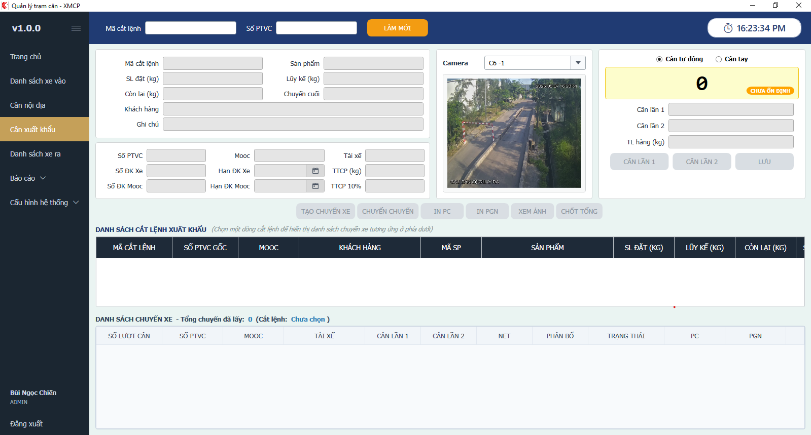

#### Danh sách Phần tử Giao diện Chính (ExportWeighingView.xaml)

##### A. Thanh công cụ Tìm kiếm phía trên (Header Search Bar)
| Mã phần tử | Loại Control | Tên / Binding | Mô tả chức năng |
| :--- | :--- | :--- | :--- |
| UI-EXP-HDR-TXT-CUTORDER | `TextBox` | `SearchErpCutOrderId` | Nhập mã cắt lệnh ERP để tìm kiếm nhanh đơn hàng xuất khẩu lớn. Nhấn Enter để lọc. |
| UI-EXP-HDR-TXT-PLATE | `TextBox` | `SearchVehiclePlate` | Nhập biển số xe con để tìm kiếm nhanh các đơn hàng xuất khẩu lớn liên quan. Nhấn Enter để lọc. |
| UI-EXP-HDR-BTN-REFRESH | `Button` | `RefreshCommand` | Làm sạch các bộ lọc tìm kiếm và tải lại toàn bộ danh sách đơn hàng xuất khẩu từ database cục bộ. |

##### B. Lưới danh sách đơn hàng xuất khẩu lớn (Lưới phía trên)
| Mã phần tử | Loại Control | Tên / Binding | Mô tả chức năng |
| :--- | :--- | :--- | :--- |
| UI-EXP-GRID-CO | `DataGrid` | `ItemsSource={Binding CutOrders}` | Bảng danh sách các đơn hàng xuất khẩu lớn đang hoạt động tại trạm. Nhân viên chọn một dòng để quản lý các chuyến xe con tương ứng. |

##### C. Bảng chi tiết đơn hàng cha (Export Cut Order Details Panel)
| Mã phần tử | Loại Control | Tên / Binding | Mô tả chức năng |
| :--- | :--- | :--- | :--- |
| UI-EXP-TXT-COID | `TextBox` | `SelectedCutOrder.ErpCutOrderId` | Hiển thị mã cắt lệnh ERP của đơn xuất khẩu lớn (Chỉ đọc). |
| UI-EXP-TXT-PRODUCT | `TextBox` | `SelectedCutOrder.ProductName` | Hiển thị tên sản phẩm của hợp đồng xuất khẩu (Chỉ đọc). |
| UI-EXP-TXT-PLANW | `TextBox` | `SelectedCutOrder.PlannedWeight` | Hiển thị sản lượng đăng ký kế hoạch thiết kế (kg) (Chỉ đọc). |
| UI-EXP-TXT-ACCUMW | `TextBox` | `SelectedCutOrder.AccumulatedWeight` | Hiển thị tổng sản lượng lũy kế thực tế đã bốc xếp cân được (kg) (Chỉ đọc). |
| UI-EXP-TXT-REMAINW | `TextBox` | `SelectedCutOrder.RemainingWeight` | Hiển thị sản lượng còn lại chưa bốc của đơn hàng (kg) (Chỉ đọc). |
| UI-EXP-TXT-LASTTRIP | `TextBox` | `SelectedCutOrder.LastTripAt` | Hiển thị thời điểm hoàn thành chuyến xe con gần nhất (Chỉ đọc). |
| UI-EXP-TXT-CUSTOMER | `TextBox` | `SelectedCutOrder.CustomerName` | Hiển thị tên khách hàng/đối tác xuất khẩu (Chỉ đọc). |
| UI-EXP-TXT-NOTES | `TextBox` | `SelectedCutOrder.Notes` | Hiển thị ghi chú của đơn hàng (Chỉ đọc). |

##### D. Form chi tiết chuyến xe con (Trips Form Panel - Bên trái giao diện)
| Mã phần tử | Loại Control | Tên / Binding | Mô tả chức năng |
| :--- | :--- | :--- | :--- |
| UI-EXP-FORM-TXT-PLATE | `AutocompleteTextBox` | `TripVehiclePlateInput` | Nhập biển số xe con. Hỗ trợ tự động gợi ý và điền nhanh thông tin mooc, tài xế, đăng kiểm, TTCP. |
| UI-EXP-FORM-TXT-MOOC | `AutocompleteTextBox` | `TripMoocInput` | Nhập biển số mooc của chuyến xe. Hỗ trợ tự động gợi ý và điền hạn đăng kiểm mooc. |
| UI-EXP-FORM-TXT-DRIVER | `AutocompleteTextBox` | `TripDriverInput` | Nhập tên tài xế lái xe con. Hỗ trợ tự động gợi ý từ danh mục tài xế đã cân tại trạm. |
| UI-EXP-FORM-TXT-REGNO | `TextBox` | `VehicleRegistrationNo` | Nhập số đăng kiểm của xe con. |
| UI-EXP-FORM-DP-REGEXP | `DatePicker` | `VehicleRegistrationExpiryDate` | Chọn ngày hết hạn đăng kiểm xe con. Chữ và viền báo đỏ nếu đã hết hạn so với ngày hiện tại. |
| UI-EXP-FORM-TXT-TTCP | `TextBox` | `VehicleTtcpWeight` | Nhập trọng tải thiết kế cho phép (TTCP) của xe con (kg). |
| UI-EXP-FORM-TXT-MOOCREG | `TextBox` | `MoocRegistrationNo` | Nhập số đăng kiểm mooc của xe con. |
| UI-EXP-FORM-DP-MOOCEXP | `DatePicker` | `MoocRegistrationExpiryDate` | Chọn ngày hết hạn đăng kiểm mooc. Chữ và viền báo đỏ nếu đã hết hạn so với ngày hiện tại. |
| UI-EXP-FORM-TXT-TTCP10 | `TextBox` | `VehicleTtcp10Weight` | Hiển thị tải trọng tối đa cho phép lưu hành của xe con (bằng TTCP + 10%) (Chỉ đọc). |

##### E. Khu vực xem trước camera RTSP (Giữa giao diện)
| Mã phần tử | Loại Control | Tên / Binding | Mô tả chức năng |
| :--- | :--- | :--- | :--- |
| UI-EXP-COM-CAMERA | `ComboBox` | `SelectedPreviewCameraCode` | Chọn camera xem trước thời gian thực (CAM1 / CAM2). |
| UI-EXP-IMG-CAM | `Image` | `CameraPreviewSource` | Hiển thị luồng video RTSP thời gian thực để nhân viên giám sát vị trí đỗ xe con trên bàn cân. |

##### F. Khu vực đầu cân và nút lấy số cân (Bên phải giao diện)
| Mã phần tử | Loại Control | Tên / Binding | Mô tả chức năng |
| :--- | :--- | :--- | :--- |
| UI-EXP-TXT-LWEIGHT | `TextBox` | `CurrentWeight` | Hiển thị số cân từ thiết bị đọc. Cho phép Admin sửa số tay thủ công ở chế độ "Cân Tay". |
| UI-EXP-RDO-AUTO | `RadioButton` | `CurrentCaptureMode` | Lựa chọn chế độ đọc cân tự động (AUTO) qua cổng COM của thiết bị cân. |
| UI-EXP-RDO-MANUAL | `RadioButton` | `CurrentCaptureMode` | Lựa chọn chế độ nhập số cân bằng tay (Chỉ dành cho Admin). |
| UI-EXP-TXT-STABLE | `TextBlock` | `StabilityText` | Trạng thái ổn định số cân đọc về (`ỔN ĐỊNH` hoặc `DAO ĐỘNG`). |
| UI-EXP-TXT-W1 | `TextBox` | `Weight1` | Hiển thị trọng lượng cân lần 1 ghi nhận được (kg) (Chỉ đọc). |
| UI-EXP-TXT-W2 | `TextBox` | `Weight2` | Hiển thị trọng lượng cân lần 2 ghi nhận được (kg) (Chỉ đọc). |
| UI-EXP-TXT-NET | `TextBox` | `NetWeight` | Hiển thị trọng lượng tịnh thực tế của xe con: `NetWeight = |Weight1 - Weight2|` (kg) (Chỉ đọc). |
| UI-EXP-BTN-W1 | `Button` | `CaptureWeight1Command` | Lấy giá trị cân lần 1 khi xe con cân vào trạm, cập nhật `Weight1` và chụp ảnh camera. |
| UI-EXP-BTN-W2 | `Button` | `CaptureWeight2Command` | Lấy giá trị cân lần 2 khi xe con cân ra trạm, cập nhật `Weight2` và chụp ảnh camera. |
| UI-EXP-BTN-SAVE | `Button` | `SaveCapturedWeightCommand` | Ghi nhận số cân, kiểm tra dung sai, kiểm tra vượt sản lượng còn lại của đơn cha và lưu chuyến xe. |

##### G. Các nút chức năng ở giữa (Items Control)
| Mã phần tử | Loại Control | Tên / Binding | Mô tả chức năng |
| :--- | :--- | :--- | :--- |
| UI-EXP-BTN-ADDTRIP | `Button` | `CreateTripCommand` | Khởi tạo chuyến xe con mới cho đơn xuất khẩu cha đang chọn. |
| UI-EXP-BTN-TRANSFER | `Button` | `TransferTripCommand` | Chuyển chuyến xe con từ đơn xuất khẩu nguồn sang đích (khi thay đổi kế hoạch bốc hàng). |
| UI-EXP-BTN-INPC | `Button` | `PrintWeighTicketCommand` | In phiếu cân Master của chuyến xe con đang chọn. |
| UI-EXP-BTN-INPGN | `Button` | `PrintDeliveryTicketCommand` | In phiếu giao nhận chi tiết của chuyến xe con đang chọn. |
| UI-EXP-BTN-XEM | `Button` | `ViewImageHistoryCommand` | Mở dialog xem lịch sử ảnh chụp camera của chuyến xe con hiện tại. |
| UI-EXP-BTN-FINALIZE | `Button` | `FinalizeCommand` | Nút bấm chốt tổng sản lượng cho hợp đồng xuất khẩu lớn để kết thúc và khóa đơn hàng. |

##### H. Lưới danh sách chuyến xe con (Lưới phía dưới cùng)
| Mã phần tử | Loại Control | Tên / Binding | Mô tả chức năng |
| :--- | :--- | :--- | :--- |
| UI-EXP-GRID-TRIPS | `DataGrid` | `ItemsSource={Binding Trips}` | Lưới hiển thị danh sách toàn bộ các chuyến xe con đã và đang thực hiện của đơn xuất khẩu được chọn. |

#### Các Yêu cầu Chức năng Nghiệp vụ liên quan (FR-EXPORT-001)

##### 1. Thời điểm nạp dữ liệu (Data Loading Triggers)
Hệ thống tự động thực hiện truy vấn và nạp dữ liệu vào các lưới dữ liệu trong các trường hợp sau:
- **Khi truy cập màn hình**: Khi người dùng nhấn chọn chức năng "Cân Xuất Khẩu" từ Menu chính, hệ thống sẽ gọi phương thức `InitializeAsync()` để nạp danh sách đơn hàng xuất khẩu cục bộ.
- **Khi tìm kiếm/Tải lại**: Nhập thông tin bộ lọc tìm kiếm và bấm nút Tải lại (`RefreshCommand`). Hệ thống sẽ gọi repository `ICutOrderRepository.GetActiveExportScaleCutOrdersAsync()` để lấy ra các đơn xuất khẩu lớn có trạng thái `REGISTERED` (chưa chốt).
- **Khi click chọn đơn cắt lệnh cha (CutOrder Grid - Lưới phía trên)**: Hệ thống lập tức gọi `LoadTripsAsync` để truy vấn danh sách chuyến xe con (`Trips`) của cắt lệnh đó từ cơ sở dữ liệu và hiển thị lên lưới chuyến con ở dưới cùng, đồng thời cập nhật thông tin chung của đơn cha lên Form hiển thị.
- **Khi click chọn chuyến xe con (Trips Grid - Lưới phía dưới)**: Hệ thống lấy thông tin trọng lượng (Cân lần 1, Cân lần 2, Net Weight) của chuyến xe con đó nạp lên Panel cân và nạp các thông tin biển số xe, mooc, tài xế, đăng kiểm của chuyến xe con đó lên Form chi tiết chuyến xe để nhân viên kiểm tra hoặc lấy số cân lần tiếp theo.

##### 2. Thứ tự thao tác với các Lưới dữ liệu (Grids Interaction Flow)
- **Bước 1: Chọn Đơn cắt lệnh xuất khẩu lớn (UI-EXP-GRID-CO - Lưới phía trên)**: Nhân viên click chọn hợp đồng xuất khẩu đang bốc hàng (ví dụ: clinker). Hệ thống nạp thông tin đơn hàng và hiển thị danh sách các chuyến xe con liên quan.
- **Bước 2: Tạo chuyến xe con mới (Nếu xe con bắt đầu vào cân lần 1)**: Nhân viên cân nhập biển số xe con vào Form nhập liệu chuyến xe con ở bên trái (hỗ trợ autocomplete gợi ý tự động). Kiểm tra đăng kiểm, nếu hợp lệ thì bấm nút **"TẠO CHUYẾN XE"** (`CreateTripCommand`). Hệ thống sẽ sinh một chuyến xe con dở dang mới có trạng thái `PENDING_WEIGHT1` ở lưới chuyến xe phía dưới.
- **Bước 3: Chọn chuyến xe con và lấy số cân (UI-EXP-GRID-TRIPS - Lưới phía dưới)**: Nhân viên chọn chuyến xe con đang thực hiện từ lưới phía dưới. Hệ thống đồng bộ thông tin lên Panel cân. Nhân viên tiến hành bấm "Lấy Cân 1" hoặc "Lấy Cân 2", sau đó bấm "Lưu số cân" tương tự như quy trình cân nội địa.

##### 3. Chức năng chi tiết của các nút bấm trên giao diện
- **Nút "TẠO CHUYẾN XE" (`CreateTripCommand`)**:
  - Đọc thông tin từ Form chuyến xe con (PTVC, Mooc, Tài xế, Số/Hạn đăng kiểm, TTCP).
  - Tiến hành validate: Bắt buộc nhập biển số xe, tên tài xế. Kiểm tra hạn đăng kiểm xe và mooc (nếu có hạn đăng kiểm nhỏ hơn ngày hiện tại, hệ thống chặn cứng và hiển thị thông báo lỗi, không cho phép tạo chuyến).
  - Gọi UseCase `CreateExportVehicleSessionUseCase` để lưu chuyến xe con dở dang vào database.
- **Nút "CHUYỂN CHUYẾN" (`TransferTripCommand`)**:
  - Hỗ trợ tình huống thực tế khi một xe con đã cân xong (hoặc đang cân) nhưng cần chuyển sản lượng sang một đơn hàng xuất khẩu lớn khác của tàu (do thay đổi kế hoạch bốc hàng).
  - Nhân viên chọn chuyến xe cần chuyển, bấm nút để mở dialog `ExportTripTransferDialogWindow`.
  - Hệ thống hiển thị danh sách các đơn hàng xuất khẩu lớn hoạt động khác để chọn đơn đích. Khi nhân viên xác nhận chuyển, hệ thống gọi UseCase `TransferExportVehicleTripUseCase`.
  - Tiến trình này sẽ cập nhật trường `CutOrderId` của dòng chi tiết phiên cân sang đơn mới và tự động tính toán lại lũy kế xuất khẩu của cả đơn xuất khẩu nguồn (giảm đi) và đơn đích (tăng lên).
- **Nút "CHỐT TỔNG" (`FinalizeCommand`)**:
  - Khi tàu đã bốc xong hàng hoặc tổng sản lượng lũy kế đã đạt yêu cầu kế hoạch, nhân viên cân bấm chọn đơn cắt lệnh cha và nhấn nút "Chốt tổng".
  - Sau khi nhân viên xác nhận hộp thoại cảnh báo, hệ thống gọi `FinalizeExportCutOrderUseCase` để chính thức khóa đơn cắt lệnh cha (`CutOrderStatus = 'COMPLETED'`), cập nhật trọng lượng chốt thực tế `ExportFinalizedWeight` và thời điểm chốt `ExportFinalizedAt`, sau đó đẩy bản ghi này vào Outbox để đồng bộ lên Central ERP. Sau khi chốt, đơn hàng sẽ biến mất khỏi danh sách hoạt động và không thể tạo thêm chuyến xe con mới.
- **Lấy Cân 1 / Lấy Cân 2 / Lưu số cân**:
  - Quy trình lấy số cân 2 lần được thực hiện giống hệt như phân hệ cân nội địa (bao gồm kiểm tra ổn định đầu cân ở chế độ tự động, nhập số cân tay cho Admin, kiểm soát dung sai hàng bao).
  - **Cảnh báo vượt số lượng còn lại của đơn cha**: Khi lưu cân lần 2 cho chuyến xe con, hệ thống tự động cộng dồn khối lượng tịnh dự kiến của chuyến này vào lũy kế của đơn hàng cha và đối chiếu với khối lượng kế hoạch còn lại. Nếu khối lượng tịnh của chuyến xe con lớn hơn sản lượng còn lại của đơn cha (làm cho số lượng còn lại bị âm), hệ thống hiển thị hộp thoại cảnh báo: *"Số lượng còn lại của cắt lệnh chỉ còn [A] kg, nhưng NET của chuyến này là [B] kg. Nếu lưu cân lần 2, số lượng còn lại sẽ âm [C] kg. Bạn vẫn muốn tiếp tục lưu?"*. Nhân viên cân phải xác nhận đồng ý thì hệ thống mới tiến hành gọi `CaptureSessionWeight2UseCase` để lưu.

##### 4. Cơ chế gợi ý tự động (Autocomplete) và Điền thông tin tự động (Auto-fill)
- Các trường Biển số xe con, Mooc, Tài xế trên Form nhập liệu chuyến xe đều được tích hợp component `AutocompleteTextBox`. Khi gõ phím, hệ thống gọi `IAutocompleteService.SearchAsync` để hiển thị danh sách gợi ý.
- **Auto-fill**: Khi nhân viên chọn một biển số xe từ danh mục gợi ý, hệ thống tự động điền mooc gần nhất, tài xế gần nhất, số đăng kiểm xe/mooc, hạn đăng kiểm xe/mooc và trọng tải thiết kế cho phép (`TtcpWeight`) của xe con đó lên Form để hỗ trợ tạo chuyến nhanh.


---

### 4.4.2 Dialog Chuyển chuyến xe con (ExportTripTransferDialogWindow.xaml)

Sử dụng khi một chuyến xe con đã cân xong (hoặc đang cân) nhưng cần chuyển sản lượng sang một đơn cắt lệnh xuất khẩu lớn khác do thay đổi kế hoạch xuất hàng.

#### Danh sách Phần tử Giao diện Chính
| Mã phần tử | Loại Control | Tên / Binding | Mô tả chức năng |
| :--- | :--- | :--- | :--- |
| UI-TRF-TXT-SOURCE | `TextBlock` | `SourceSessionNo` | Hiển thị số chuyến xe con hiện tại cần chuyển. |
| UI-TRF-COM-TARGET | `ComboBox` | `TargetCutOrders` | Danh sách các đơn cắt lệnh xuất khẩu lớn đang hoạt động để chọn đơn đích. |
| UI-TRF-BTN-CONFIRM | `Button` | `ConfirmTransferCommand` | Xác nhận thực hiện chuyển chuyến xe và đóng hộp thoại. |
| UI-TRF-BTN-CANCEL | `Button` | `CancelCommand` | Hủy bỏ thao tác. |

#### Nghiệp vụ xử lý liên quan
- **Chuyển đổi dữ liệu**: Cập nhật cột `CutOrderId` của dòng chi tiết phiên cân (`weighing_session_lines`) và phiếu giao nhận (`delivery_tickets`) sang ID đơn cắt lệnh mới. Hệ thống tự động tính toán lại sản lượng lũy kế xuất khẩu cho cả 2 đơn cắt lệnh (đơn nguồn giảm, đơn đích tăng).

---

## 4.5 Phân hệ Danh sách xe ra và Lịch sử Phiếu cân (Outgoing Queue & Ticket History)

### 4.5.1 Giao diện Danh sách xe ra (OutgoingVehicleListView.xaml)

Phân hệ này dành cho nhân viên cân (Operator) và quản trị viên (Admin) quản lý danh sách các xe đã hoàn thành cân lần 2, thực hiện in ấn/in lại phiếu cân (PC), phiếu giao nhận (PGN), xem lại lịch sử ảnh chụp camera, và quản lý các thiết lập đặc biệt (như bỏ qua kiểm soát dung sai hàng bao) trước khi cho xe ra khỏi trạm cân.

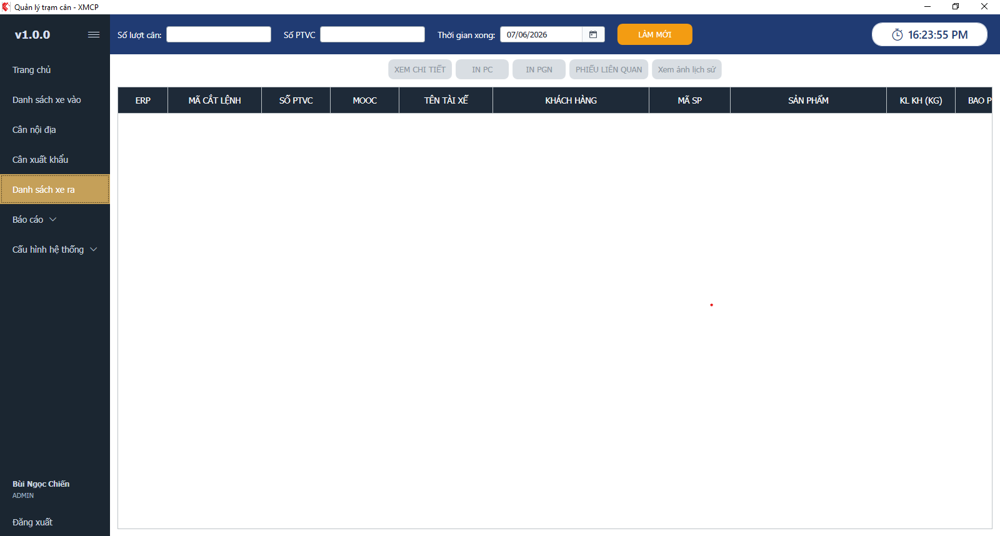

#### Danh sách Phần tử Giao diện Chính ([OutgoingVehicleListView.xaml](file:///g:/Source-code/pmcan_C%23/src/StationApp.UI/Views/OutgoingVehicleListView.xaml))

| Mã phần tử | Loại Control | Tên / Binding | Mô tả chức năng |
| :--- | :--- | :--- | :--- |
| **UI-OUT-TXT-SESSNO** | `TextBox` | `SearchSessionNo` | Nhập mã phiên cân để lọc danh sách. Nhấn Enter để thực thi lọc. |
| **UI-OUT-TXT-PLATE** | `TextBox` | `SearchVehiclePlate` | Nhập biển số xe để lọc danh sách. Nhấn Enter để thực thi lọc. |
| **UI-OUT-DP-COMPLETED** | `DatePicker` | `SelectedCompletedDate` | Chọn ngày hoàn thành để lọc danh sách xe đã hoàn thành (Mặc định: ngày hiện tại). |
| **UI-OUT-BTN-REFRESH** | `Button` | `RefreshCommand` | Đặt các bộ lọc tìm kiếm về rỗng, ngày về hiện tại, đóng các popup chi tiết, và tải lại danh sách xe. |
| **UI-OUT-GRID-VEHICLES** | `DataGrid` | `ItemsSource={Binding Vehicles}`, `SelectedItem={Binding SelectedVehicle}` | Bảng lưới hiển thị danh sách các chuyến xe đã cân xong. Hỗ trợ hiển thị gạch ngang (Strikethrough) và đổi màu xám nếu xe bị hủy cân (`IsNoLoad`), đổi màu đỏ chữ nếu bị quá tải cần tách tải (`HighlightAsSplitOverweight`). |
| **UI-OUT-BTN-DETAILS** | `Button` | `ShowDetailsCommand` | Mở Popup chi tiết phân bổ khối lượng của lượt cân được chọn. Chỉ hoạt động khi có dòng được chọn. |
| **UI-OUT-BTN-PRINTWEIGH** | `Button` | `PrintWeighTicketCommand` | In lại Phiếu Cân (PC) cho lượt cân được chọn. |
| **UI-OUT-BTN-PRINTDELIV** | `Button` | `PrintDeliveryTicketCommand` | In lại Phiếu Giao Nhận (PGN) cho lượt cân được chọn. |
| **UI-OUT-BTN-RELATED** | `Button` | `ShowRelatedTicketsCommand` | Mở Popup hiển thị danh sách chứng từ (phiếu cân, phiếu giao nhận) đã phát hành của lượt cân được chọn. |
| **UI-OUT-BTN-IMGLOG** | `Button` | `ViewImageHistoryCommand` | Mở hộp thoại xem lại các ảnh chụp lịch sử camera khi xe dừng trên bàn cân. |
| **UI-OUT-CHK-OVERRIDE** | `CheckBox` | `UseActualWeightForBaggedCutOrders`, `Visibility={Binding ShowBaggedActualWeightOverride}` | Bật cờ ghi đè/bỏ qua việc lấy đúng số lượng hàng bao đối với lượt cân đang chọn. Chỉ hiển thị đối với hàng Bao (`ProductType` là `Bagged`). |

#### Trình kích hoạt nạp dữ liệu (Data Loading Triggers)
- **Kích hoạt lần đầu**: Khi mở màn hình, gọi phương thức `InitializeAsync` -> `LoadVehiclesAsync` để tải toàn bộ danh sách xe ra trong ngày hiện tại.
- **Kích hoạt do thay đổi ngày**: Khi thuộc tính `SelectedCompletedDate` thay đổi (`OnSelectedCompletedDateChanged`), hệ thống tự động tải lại danh sách xe tương ứng ngày được chọn.
- **Kích hoạt thủ công**: Người dùng bấm nút **LÀM MỚI** (`RefreshCommand`) hoặc nhấn phím Enter trong các ô nhập tìm kiếm biển số/mã phiên cân.

#### Tương tác giữa Lưới và các Popup/Dialog (Grids Interaction Flow)
1. **Lưới xe chính (`Vehicles`) & Popup Chi tiết phân bổ (`DetailLines`)**:
   - Khi chọn một xe trên lưới chính và bấm **XEM CHI TIẾT** (`ShowDetailsCommand`), hệ thống kiểm tra thuộc tính `WeighingSessionId`. Nếu có giá trị, gọi UseCase truy vấn danh sách các dòng hàng phân bổ (`weighing_session_lines`) cục bộ qua phương thức `LoadSessionDetailsAsync`.
   - Nạp kết quả vào lưới `DetailLines` hiển thị trên Popup Modal `IsDetailsVisible = true`. Grid hiển thị chi tiết số thứ tự dòng, mã cắt lệnh, tên khách hàng, tên sản phẩm, khối lượng kế hoạch, số bao kế hoạch, khối lượng phân bổ thực tế, và số bao phân bổ thực tế.
2. **Lưới xe chính (`Vehicles`) & Popup Danh sách chứng từ liên quan (`RelatedTickets`)**:
   - Khi bấm **RELATED TICKETS** (`ShowRelatedTicketsCommand`), hệ thống truy vấn các phiếu cân (`weigh_tickets`) và phiếu giao nhận (`delivery_tickets`) tương ứng với ID phiên cân được chọn từ CSDL cục bộ.
   - Gộp kết quả hiển thị lên lưới `RelatedTickets` trên Popup Modal `IsRelatedTicketsVisible = true`. Danh sách sắp xếp theo loại chứng từ, vai trò phiếu (Master lên trước), thứ tự tách tải, và thời gian phát hành.
3. **Lưới xe chính (`Vehicles`) & Hộp thoại Ảnh lịch sử (`CameraImageHistoryWindow`)**:
   - Khi bấm **XEM ẢNH LỊCH SỬ** (`ViewImageHistoryCommand`), hệ thống lấy các bản ghi ảnh chụp từ bảng `weighing_session_images` cục bộ. Nếu không có ảnh, hiển thị cảnh báo. Nếu có ảnh, khởi tạo ViewModel `CameraImageHistoryViewModel` và hiển thị hộp thoại `CameraImageHistoryWindow` dạng Carousel slide để người dùng xem lại ảnh biển số trước/sau và ảnh toàn cảnh lúc cân.

#### Nghiệp vụ xử lý liên quan ([OutgoingVehicleListViewModel.cs](file:///g:/Source-code/pmcan_C%23/src/StationApp.UI/ViewModels/OutgoingVehicleListViewModel.cs))
- **Ghi đè sai lệch hàng bao**: Khi người dùng tích chọn checkbox **Không lấy đúng số lượng hàng bao** (`UseActualWeightForBaggedCutOrders`), hệ thống gọi UseCase [SetWeighingSessionBaggedActualWeightOverrideUseCase](file:///g:/Source-code/pmcan_C%23/src/StationApp.Application/UseCases/SetWeighingSessionBaggedActualWeightOverrideUseCase.cs) để lưu tùy chọn ghi đè này vào CSDL cục bộ. Điều này cho phép bỏ qua kiểm soát sai lệch bao/khối lượng đối với hàng bao ở lượt cân được chọn. Tác vụ này tự động nạp lại danh sách xe và giữ nguyên dòng đang chọn.
- **Quy trình in lại chứng từ (Print Flow)**:
  1. Người dùng bấm **IN PC** hoặc **IN PGN**.
  2. Hệ thống gọi `LoadPrintContextAsync` để nạp đầy đủ thông tin phiên cân, chi tiết sản phẩm, thông tin xe và các phiếu đã phát hành.
  3. Lấy cấu hình máy in mặc định tương ứng (`DefaultWeighTicketPrinter` hoặc `DefaultDeliveryTicketPrinter`) từ CSDL cấu hình.
  4. Nạp mẫu phôi in (`IPrintTemplateProvider.GetTemplateAsync`) và các profile căn chỉnh lệch lề.
  5. Gọi `BuildPrintBatchPreview` để tạo ảnh biểu mẫu xem trước (Preview) tích hợp vẽ đè tọa độ dịch chuyển qua `PrintOverlayRenderer`.
  6. Hiển thị hộp thoại cấu hình in [PrintOptionsDialogWindow](file:///g:/Source-code/pmcan_C%23/src/StationApp.UI/Views/Dialogs/PrintOptionsDialogWindow.xaml) để người dùng chọn máy in, số bản in, và lề in offset X/Y.
  7. Bấm Xác nhận in: Gọi `IPrintService.PrintAsync` để gửi lệnh in ra máy in vật lý, đồng thời gọi `PersistPrintResultAsync` để thực hiện cập nhật cột `IsPrinted = true`, `LastPrintedAt = DateTime.Now` của phiếu tương ứng vào CSDL cục bộ trong một giao dịch (Transaction) của `IUnitOfWork`.

---

### 4.5.2 Giao diện Danh sách phiếu cân (TicketListView.xaml)

Giao diện tra cứu lịch sử toàn bộ các phiếu cân (`weigh_tickets`) đã được phát hành tại trạm cân dưới dạng danh sách lưu trữ cục bộ.

#### Danh sách Phần tử Giao diện Chính ([TicketListView.xaml](file:///g:/Source-code/pmcan_C%23/src/StationApp.UI/Views/TicketListView.xaml))

| Mã phần tử | Loại Control | Tên / Binding | Mô tả chức năng |
| :--- | :--- | :--- | :--- |
| **UI-TKT-TXT-SEARCH** | `TextBox` | `SearchKeyword` | Ô nhập từ khóa tìm kiếm (biển số xe hoặc số phiếu cân). Hỗ trợ nhấn Enter để tìm kiếm. |
| **UI-TKT-BTN-SEARCH** | `Button` | `SearchCommand` | Thực thi tìm kiếm phiếu cân theo bộ lọc từ khóa. |
| **UI-TKT-BTN-CREATE** | `Button` | `CreateTicketCommand` | Tạo phiếu cân thử nghiệm (chỉ dùng cho debug/test). |
| **UI-TKT-GRID-DATA** | `DataGrid` | `ItemsSource={Binding Tickets}`, `SelectedItem={Binding SelectedTicket}` | Lưới danh sách các phiếu cân cục bộ bao gồm các cột: Số phiếu, Số xe, Loại phiếu (Inbound/Outbound), Trạng thái, Cân 1 (kg), Cân 2 (kg), Trọng lượng tịnh (kg), Trạng thái đồng bộ, và Ngày tạo. |

#### Nghiệp vụ xử lý liên quan ([TicketListViewModel.cs](file:///g:/Source-code/pmcan_C%23/src/StationApp.UI/ViewModels/TicketListViewModel.cs))
- **Tìm kiếm dữ liệu**: Khi nhấn nút tìm kiếm hoặc nhấn phím Enter trong ô nhập từ khóa, hệ thống gọi `ITicketRepository.SearchAsync` để truy vấn CSDL cục bộ với từ khóa tìm kiếm, nạp kết quả trả về vào danh sách `Tickets`.
- **Tạo phiếu thử**: Khi bấm nút **TẠO PHIẾU**, hệ thống gọi `CreateTicketUseCase` để sinh một phiếu cân thử nghiệm với biển số xe mặc định "TEST-001" có loại nghiệp vụ là `OUTBOUND` và tự động tải lại danh sách phiếu cân.

---

## 4.6 Phân hệ Báo cáo Thống kê (Reporting Module)

Phân hệ báo cáo cung cấp các form lọc tham số để kết xuất báo cáo thống kê sản lượng hàng hóa nhập/xuất tại trạm cân ra tệp Microsoft Excel (`.xlsx`). Hệ thống không hiển thị lưới kết quả trực tiếp trên giao diện WPF nhằm tăng tốc độ tải dữ liệu và tối ưu trải nghiệm người dùng, thay vào đó thực hiện kết xuất trực tiếp ra file Excel.

### 4.6.1 Báo cáo tổng hợp cân nhập hàng (InboundSummaryReportView.xaml)

Báo cáo chi tiết sản lượng hàng hóa, nguyên vật liệu nhập vào nhà máy (Inbound) trong một khoảng thời gian được cấu hình.

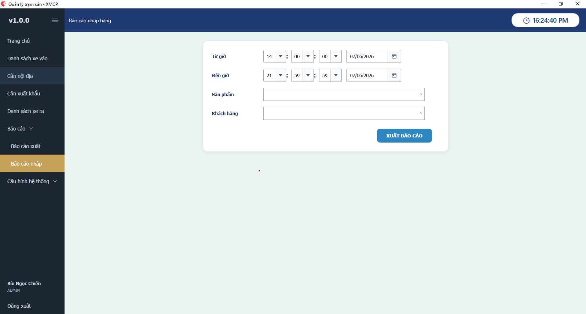

#### Danh sách Phần tử Giao diện Chính ([InboundSummaryReportView.xaml](file:///g:/Source-code/pmcan_C%23/src/StationApp.UI/Views/InboundSummaryReportView.xaml))

| Mã phần tử | Loại Control | Tên / Binding | Mô tả chức năng |
| :--- | :--- | :--- | :--- |
| **UI-RPT-IN-FROM-HOUR** | `ComboBox` | `HourOptions`, `FromHour` | Chọn Giờ bắt đầu lọc báo cáo (00 đến 23). |
| **UI-RPT-IN-FROM-MIN** | `ComboBox` | `MinuteOptions`, `FromMinute` | Chọn Phút bắt đầu lọc báo cáo (00 đến 59). |
| **UI-RPT-IN-FROM-SEC** | `ComboBox` | `SecondOptions`, `FromSecond` | Chọn Giây bắt đầu lọc báo cáo (00 đến 59). |
| **UI-RPT-IN-FROM-DATE** | `DatePicker` | `FromDate` | Chọn Ngày bắt đầu lọc báo cáo. |
| **UI-RPT-IN-TO-HOUR** | `ComboBox` | `HourOptions`, `ToHour` | Chọn Giờ kết thúc lọc báo cáo (00 đến 23). |
| **UI-RPT-IN-TO-MIN** | `ComboBox` | `MinuteOptions`, `ToMinute` | Chọn Phút kết thúc lọc báo cáo (00 đến 59). |
| **UI-RPT-IN-TO-SEC** | `ComboBox` | `SecondOptions`, `ToSecond` | Chọn Giây kết thúc lọc báo cáo (00 đến 59). |
| **UI-RPT-IN-TO-DATE** | `DatePicker` | `ToDate` | Chọn Ngày kết thúc lọc báo cáo. |
| **UI-RPT-IN-COM-PRODUCT** | `ComboBox` | `ProductOptionsView`, `SelectedProduct`, `ProductSearchText` | Ô chọn sản phẩm vật tư có chức năng gõ tìm kiếm tự động (Autocomplete) lọc theo mã/tên sản phẩm. |
| **UI-RPT-IN-COM-CUSTOMER** | `ComboBox` | `CustomerOptionsView`, `SelectedCustomer`, `CustomerSearchText` | Ô chọn khách hàng/nhà phân phối có chức năng gõ tìm kiếm tự động (Autocomplete) lọc theo mã/tên khách hàng. |
| **UI-RPT-IN-BTN-EXCEL** | `Button` | `ExportCommand` | Thực hiện kiểm tra tham số, mở hộp thoại chọn đường dẫn lưu file Excel, gọi UseCases truy vấn và xuất file Excel. |

---

### 4.6.2 Báo cáo tổng hợp cân xuất khẩu (ExportSummaryReportView.xaml)

Báo cáo tổng hợp sản lượng xuất khẩu xi măng, clinker (Outbound) chạy qua luồng cân xuất khẩu đơn hàng lớn.

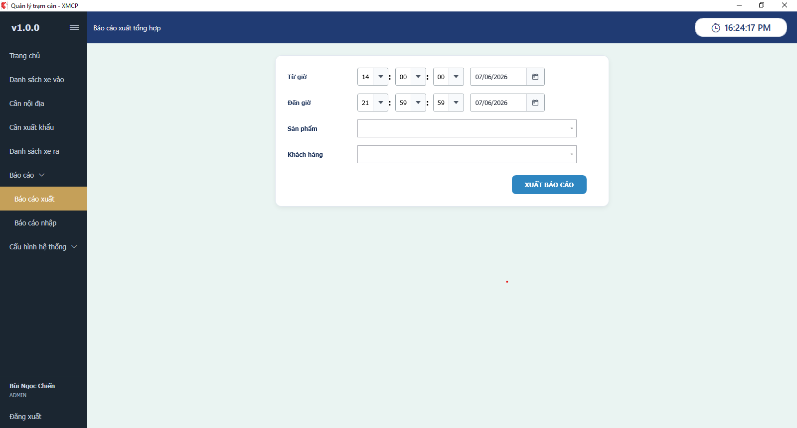

#### Danh sách Phần tử Giao diện Chính ([ExportSummaryReportView.xaml](file:///g:/Source-code/pmcan_C%23/src/StationApp.UI/Views/ExportSummaryReportView.xaml))

| Mã phần tử | Loại Control | Tên / Binding | Mô tả chức năng |
| :--- | :--- | :--- | :--- |
| **UI-RPT-EX-FROM-HOUR** | `ComboBox` | `HourOptions`, `FromHour` | Chọn Giờ bắt đầu lọc báo cáo (00 đến 23). |
| **UI-RPT-EX-FROM-MIN** | `ComboBox` | `MinuteOptions`, `FromMinute` | Chọn Phút bắt đầu lọc báo cáo (00 đến 59). |
| **UI-RPT-EX-FROM-SEC** | `ComboBox` | `SecondOptions`, `FromSecond` | Chọn Giây bắt đầu lọc báo cáo (00 đến 59). |
| **UI-RPT-EX-FROM-DATE** | `DatePicker` | `FromDate` | Chọn Ngày bắt đầu lọc báo cáo. |
| **UI-RPT-EX-TO-HOUR** | `ComboBox` | `HourOptions`, `ToHour` | Chọn Giờ kết thúc lọc báo cáo (00 đến 23). |
| **UI-RPT-EX-TO-MIN** | `ComboBox` | `MinuteOptions`, `ToMinute` | Chọn Phút kết thúc lọc báo cáo (00 đến 59). |
| **UI-RPT-EX-TO-SEC** | `ComboBox` | `SecondOptions`, `ToSecond` | Chọn Giây kết thúc lọc báo cáo (00 đến 59). |
| **UI-RPT-EX-TO-DATE** | `DatePicker` | `ToDate` | Chọn Ngày kết thúc lọc báo cáo. |
| **UI-RPT-EX-COM-PRODUCT** | `ComboBox` | `ProductOptionsView`, `SelectedProduct`, `ProductSearchText` | Ô chọn sản phẩm có chức năng gõ gợi ý tìm kiếm tự động lọc theo mã/tên. |
| **UI-RPT-EX-COM-CUSTOMER** | `ComboBox` | `CustomerOptionsView`, `SelectedCustomer`, `CustomerSearchText` | Ô chọn khách hàng có chức năng gõ gợi ý tìm kiếm tự động lọc theo mã/tên. |
| **UI-RPT-EX-BTN-EXCEL** | `Button` | `ExportCommand` | Thực hiện kiểm tra tham số, mở hộp thoại chọn đường dẫn lưu file Excel, gọi UseCases truy vấn và xuất file Excel. |

---

### 4.6.3 Nghiệp vụ xử lý liên quan ([InboundSummaryReportViewModel.cs](file:///g:/Source-code/pmcan_C%23/src/StationApp.UI/ViewModels/InboundSummaryReportViewModel.cs), [ExportSummaryReportViewModel.cs](file:///g:/Source-code/pmcan_C%23/src/StationApp.UI/ViewModels/ExportSummaryReportViewModel.cs))

#### 1. Logic Tự động Điền Ca Làm Việc Hiện Tại (Auto-fill Shift Range)
Khi người dùng mở màn hình báo cáo, hệ thống tự động tính toán ca làm việc hiện tại của nhân viên dựa trên thời gian thực tế của máy tính (`ResolveShiftRange`) để điền mặc định cho bộ lọc Ngày/Giờ:
- **Ca 1**: Từ `06:00:00` đến `13:59:59` của ngày hiện tại.
- **Ca 2**: Từ `14:00:00` đến `21:59:59` của ngày hiện tại.
- **Ca 3**: Từ `22:00:00` đến `05:59:59` sáng hôm sau.
  - *Lưu ý*: Nếu thời gian mở màn hình nằm trong khoảng từ `00:00:00` đến `05:59:59`, ngày bắt đầu lọc sẽ lùi lại 1 ngày và giờ bắt đầu là `22:00:00` ngày hôm trước, giờ kết thúc là `05:59:59` ngày hiện tại.

#### 2. Quy trình kiểm tra và kết xuất Excel (Excel Export Flow)
Khi người dùng bấm **XUẤT BÁO CÁO** (`ExportCommand`):
1. **Kiểm tra dữ liệu đầu vào (`TryBuildDateRange`)**:
   - Xác minh các trường Ngày bắt đầu, Giờ/Phút/Giây bắt đầu và Ngày kết thúc, Giờ/Phút/Giây kết thúc có đầy đủ và hợp lệ về mặt dữ liệu số (Giờ: 0-23, Phút/Giây: 0-59).
   - Kiểm tra đảm bảo thời gian bắt đầu (`FromTime`) không lớn hơn thời gian kết thúc (`ToTime`). Nếu không hợp lệ, hiển thị Toast cảnh báo và dừng thực thi.
2. **Chọn thư mục và đặt tên file**:
   - Hiển thị hộp thoại chọn vị trí lưu tệp tin `SaveFileDialog` mặc định lọc đuôi `.xlsx` (Excel Workbook).
   - Đường dẫn thư mục gợi ý ban đầu là thư mục **Downloads** của tài khoản người dùng Windows hiện tại. Nếu thư mục này không tồn tại, hệ thống sử dụng thư mục **My Documents**.
   - Tên file gợi ý mặc định: `BaoCaoNhapHang_yyyyMMdd_HHmmss_yyyyMMdd_HHmmss.xlsx` (đối với Inbound) hoặc `BaoCaoXuatTongHop_yyyyMMdd_HHmmss_yyyyMMdd_HHmmss.xlsx` (đối với Export).
3. **Thực thi truy vấn và ghi file**:
   - Hệ thống chuyển đổi mã sản phẩm và mã khách hàng được chọn (nếu chọn tất cả thì truyền giá trị `null`).
   - Gọi UseCase [BuildInboundSummaryReportUseCase](file:///g:/Source-code/pmcan_C%23/src/StationApp.Application/UseCases/BuildInboundSummaryReportUseCase.cs) hoặc [BuildExportSummaryReportUseCase](file:///g:/Source-code/pmcan_C%23/src/StationApp.Application/UseCases/BuildExportSummaryReportUseCase.cs) để thực hiện truy vấn cơ sở dữ liệu cục bộ lấy dữ liệu báo cáo.
   - Gọi UseCase [ExportInboundSummaryReportUseCase](file:///g:/Source-code/pmcan_C%23/src/StationApp.Application/UseCases/ExportInboundSummaryReportUseCase.cs) hoặc [ExportExportSummaryReportUseCase](file:///g:/Source-code/pmcan_C%23/src/StationApp.Application/UseCases/ExportExportSummaryReportUseCase.cs) để ghi tài liệu báo cáo ra file Excel vật lý tại đường dẫn đã chọn.
   - Hiển thị Toast thông báo thành công và kèm theo đường dẫn file Excel vừa lưu. Nếu có lỗi phát sinh trong quá trình truy vấn hoặc ghi đè file (ví dụ file đang bị mở bởi phần mềm khác), hiển thị Toast thông báo lỗi chi tiết.

---

## 4.7 Phân hệ Cấu hình Hệ thống (System Configuration Module - SettingsView.xaml)

Giao diện cấu hình toàn bộ hệ thống trạm cân, được tổ chức thành 9 Tab con dành riêng cho Quản trị viên (ADMIN) thiết lập, kiểm tra và bảo trì hệ thống.

---

### 4.7.1 Cấu hình thiết bị cân (ScaleDeviceConfigView.xaml)

Tab cấu hình kết nối cổng nối tiếp (Serial COM Port) với đầu cân hiển thị số (Scale Indicator) và thuật toán giải mã.

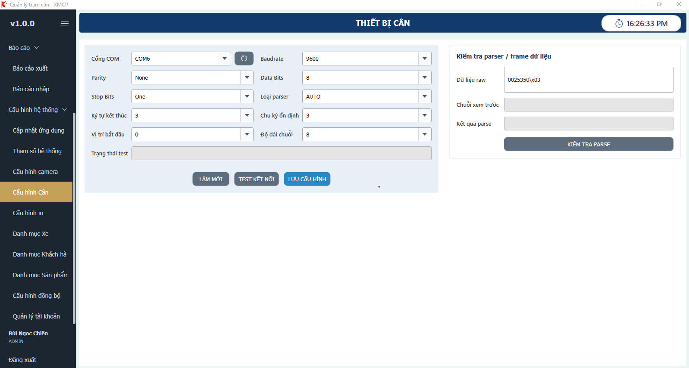

#### Danh sách Phần tử Giao diện Chính ([ScaleDeviceConfigView.xaml](file:///g:/Source-code/pmcan_C%23/src/StationApp.UI/Views/Settings/ScaleDeviceConfigView.xaml))

| Mã phần tử | Loại Control | Tên / Binding | Mô tả chức năng |
| :--- | :--- | :--- | :--- |
| **UI-CFG-SCL-PORT** | `ComboBox` | `ComPort`, `AvailablePorts` | Chọn cổng COM vật lý khả dụng trên máy tính (COM1, COM2...). |
| **UI-CFG-SCL-BAUD** | `ComboBox` | `Baudrate`, `AvailableBaudrates` | Chọn tốc độ truyền dữ liệu (1200 đến 115200, mặc định: 9600). |
| **UI-CFG-SCL-PARITY** | `ComboBox` | `Parity`, `AvailableParities` | Chọn Parity bit (None, Even, Odd, Mark, Space). |
| **UI-CFG-SCL-DATABITS** | `ComboBox` | `DataBits`, `AvailableDataBits` | Chọn độ dài dữ liệu (7 hoặc 8 bits). |
| **UI-CFG-SCL-STOPBITS** | `ComboBox` | `StopBits`, `AvailableStopBits` | Chọn Stop bit (One hoặc Two). |
| **UI-CFG-SCL-PARSER** | `ComboBox` | `ParserType`, `AvailableParserTypes` | Thuật toán parser (Auto, YaohuaWeightFrameParser, Default). |
| **UI-CFG-SCL-ENDCHAR** | `ComboBox` | `FrameEndChar`, `AvailableFrameEndChars` | Kí tự kết thúc khung truyền (CR, LF, ETX). |
| **UI-CFG-SCL-STABLE** | `ComboBox` | `StableCycles`, `AvailableStableCycles` | Số chu kỳ lặp liên tiếp để đầu cân xác nhận số cân ổn định (2 đến 5). |
| **UI-CFG-SCL-SUBSTART** | `ComboBox` | `WeightSubstringStart` | Vị trí bắt đầu cắt chuỗi lấy khối lượng trong khung truyền thô (0 đến 32). |
| **UI-CFG-SCL-SUBLEN** | `ComboBox` | `WeightSubstringLength` | Độ dài chuỗi khối lượng cần cắt (1 đến 32). |
| **UI-CFG-SCL-TXTSAMPLE**| `TextBox` | `SampleRawFrame` | Ô nhập chuỗi khung truyền mẫu để chạy thử thuật toán giải mã. |
| **UI-CFG-SCL-BTN-PARSE** | `Button` | `TestParseCommand` | Thực hiện giải mã chuỗi mẫu và hiển thị kết quả cắt chuỗi và khối lượng. |
| **UI-CFG-SCL-BTN-TEST**  | `Button` | `TestConnectionCommand` | Mở cổng COM và đọc thử tín hiệu đầu cân thực tế trong 5 giây. |
| **UI-CFG-SCL-BTN-SAVE**  | `Button` | `SaveCommand` | Lưu cấu hình cổng COM vào CSDL, ngắt kết nối cũ và tái khởi động cổng COM mới. |
| **UI-CFG-SCL-BTN-PORTS** | `Button` | `RefreshPortsCommand` | Quét lại danh sách cổng COM vật lý khả dụng hiện tại trên Windows. |

#### Nghiệp vụ xử lý liên quan ([ScaleDeviceConfigViewModel.cs](file:///g:/Source-code/pmcan_C%23/src/StationApp.UI/ViewModels/Settings/ScaleDeviceConfigViewModel.cs))
- **Quyền hạn**: Phải có quyền quản trị cấu hình thiết bị cân (`CanManageDeviceConfiguration`).
- **Lưu cấu hình**: Khi bấm **LƯU** (`SaveCommand`), hệ thống gọi [UpdateScaleDeviceSettingsUseCase](file:///g:/Source-code/pmcan_C%23/src/StationApp.Application/UseCases/UpdateScaleDeviceSettingsUseCase.cs) để cập nhật bảng `app_config`, sau đó gọi ngầm `ReconnectScaleDeviceAsync` để ngắt cổng COM hiện tại và khởi tạo kết nối Serial Port với bộ thông số mới.
- **Chạy thử parse chuỗi mẫu (`TestParseCommand`)**: Sử dụng chuỗi thô nhập tại `SampleRawFrame` (hỗ trợ giải mã các kí tự điều khiển đặc biệt như `\x03`, `\r`, `\n`). Khởi tạo parser động và hiển thị chuỗi con cắt được và số cân tương ứng.
- **Test kết nối thực tế (`TestConnectionCommand`)**: Khởi tạo một đối tượng kết nối tạm thời `SerialScaleDevice` theo cấu hình hiện tại và lắng nghe trong tối đa 5 giây. Nếu nhận được dữ liệu, hiển thị Toast thành công kèm số cân nhận được và chuỗi raw payload thô. Nếu mở cổng thành công nhưng không có dữ liệu, hiển thị cảnh báo.

---

### 4.7.2 Cấu hình camera IP RTSP (CameraConfigView.xaml)

Tab thiết lập luồng kết nối RTSP và các thông số chụp ảnh cho 4 camera giám sát (2 camera chụp ảnh vị trí cân C2, 2 camera chụp ảnh toàn cảnh/phụ trợ C6).

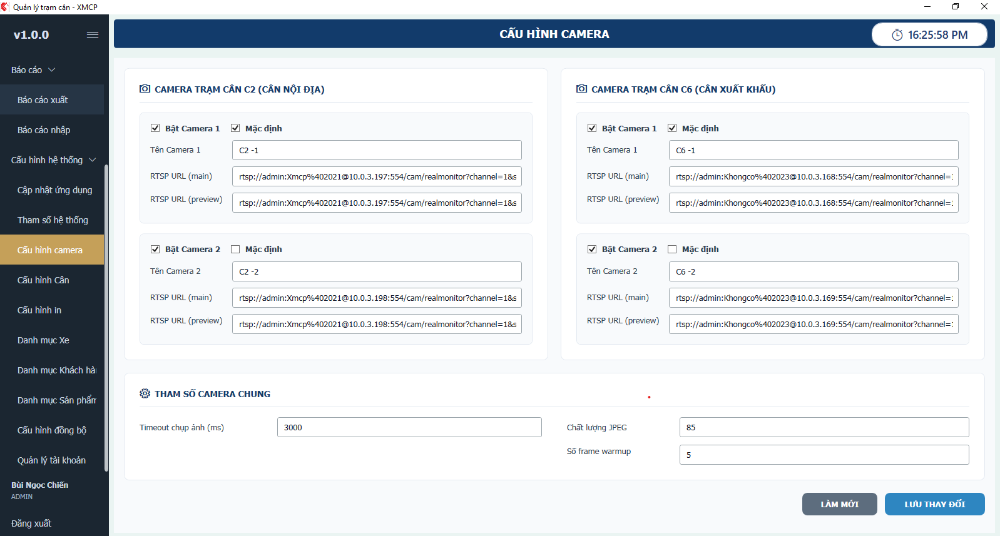

#### Danh sách Phần tử Giao diện Chính ([CameraConfigView.xaml](file:///g:/Source-code/pmcan_C%23/src/StationApp.UI/Views/Settings/CameraConfigView.xaml))

| Mã phần tử | Loại Control | Tên / Binding | Mô tả chức năng |
| :--- | :--- | :--- | :--- |
| **UI-CFG-CAM-C2-1-EN** | `CheckBox` | `Camera1Enabled` | Bật/tắt hoạt động của Camera 1 (Đầu xe). |
| **UI-CFG-CAM-C2-1-URL**| `TextBox` | `Camera1RtspUrl` | Nhập RTSP URL chính để chụp ảnh biển số cho Camera 1. |
| **UI-CFG-CAM-C2-1-PRV**| `TextBox` | `Camera1PreviewRtspUrl` | Nhập RTSP URL phụ để phát luồng live preview cho Camera 1. |
| **UI-CFG-CAM-C2-2-EN** | `CheckBox` | `Camera2Enabled` | Bật/tắt hoạt động của Camera 2 (Đuôi xe). |
| **UI-CFG-CAM-C2-2-URL**| `TextBox` | `Camera2RtspUrl` | Nhập RTSP URL chính để chụp ảnh biển số cho Camera 2. |
| **UI-CFG-CAM-C2-2-PRV**| `TextBox` | `Camera2PreviewRtspUrl` | Nhập RTSP URL phụ để phát luồng live preview cho Camera 2. |
| **UI-CFG-CAM-C6-1-EN** | `CheckBox` | `CameraC6_1Enabled` | Bật/tắt hoạt động của Camera C6-1. |
| **UI-CFG-CAM-C6-1-URL**| `TextBox` | `CameraC6_1RtspUrl` | Nhập RTSP URL chính để chụp ảnh của Camera C6-1. |
| **UI-CFG-CAM-C6-1-PRV**| `TextBox` | `CameraC6_1PreviewRtspUrl` | Nhập RTSP URL phụ phát preview của Camera C6-1. |
| **UI-CFG-CAM-C6-2-EN** | `CheckBox` | `CameraC6_2Enabled` | Bật/tắt hoạt động của Camera C6-2. |
| **UI-CFG-CAM-C6-2-URL**| `TextBox` | `CameraC6_2RtspUrl` | Nhập RTSP URL chính chụp ảnh của Camera C6-2. |
| **UI-CFG-CAM-C6-2-PRV**| `TextBox` | `CameraC6_2PreviewRtspUrl` | Nhập RTSP URL phụ phát preview của Camera C6-2. |
| **UI-CFG-CAM-PRV-DEF** | `ComboBox` | `CameraPreviewDefault` | Chọn camera preview mặc định hiển thị trên màn hình chính (CAM1 hoặc CAM2). |
| **UI-CFG-CAM-TIMEOUT** | `TextBox` | `CameraCaptureTimeoutMs` | Nhập thời gian chờ chụp ảnh tối đa (ms). |
| **UI-CFG-CAM-QUALITY** | `TextBox` | `CameraCaptureJpegQuality` | Nhập chất lượng ảnh Jpeg (1 đến 100). |
| **UI-CFG-CAM-WARMUP**  | `TextBox` | `CameraCaptureWarmupFrames` | Nhập số khung hình bỏ qua khi khởi động camera để lấy ảnh nét (mặc định: 5). |
| **UI-CFG-CAM-BTN-SAVE** | `Button` | `SaveCommand` | Lưu toàn bộ thiết lập camera vào CSDL. |

#### Nghiệp vụ xử lý liên quan ([CameraConfigViewModel.cs](file:///g:/Source-code/pmcan_C%23/src/StationApp.UI/ViewModels/Settings/CameraConfigViewModel.cs))
- **Quyền hạn**: Phải có quyền quản lý hệ thống (`CanManageCameraSettings`).
- **Lưu cấu hình**: Khi bấm **LƯU**, hệ thống gọi [UpdateCameraSettingsUseCase](file:///g:/Source-code/pmcan_C%23/src/StationApp.Application/UseCases/UpdateCameraSettingsUseCase.cs) để cập nhật các tham số key tương ứng trong bảng `app_config` (ví dụ `Camera1Enabled`, `Camera1RtspUrl`, `CameraPreviewDefault`, v.v.).
- **Đồng bộ Camera Preview mặc định**: Khi người dùng thay đổi camera mặc định (ví dụ check/uncheck `IsCamera1DefaultPreview` hoặc `IsCamera2DefaultPreview`), hệ thống tự động đồng bộ giá trị tương ứng `CAM1` hoặc `CAM2` lên UI và ngược lại.

---

### 4.7.3 Cấu hình phôi in ấn (PrintConfigView.xaml)

Tab thiết lập máy in mặc định cho từng loại chứng từ và căn chỉnh offset tọa độ lề in.

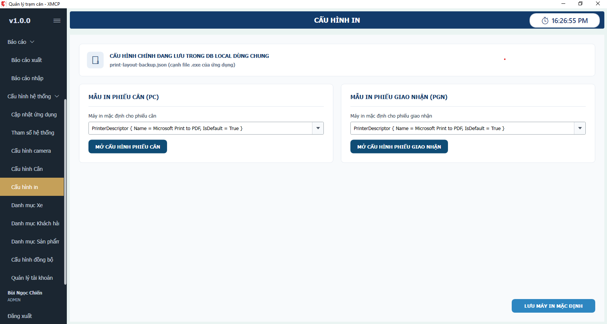

Để tinh chỉnh vị trí in ấn chính xác cho từng loại biểu mẫu được thiết kế sẵn của nhà máy, Quản trị viên sử dụng giao diện căn chỉnh tọa độ in ấn:

.png)

#### Danh sách Phần tử Giao diện Chính ([PrintConfigView.xaml](file:///g:/Source-code/pmcan_C%23/src/StationApp.UI/Views/Settings/PrintConfigView.xaml))

| Mã phần tử | Loại Control | Tên / Binding | Mô tả chức năng |
| :--- | :--- | :--- | :--- |
| **UI-CFG-PRN-WEIGHDEV**| `ComboBox` | `WeighTicketPrinters`, `SelectedWeighTicketPrinter` | Chọn máy in mặc định dùng để in Phiếu Cân. |
| **UI-CFG-PRN-DELIVDEV**| `ComboBox` | `DeliveryTicketPrinters`, `SelectedDeliveryTicketPrinter` | Chọn máy in mặc định dùng để in Phiếu Giao Nhận. |
| **UI-CFG-PRN-BTN-WCFG**| `Button` | `ConfigureWeighTicketCommand` | Mở hộp thoại căn lề in offset cho phôi in Phiếu Cân. |
| **UI-CFG-PRN-BTN-DCFG**| `Button` | `ConfigureDeliveryTicketCommand` | Mở hộp thoại căn lề in offset cho phôi in Phiếu Giao Nhận. |
| **UI-CFG-PRN-BTN-SAVE**| `Button` | `SavePrinterDefaultsCommand` | Lưu cấu hình máy in mặc định của hệ thống. |
| **UI-CFG-PRN-TXT-BKUP**| `TextBlock` | `LastBackupFileDisplay` | Hiển thị thông tin file sao lưu mẫu in hiện tại (lưu dưới dạng file nén backup). |

#### Nghiệp vụ xử lý liên quan ([PrintConfigViewModel.cs](file:///g:/Source-code/pmcan_C%23/src/StationApp.UI/ViewModels/Settings/PrintConfigViewModel.cs))
- **Quyền hạn**: Phải có quyền cấu hình mẫu in (`CanManagePrintLayout`).
- **Cấu hình lề in**: Khi người dùng bấm **Cấu hình** phôi in, hệ thống mở hộp thoại [PrintOptionsDialogWindow](file:///g:/Source-code/pmcan_C%23/src/StationApp.UI/Views/Dialogs/PrintOptionsDialogWindow.xaml). Tại đây, Admin có thể nhập độ lệch lề in theo chiều ngang Offset X (mm) và chiều dọc Offset Y (mm) dưới dạng số thực (`decimal`). Các giá trị này sẽ được lưu vào bảng `print_template_profiles` cục bộ và tự động sao lưu cấu hình phôi in (`templateProvider.ExportBackupAsync`).

---

### 4.7.4 Quản lý tài khoản người dùng (AccountManagementView.xaml)

Tab quản trị danh sách tài khoản, phân quyền (Admin / Operator), thiết lập và reset mật khẩu.

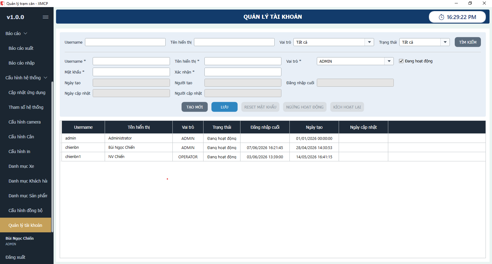

#### Danh sách Phần tử Giao diện Chính ([AccountManagementView.xaml](file:///g:/Source-code/pmcan_C%23/src/StationApp.UI/Views/Settings/AccountManagementView.xaml))

| Mã phần tử | Loại Control | Tên / Binding | Mô tả chức năng |
| :--- | :--- | :--- | :--- |
| **UI-CFG-ACC-TXT-SNAME**| `TextBox` | `SearchUsername` | Tìm kiếm tài khoản theo Tên đăng nhập. |
| **UI-CFG-ACC-TXT-SDISP**| `TextBox` | `SearchDisplayName` | Tìm kiếm tài khoản theo Tên hiển thị. |
| **UI-CFG-ACC-COM-SROLE**| `ComboBox` | `SelectedSearchRoleOption` | Lọc tài khoản theo vai trò (Tất cả, ADMIN, OPERATOR). |
| **UI-CFG-ACC-COM-SSTAT**| `ComboBox` | `SelectedStatusFilter` | Lọc tài khoản theo trạng thái (Tất cả, Đang hoạt động, Ngừng hoạt động). |
| **UI-CFG-ACC-BTN-SRCH** | `Button` | `SearchCommand` | Thực hiện tìm kiếm theo các điều kiện lọc. |
| **UI-CFG-ACC-BTN-NEW**  | `Button` | `NewCommand` | Chuyển Form nhập liệu sang chế độ tạo tài khoản mới (Clear Form). |
| **UI-CFG-ACC-GRID**     | `DataGrid` | `ItemsSource={Binding Users}`, `SelectedItem={Binding SelectedUser}` | Lưới danh sách người dùng. |
| **UI-CFG-ACC-TXT-UNAME**| `TextBox` | `EditUsername`, `IsReadOnly={Binding IsUsernameReadOnly}` | Ô nhập Tên đăng nhập (Chỉ cho phép sửa khi tạo mới). |
| **UI-CFG-ACC-TXT-DISP** | `TextBox` | `EditDisplayName` | Ô nhập Tên hiển thị. |
| **UI-CFG-ACC-COM-ROLE** | `ComboBox` | `SelectedRoleOption` | Chọn vai trò tài khoản (ADMIN, OPERATOR). |
| **UI-CFG-ACC-PASS**     | `PasswordBox` | `CreatePassword` | Ô nhập Mật khẩu (Chỉ hiển thị khi tạo mới). |
| **UI-CFG-ACC-CONFIRM**  | `PasswordBox` | `CreateConfirmPassword` | Ô nhập lại Mật khẩu xác nhận. |
| **UI-CFG-ACC-CHK-ACT**  | `CheckBox` | `EditIsActive` | Lựa chọn trạng thái hoạt động. |
| **UI-CFG-ACC-BTN-SAVE** | `Button` | `SaveCommand` | Thực hiện Lưu thông tin thêm mới hoặc cập nhật tài khoản. |
| **UI-CFG-ACC-BTN-RESET**| `Button` | `ResetPasswordCommand` | Mở hộp thoại reset mật khẩu cho tài khoản đang chọn. |
| **UI-CFG-ACC-BTN-DEACT**| `Button` | `DeactivateCommand` | Thực hiện ngừng hoạt động tài khoản đang chọn. |
| **UI-CFG-ACC-BTN-REACT**| `Button` | `ReactivateCommand` | Thực hiện kích hoạt lại tài khoản đang chọn. |

#### Nghiệp vụ xử lý liên quan ([AccountManagementViewModel.cs](file:///g:/Source-code/pmcan_C%23/src/StationApp.UI/ViewModels/Settings/AccountManagementViewModel.cs))
- **Băm mật khẩu bằng BCrypt**: Khi tạo tài khoản mới hoặc reset mật khẩu, chuỗi mật khẩu thô của người dùng được gửi qua UseCase [CreateUserAccountUseCase](file:///g:/Source-code/pmcan_C%23/src/StationApp.Application/UseCases/CreateUserAccountUseCase.cs) hoặc [ResetUserPasswordUseCase](file:///g:/Source-code/pmcan_C%23/src/StationApp.Application/UseCases/ResetUserPasswordUseCase.cs), thực hiện mã hóa băm bảo mật BCrypt và lưu vào trường `PasswordHash` trong bảng `users` cục bộ.
- **Kích hoạt/Vô hiệu hóa tài khoản**: Khi bấm Ngừng hoạt động hoặc Kích hoạt lại, hệ thống hiển thị hộp thoại xác nhận (`dialogService.ShowConfirmAsync`). Sau khi Admin xác nhận, hệ thống gọi [SetUserActiveStatusUseCase](file:///g:/Source-code/pmcan_C%23/src/StationApp.Application/UseCases/SetUserActiveStatusUseCase.cs) để cập nhật cột `IsActive` trong DB cục bộ và làm mới lưới.

---

### 4.7.5 Tham số hệ thống và Sao lưu dữ liệu (SystemSettingsView.xaml)

Tab cấu hình các thông số chung của trạm cân và cài đặt thư mục sao lưu cơ sở dữ liệu cục bộ.

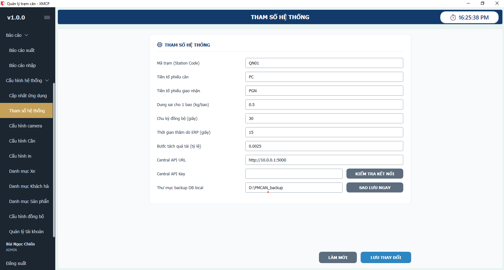

#### Danh sách Phần tử Giao diện Chính ([SystemSettingsView.xaml](file:///g:/Source-code/pmcan_C%23/src/StationApp.UI/Views/Settings/SystemSettingsView.xaml))

| Mã phần tử | Loại Control | Tên / Binding | Mô tả chức năng |
| :--- | :--- | :--- | :--- |
| **UI-CFG-SYS-STCODE**  | `TextBox` | `StationCode` | Nhập mã định danh trạm cân (ví dụ: TRAM01). |
| **UI-CFG-SYS-TKPRE**   | `TextBox` | `TicketPrefix` | Nhập tiền tố số phiếu cân (ví dụ: PC). |
| **UI-CFG-SYS-DLPRE**   | `TextBox` | `DeliveryPrefix` | Nhập tiền tố số phiếu giao nhận (ví dụ: DN). |
| **UI-CFG-SYS-TOLERANCE**| `TextBox` | `ToleranceKgPerBag` | Dung sai cân tối đa cho phép trên mỗi bao (kg/bao). Mặc định: 2.0. |
| **UI-CFG-SYS-SYNCINT** | `TextBox` | `SyncIntervalSeconds` | Chu kỳ thời gian đồng bộ dữ liệu Outbox lên Central ERP (giây). |
| **UI-CFG-SYS-POLLINT** | `TextBox` | `RegistrationInboundPollSeconds` | Chu kỳ thời gian tự động thăm dò đơn đăng ký cân từ ERP (giây). |
| **UI-CFG-SYS-SPLITSTEP**| `TextBox` | `OverweightSplitStepWeight` | Tỷ lệ bước tách quá tải trọng cho phép (mặc định: 0.1). |
| **UI-CFG-SYS-APIURL**  | `TextBox` | `CentralApiUrl` | URL máy chủ API trung tâm của ERP. |
| **UI-CFG-SYS-APIKEY**  | `PasswordBox` | `CentralApiKey` | Khóa bảo mật API Key để xác thực kết nối Central Server. |
| **UI-CFG-SYS-BKDIR**   | `TextBox` | `LocalDatabaseBackupDirectory`| Thư mục lưu trữ tệp tin sao lưu cơ sở dữ liệu cục bộ. Tooltip: Mặc định là `C:\ProgramData\StationApp\SqlBackups`. |
| **UI-CFG-SYS-BTN-TEST** | `Button` | `TestCentralApiConnectionCommand` | Kiểm tra kết nối mạng và khóa API Key tới Central Server ERP. |
| **UI-CFG-SYS-BTN-BKNOW**| `Button` | `RunLocalDatabaseBackupNowCommand` | Thực thi sao lưu cơ sở dữ liệu SQL Server cục bộ ngay lập tức. |
| **UI-CFG-SYS-BTN-SAVE** | `Button` | `SaveCommand` | Lưu toàn bộ tham số cấu hình hệ thống. |
| **UI-CFG-SYS-BTN-RESET**| `Button` | `LoadCommand` | Hủy các thay đổi chưa lưu và tải lại cấu hình từ CSDL. |

#### Nghiệp vụ xử lý liên quan ([SystemSettingsViewModel.cs](file:///g:/Source-code/pmcan_C%23/src/StationApp.UI/ViewModels/Settings/SystemSettingsViewModel.cs))
- **Kiểm tra kết nối Central API (`TestCentralApiConnectionCommand`)**: Gọi `ICentralApiHealthChecker.CheckAsync` để thực hiện gửi request test tới Central URL được nhập. Kết quả thành công hoặc thất bại sẽ hiển thị chi tiết qua hộp thoại thông báo.
- **Tác vụ Tự động Sao lưu CSDL cục bộ (FR-BACKUP-001)**: Tác vụ chạy ngầm `LocalDatabaseBackupWorker` chạy định kỳ mỗi ngày. Đúng vào lúc **03:00 AM**, worker gọi câu lệnh backup cơ sở dữ liệu SQL Server lưu vào thư mục `LocalDatabaseBackupDirectory` dưới định dạng tệp `yyyyMMdd_{DatabaseName}.bak`.
- **Dọn dẹp tệp tin cũ (Retention Policy)**: Sau khi hoàn thành sao lưu tự động, worker tự động quét thư mục lưu trữ và xóa các tệp tin backup `.bak` cũ hơn **10 ngày** để giải phóng dung lượng đĩa cứng.
- **Sao lưu thủ công**: Người dùng có thể nhấn nút **SAO LƯU NGAY** để thực thi tác vụ sao lưu ngay tức thì thông qua `ILocalDatabaseBackupService.RunBackupNowAsync`. 

---

### 4.7.6 Trạng thái đồng bộ hàng chờ Outbox (SyncInfoView.xaml)

Tab theo dõi, kiểm toán hàng đợi outbox đồng bộ dữ liệu cục bộ lên Central Server ERP.

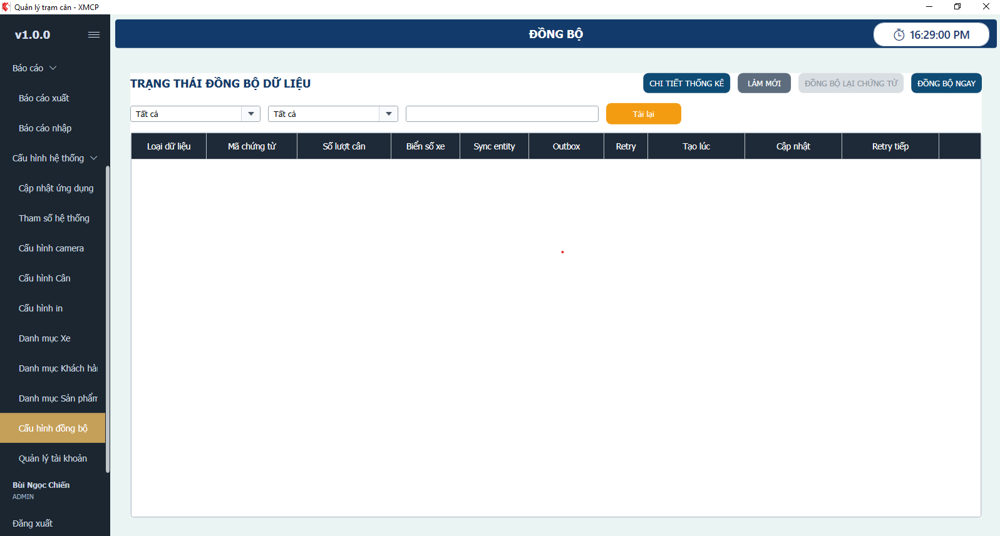

#### Danh sách Phần tử Giao diện Chính ([SyncInfoView.xaml](file:///g:/Source-code/pmcan_C%23/src/StationApp.UI/Views/Settings/SyncInfoView.xaml))

| Mã phần tử | Loại Control | Tên / Binding | Mô tả chức năng |
| :--- | :--- | :--- | :--- |
| **UI-CFG-SYN-COM-TYPE**| `ComboBox` | `AggregateTypeOptions`, `SelectedAggregateType` | Bộ lọc danh sách outbox theo Loại dữ liệu (ĐKPT, Phiếu cân, Phiếu giao nhận, Phiên cân, Danh mục xe, Khách hàng, Sản phẩm). |
| **UI-CFG-SYN-COM-STAT**| `ComboBox` | `OutboxStatusOptions`, `SelectedOutboxStatus` | Bộ lọc theo Trạng thái đồng bộ (PENDING, PROCESSING, SUCCESS, FAILED_RETRYABLE, FAILED_FINAL). |
| **UI-CFG-SYN-TXT-SRCH**| `TextBox` | `SearchKeyword` | Ô nhập từ khóa tìm kiếm nhanh (Mã Aggregate, Biển số, Lỗi). |
| **UI-CFG-SYN-BTN-SYNC**| `Button` | `ForceSyncCommand` | Buộc hệ thống mở lại và kích hoạt gửi lại ngay lập tức toàn bộ các bản ghi đang chờ hoặc bị lỗi đồng bộ. |
| **UI-CFG-SYN-GRID**    | `DataGrid` | `ItemsSource={Binding SyncItems}`, `SelectedItem={Binding SelectedSyncItem}` | Lưới hiển thị danh sách các bản ghi outbox đang xếp hàng. |
| **UI-CFG-SYN-BTN-RE**  | `Button` | `ResyncSelectedCommand` | Đưa bản ghi outbox đang chọn bị lỗi trở lại hàng đợi đồng bộ lại. |
| **UI-CFG-SYN-BTN-METR**| `Button` | `ShowMetricsCommand` | Hiển thị Popup thống kê số lượng hàng chờ chi tiết. |

#### Nghiệp vụ xử lý liên quan ([SyncInfoViewModel.cs](file:///g:/Source-code/pmcan_C%23/src/StationApp.UI/ViewModels/Settings/SyncInfoViewModel.cs))
- **Đồng bộ thủ công toàn bộ (`ForceSyncCommand`)**: Gọi `ISyncOutboxRepository.ForceRetryNowAsync` để đặt trạng thái các outbox lỗi hoặc processing về `PENDING`. Worker chạy ngầm sẽ ngay lập tức gửi lại trong chu kỳ kế tiếp.
- **Đồng bộ lại dòng đơn lẻ (`ResyncSelectedCommand` / `ResyncItemCommand`)**:
  1. Sử dụng [ISyncPayloadFactory](file:///g:/Source-code/pmcan_C%23/src/StationApp.Application/Interfaces/ISyncPayloadFactory.cs) để tạo lại nội dung Payload JSON mới nhất từ CSDL cục bộ theo loại thực thể được chọn (`CutOrder`, `WeighTicket`, `DeliveryTicket`, `WeighingSession`, `Vehicle`, `Customer`, `Product`).
  2. Ghi nhận trạng thái thực thể gốc về `SYNC_QUEUED` và insert/update bản ghi outbox tương ứng về trạng thái `PENDING`, reset `RetryCount = 0`, `LastError = null`, đặt `NextRetryAt = DateTime.Now`.
  3. Làm mới lưới dữ liệu outbox.

---

### 4.7.7 Danh mục sản phẩm (ProductMasterView.xaml)

Tab cho phép thêm mới, chỉnh sửa thông tin sản phẩm và phân loại sản phẩm (Hàng bao, Hàng rời, v.v.).

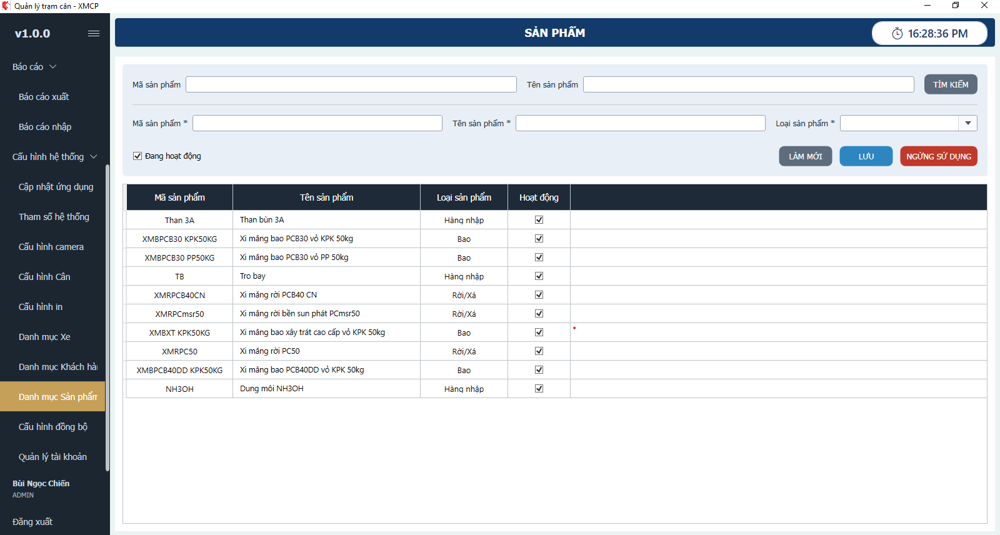

#### Danh sách Phần tử Giao diện Chính ([ProductMasterView.xaml](file:///g:/Source-code/pmcan_C%23/src/StationApp.UI/Views/Settings/ProductMasterView.xaml))

| Mã phần tử | Loại Control | Tên / Binding | Mô tả chức năng |
| :--- | :--- | :--- | :--- |
| **UI-MST-PRD-TXT-SCHCD**| `TextBox` | `SearchCode` | Nhập mã sản phẩm để tìm kiếm nhanh. |
| **UI-MST-PRD-TXT-SCHNM**| `TextBox` | `SearchName` | Nhập tên sản phẩm để tìm kiếm nhanh. |
| **UI-MST-PRD-BTN-SCH**  | `Button` | `SearchCommand` | Thực hiện lọc dữ liệu trên lưới. |
| **UI-MST-PRD-GRID**     | `DataGrid` | `ItemsSource={Binding Products}`, `SelectedItem={Binding SelectedProduct}` | Lưới danh sách sản phẩm cục bộ. |
| **UI-MST-PRD-TXT-CODE** | `TextBox` | `EditCode`, `IsEnabled` | Ô nhập mã sản phẩm (chỉ cho phép sửa khi tạo mới). |
| **UI-MST-PRD-TXT-NAME** | `TextBox` | `EditName` | Ô nhập tên sản phẩm. |
| **UI-MST-PRD-COM-TYPE** | `ComboBox` | `ProductTypeOptions`, `EditType` | Chọn phân loại sản phẩm (Bagged - Hàng bao, Bulk - Hàng rời, Other). |
| **UI-MST-PRD-CHK-ACT**  | `CheckBox` | `EditIsActive` | Chọn trạng thái hoạt động của sản phẩm. |
| **UI-MST-PRD-BTN-NEW**  | `Button` | `ResetFormCommand` | Xóa trống Form để chuẩn bị thêm sản phẩm mới. |
| **UI-MST-PRD-BTN-SAVE** | `Button` | `SaveCommand` | Lưu thông tin sản phẩm (thêm mới hoặc cập nhật). |
| **UI-MST-PRD-BTN-DEACT**| `Button` | `DeactivateCommand` | Ngừng sử dụng sản phẩm đang chọn. |

#### Nghiệp vụ xử lý liên quan ([ProductMasterViewModel.cs](file:///g:/Source-code/pmcan_C%23/src/StationApp.UI/ViewModels/Settings/ProductMasterViewModel.cs))
- **Đồng bộ danh mục lên ERP**: Khi lưu thông tin sản phẩm thành công hoặc ngừng hoạt động sản phẩm, hệ thống tự động lưu vào bảng `products` cục bộ, đồng thời tự động gọi `EnqueueMasterSyncAsync` để đẩy một payload thay đổi của danh mục sản phẩm vào hàng đợi Outbox (`SyncAggregateTypes.Product`) nhằm đồng bộ lên Central Server ERP.

---

### 4.7.8 Danh mục khách hàng (CustomerMasterView.xaml)

Tab tra cứu danh mục khách hàng, nhà phân phối.

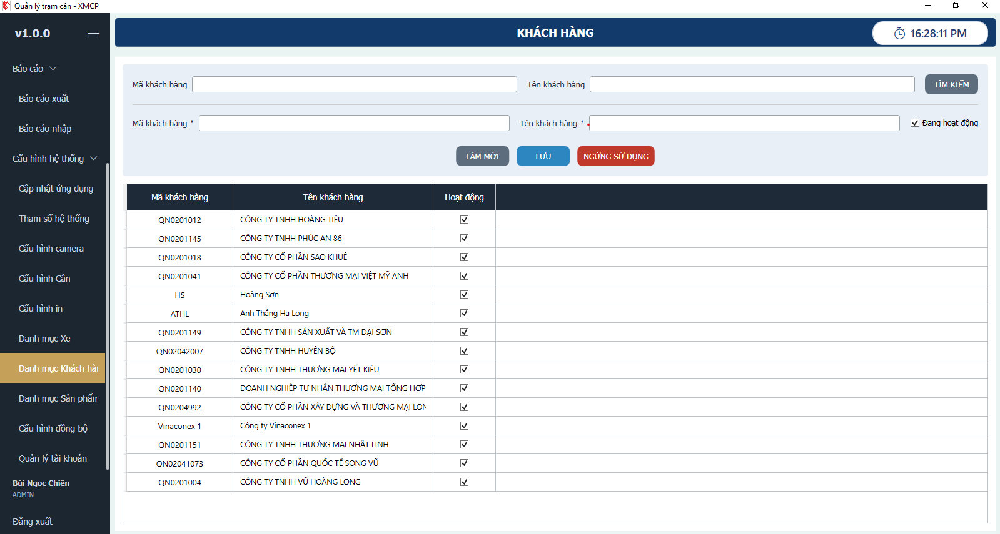

#### Danh sách Giao diện và Nghiệp vụ ([CustomerMasterView.xaml](file:///g:/Source-code/pmcan_C%23/src/StationApp.UI/Views/Settings/CustomerMasterView.xaml))
- **Giao diện**: Lưới [CustomerMasterView.xaml](file:///g:/Source-code/pmcan_C%23/src/StationApp.UI/Views/Settings/CustomerMasterView.xaml) hiển thị danh mục khách hàng (`customers`) đồng bộ từ ERP xuống.
- **Nghiệp vụ ([CustomerMasterViewModel.cs](file:///g:/Source-code/pmcan_C%23/src/StationApp.UI/ViewModels/Settings/CustomerMasterViewModel.cs))**: Cung cấp dữ liệu nguồn để điền thông tin tự động (Auto-fill) hoặc gợi ý thông minh (Autocomplete) khi nhân viên tạo các đơn cân lẻ thủ công trực tiếp tại trạm. Khi có thay đổi từ phía máy trạm, dữ liệu thay đổi cũng được enqueue vào outbox đồng bộ lên ERP tương tự như danh mục Sản phẩm.

---

### 4.7.9 Danh mục phương tiện (VehicleMasterView.xaml)

Tab quản lý danh mục phương tiện vận chuyển (xe, mooc) và tải trọng thiết kế đăng kiểm cho phép (TTCP).

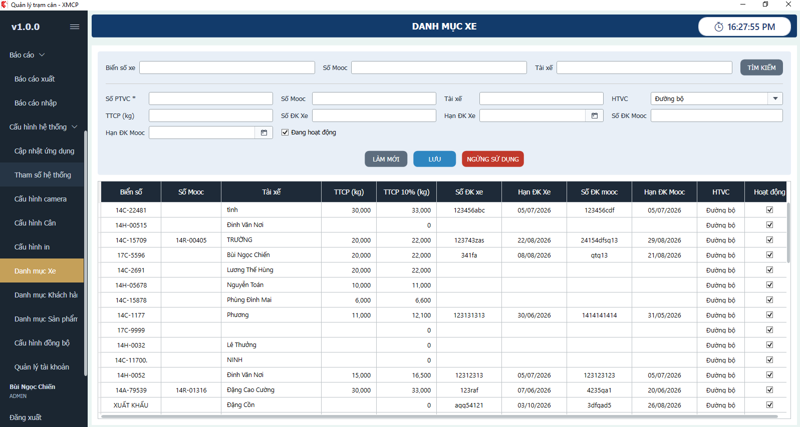

#### Danh sách Phần tử Giao diện Chính ([VehicleMasterView.xaml](file:///g:/Source-code/pmcan_C%23/src/StationApp.UI/Views/Settings/VehicleMasterView.xaml))

| Mã phần tử | Loại Control | Tên / Binding | Mô tả chức năng |
| :--- | :--- | :--- | :--- |
| **UI-MST-VEH-GRID**     | `DataGrid` | `ItemsSource={Binding Vehicles}`, `SelectedItem={Binding SelectedVehicle}` | Lưới danh sách xe, mooc, tải trọng cho phép (TTCP) và số đăng kiểm tương ứng. |
| **UI-MST-VEH-TXT-PLATE**| `TextBox` | `EditVehiclePlate` | Ô nhập biển số xe. |
| **UI-MST-VEH-TXT-MOOC** | `TextBox` | `EditMoocNumber` | Ô nhập số rơ mooc đi kèm. |
| **UI-MST-VEH-TXT-LIMIT**| `TextBox` | `EditTtcpWeight` | Ô nhập trọng tải thiết kế cho phép của xe (kg). |
| **UI-MST-VEH-BTN-SAVE** | `Button` | `SaveCommand` | Lưu thông tin phương tiện. |

#### Nghiệp vụ xử lý liên quan ([VehicleMasterViewModel.cs](file:///g:/Source-code/pmcan_C%23/src/StationApp.UI/ViewModels/Settings/VehicleMasterViewModel.cs))
- **Kiểm soát tải trọng**: Khi lưu thông tin xe vào bảng `vehicles` cục bộ, hệ thống tự động enqueue outbox để đồng bộ lên ERP. Dữ liệu tải trọng cho phép (`TtcpWeight`) này sẽ được hệ thống đối chiếu tự động khi xe cân lần 2 để kiểm soát và đưa ra cảnh báo quá tải trọng thiết kế cho phép.

---

## 4.8 Phân hệ Chẩn đoán và Cập nhật (Diagnostics & Update Module)

Phân hệ chẩn đoán cung cấp cho kỹ thuật viên và Admin các công cụ trực quan để giám sát trạng thái kết nối phần cứng đầu cân, xem dữ liệu chuỗi truyền thô và theo dõi hiệu năng hàng chờ đồng bộ CSDL/hình ảnh. Phân hệ cập nhật hỗ trợ nâng cấp phần mềm tự động từ thư mục chia sẻ.

---

### 4.8.1 Chẩn đoán phần cứng (DiagnosticsView.xaml)

Màn hình hiển thị chi tiết thông số vận hành thời gian thực của thiết bị đầu cân, hàng đợi đồng bộ và sức khỏe Central API.

#### Danh sách Phần tử Giao diện Chính ([DiagnosticsView.xaml](file:///g:/Source-code/pmcan_C%23/src/StationApp.UI/Views/DiagnosticsView.xaml))

| Mã phần tử | Loại Control | Tên / Binding | Mô tả chức năng |
| :--- | :--- | :--- | :--- |
| **UI-DIA-TXT-RAWLOG**   | `TextBox` | `RawFrame` | Hiển thị log chuỗi dữ liệu thô nhận được từ cổng COM (ví dụ: `0025350\x03`). Các kí tự điều khiển được thay thế bằng chuỗi text tương đương để dễ theo dõi. |
| **UI-DIA-TXT-SUBSTR**   | `TextBox` | `SubstringPreview` | Hiển thị chuỗi con cắt được từ khung truyền thô dựa theo cấu hình start/length của đầu cân. |
| **UI-DIA-TXT-PARSER**   | `TextBlock` | `ParserType` | Hiển thị tên thuật toán parser đang sử dụng. |
| **UI-DIA-TXT-LIVEWT**   | `TextBlock` | `LiveWeight` | Hiển thị số cân trực tiếp nhận được từ đầu cân. |
| **UI-DIA-TXT-STABLE**   | `TextBlock` | `LiveIsStable` | Hiển thị trạng thái ổn định của số cân trực tiếp (Ổn định / Chưa ổn định). |
| **UI-DIA-TXT-DEVSTAT**  | `TextBlock` | `DeviceConnectionStatus`, `DeviceConnectionBrush` | Hiển thị trạng thái kết nối đầu cân kèm màu sắc trực quan (Xanh: Hoạt động, Đỏ: Mất kết nối, Cam: Đang thử lại). |
| **UI-DIA-TXT-ERROR**    | `TextBlock` | `DeviceError` | Hiển thị log lỗi phát sinh gần nhất của thiết bị cân. |
| **UI-DIA-TXT-PENDSYNC** | `TextBlock` | `PendingSyncCount` | Số bản ghi thay đổi nghiệp vụ (Outbox) đang xếp hàng chờ đồng bộ lên ERP. |
| **UI-DIA-TXT-FAILSYNC** | `TextBlock` | `FailedSyncCount` | Số bản ghi Outbox bị lỗi đồng bộ. |
| **UI-DIA-TXT-LSTERR**   | `TextBlock` | `LastSyncError` | Mô tả lỗi đồng bộ outbox gần đây nhất. |
| **UI-DIA-TXT-LSTSUCC**  | `TextBlock` | `LastSyncSuccessAt` | Thời điểm đồng bộ thành công gần nhất. |
| **UI-DIA-TXT-LSTFAIL**  | `TextBlock` | `LastSyncFailureAt` | Thời điểm đồng bộ thất bại gần nhất. |
| **UI-DIA-TXT-APISTAT**  | `TextBlock` | `CentralApiHealthStatus` | Kết quả kiểm tra kết nối mạng thực tế tới Central Server ERP. |
| **UI-DIA-TXT-MSTSTAT**  | `TextBlock` | `MasterDataSyncStatus` | Trạng thái đồng bộ danh mục gốc, bao gồm số lượng outbox danh mục pending và số lượng ảnh camera chụp lượt cân pending chưa sync lên ERP. |
| **UI-DIA-TXT-VER**      | `TextBlock` | `AppVersion` | Phiên bản ứng dụng máy trạm hiện tại. |
| **UI-DIA-BTN-REFRESH**  | `Button` | `RefreshCommand` | Thực hiện xóa log cũ và quét nạp lại toàn bộ thông tin chẩn đoán hệ thống. |

#### Nghiệp vụ xử lý liên quan ([DiagnosticsViewModel.cs](file:///g:/Source-code/pmcan_C%23/src/StationApp.UI/ViewModels/DiagnosticsViewModel.cs))
- **Đọc dữ liệu thô và live weight**: Khi mở màn hình, hệ thống đăng ký lắng nghe sự kiện nhận số cân `WeightReceived` và sự kiện log chẩn đoán `DiagnosticsReceived` từ cổng COM của `IScaleDevice`. Để tránh quá tải giao diện, hệ thống sử dụng cơ chế khóa liên động `Interlocked.CompareExchange` để giới hạn tần suất cập nhật log thô tối đa 250ms/lần.
- **Trạng thái kết nối đầu cân**: Được cập nhật động dựa trên trạng thái của Serial Port. Cọ vẽ `DeviceConnectionBrush` tự động đổi màu: Xanh lá (Active), Vàng (Connecting), Cam (ReconnectWaiting), Đỏ đậm (Faulted), Đỏ (Disconnected).
- **Thống kê hiệu năng đồng bộ**: Đọc từ CSDL cục bộ để đếm tổng số bản ghi outbox lỗi/chờ, đếm số ảnh camera pending chụp từ bảng `weighing_session_images` có trạng thái PENDING/FAILED để hiển thị lên mục Trạng thái danh mục gốc.
- **Kiểm tra Central API**: Gọi `ICentralApiHealthChecker.CheckAsync` để thực hiện ping API Server trung tâm và kiểm tra tính hợp lệ của khóa API Key bảo mật.

---

### 4.8.2 Cập nhật phiên bản ứng dụng (AppUpdateView.xaml)

Màn hình hỗ trợ kiểm tra phiên bản mới, xem ghi chú phát hành, cấu hình thư mục shared update và tiến hành cập nhật ứng dụng tự động.

#### Danh sách Phần tử Giao diện Chính ([AppUpdateView.xaml](file:///g:/Source-code/pmcan_C%23/src/StationApp.UI/Views/AppUpdateView.xaml))

| Mã phần tử | Loại Control | Tên / Binding | Mô tả chức năng |
| :--- | :--- | :--- | :--- |
| **UI-UPD-TXT-CURVER**  | `TextBlock` | `CurrentVersion` | Hiển thị phiên bản phần mềm trạm cân hiện tại. |
| **UI-UPD-TXT-LATEST**  | `TextBlock` | `LatestVersion` | Hiển thị phiên bản mới nhất khả dụng trên máy chủ. |
| **UI-UPD-TXT-STATUS**  | `TextBlock` | `StatusText` | Hiển thị trạng thái kiểm tra (Sẵn sàng, Đang kiểm tra, Đang tải...). |
| **UI-UPD-TXT-NOTES**   | `TextBox` | `ReleaseNotes` | Hiển thị nội dung ghi chú phát hành (Release Notes) của phiên bản mới. |
| **UI-UPD-TXT-ROOT**    | `TextBox` | `SharedReleaseRoot` | Nhập đường dẫn thư mục shared trên server chứa bộ cài và manifest cập nhật. |
| **UI-UPD-TXT-PATH**    | `TextBlock` | `ResolvedManifestPath` | Hiển thị đường dẫn tệp tin manifest `latest.json` đầy đủ sau khi giải quyết đường dẫn. |
| **UI-UPD-BTN-SAVE**    | `Button` | `SaveConfigurationCommand` | Lưu cấu hình đường dẫn thư mục shared update vào CSDL. |
| **UI-UPD-BTN-CHECK**   | `Button` | `CheckForUpdatesCommand` | Kiểm tra kết nối và đọc tệp manifest để xác định có bản cập nhật mới hay không. |
| **UI-UPD-BTN-UPGRADE** | `Button` | `UpdateCommand`, `IsEnabled={Binding IsUpdateAvailable}` | Thực hiện tải gói cài đặt ZIP, giải nén và kích hoạt updater để nâng cấp phần mềm. |

#### Nghiệp vụ xử lý liên quan ([AppUpdateViewModel.cs](file:///g:/Source-code/pmcan_C%23/src/StationApp.UI/ViewModels/AppUpdateViewModel.cs))
- **Quyền hạn**: Vai trò ADMIN và OPERATOR được phép thực hiện tác vụ kiểm tra và cập nhật ứng dụng (`CanUpdateApplication`).
- **Lưu cấu hình thư mục shared**: Khi bấm **LƯU**, hệ thống lưu giá trị đường dẫn vào bảng `app_config` dưới key `AppUpdateSharedReleaseRoot` và giải quyết đường dẫn manifest mặc định dạng `{SharedReleaseRoot}\latest.json`.
- **Quy trình kiểm tra cập nhật (`CheckForUpdatesCommand`)**:
  - Hệ thống gọi `IAppUpdateService.CheckForUpdatesAsync` để đọc tệp manifest JSON trên máy chủ trung tâm.
  - Phân tích tệp manifest để lấy thông tin phiên bản mới nhất, link tải gói zip, ghi chú phát hành, và cờ cập nhật bắt buộc `IsForceUpdateRequired`.
  - So sánh phiên bản hiện tại với phiên bản trên server. Nếu phiên bản trên server lớn hơn, bật cờ `IsUpdateAvailable = true`.
- **Quy trình thực thi nâng cấp phần mềm (`UpdateCommand`)**:
  1. Người dùng bấm **CẬP NHẬT**. Hệ thống hiển thị hộp thoại xác nhận. Nếu là phiên bản bắt buộc cập nhật (`IsForceUpdateRequired`), nút Hủy sẽ chuyển thành nút Đóng ứng dụng.
  2. Khi người dùng đồng ý, hệ thống gọi `IAppUpdateService.StartUpdateAsync`.
  3. Quá trình cập nhật ngầm tải xuống gói ZIP chứa bộ cài từ đường dẫn chỉ định trong manifest, giải nén ra thư mục tạm.
  4. Hệ thống kích hoạt khởi chạy file thực thi [StationApp.Updater.exe](file:///g:/Source-code/pmcan_C%23/src/StationApp.Updater/Program.cs) để bắt đầu quá trình sao chép đè tệp tin cập nhật.
  5. Gọi tắt ứng dụng WPF chính (`System.Windows.Application.Current.Shutdown()`) để tránh xung đột chiếm dụng tệp tin (File lock) khi updater chép đè mã nguồn.


# 5. Các Phụ lục (Appendices)

## Phụ lục A: Thuật ngữ và Định nghĩa (Glossary)
*(Xem chi tiết tại Mục 1.3 của tài liệu này)*

---

## Phụ lục B: Ma trận Máy Trạng thái (State Machines)

### B.1 Vòng đời của một Phiên cân (Weighing Session Lifecycle)

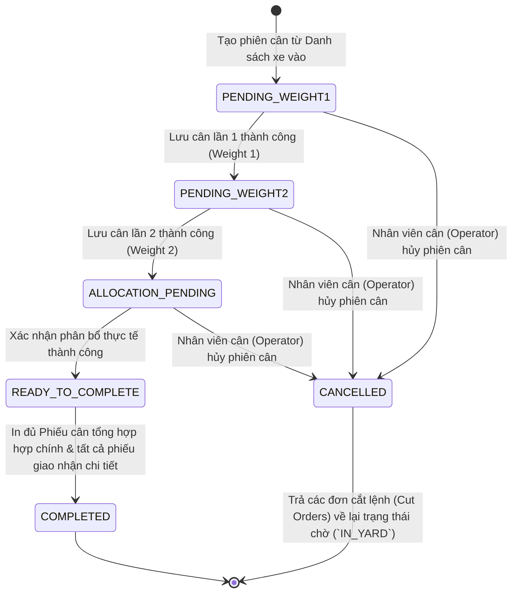
```mermaid
stateDiagram-v2
    [*] --> PENDING_WEIGHT1 : Tạo phiên cân từ Danh sách xe vào
    PENDING_WEIGHT1 --> PENDING_WEIGHT2 : Lưu cân lần 1 thành công (Weight 1)
    PENDING_WEIGHT2 --> ALLOCATION_PENDING : Lưu cân lần 2 thành công (Weight 2)
    ALLOCATION_PENDING --> READY_TO_COMPLETE : Xác nhận phân bổ thực tế thành công
    READY_TO_COMPLETE --> COMPLETED : In đủ Phiếu cân tổng hợp hợp chính & tất cả phiếu giao nhận chi tiết
    
    PENDING_WEIGHT1 --> CANCELLED : Nhân viên cân (Operator) hủy phiên cân
    PENDING_WEIGHT2 --> CANCELLED : Nhân viên cân (Operator) hủy phiên cân
    ALLOCATION_PENDING --> CANCELLED : Nhân viên cân (Operator) hủy phiên cân
    
    COMPLETED --> [*]
    CANCELLED --> [*] : Trả các đơn cắt lệnh (Cut Orders) về lại trạng thái chờ (`IN_YARD`)
```

### B.2 Trạng thái của Đơn cắt lệnh gốc (Cut Order Lifecycle)

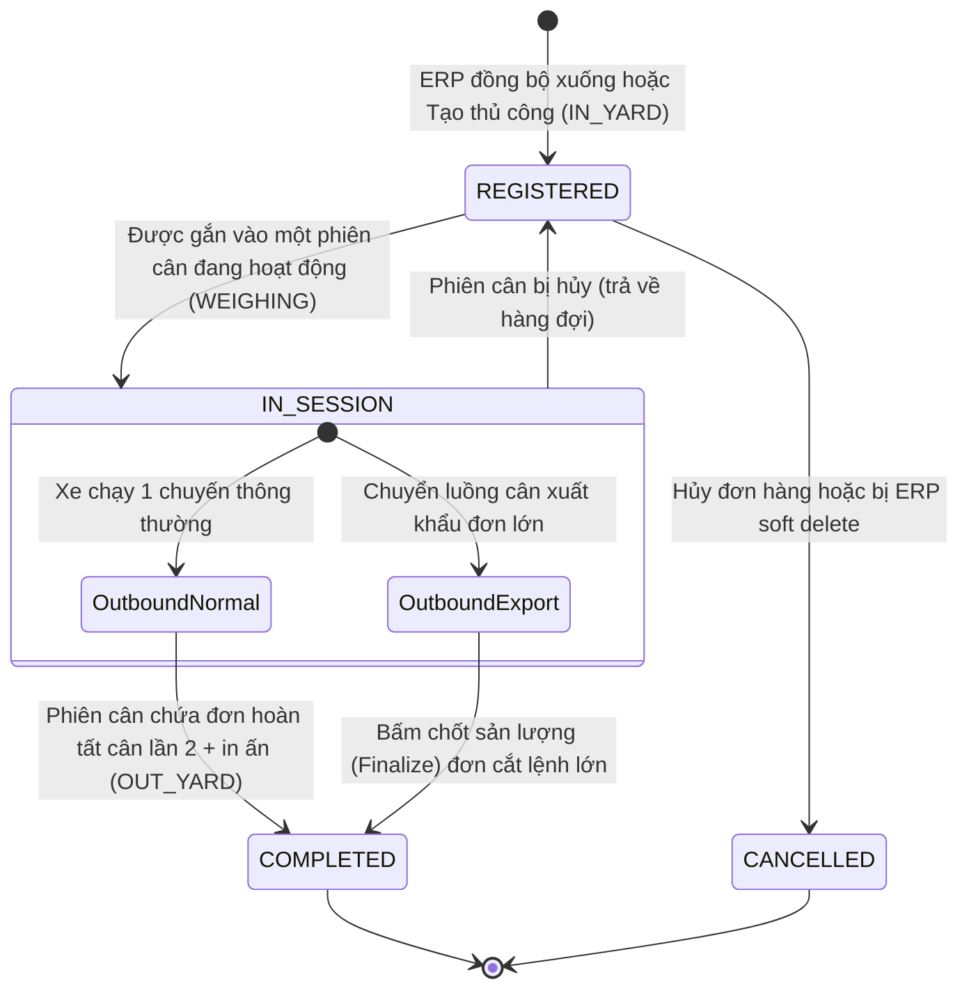
```mermaid
stateDiagram-v2
    [*] --> REGISTERED : ERP đồng bộ xuống hoặc Tạo thủ công (IN_YARD)
    REGISTERED --> IN_SESSION : Được gắn vào một phiên cân đang hoạt động (WEIGHING)
    
    state IN_SESSION {
        [*] --> OutboundNormal : Xe chạy 1 chuyến thông thường
        [*] --> OutboundExport : Chuyển luồng cân xuất khẩu đơn lớn
    }
    
    OutboundNormal --> COMPLETED : Phiên cân chứa đơn hoàn tất cân lần 2 + in ấn (OUT_YARD)
    OutboundExport --> COMPLETED : Bấm chốt sản lượng (Finalize) đơn cắt lệnh lớn
    
    REGISTERED --> CANCELLED : Hủy đơn hàng hoặc bị ERP soft delete
    IN_SESSION --> REGISTERED : Phiên cân bị hủy (trả về hàng đợi)
    
    COMPLETED --> [*]
    CANCELLED --> [*]
```

---

## Phụ lục C: Ma trận Truy xuất Yêu cầu (Requirements Traceability Matrix)

Dưới đây là bảng đối chiếu giữa các mục tiêu nghiệp vụ chính và các mã yêu cầu đặc tả tương ứng trong hệ thống.

| Mục tiêu Nghiệp vụ | Mã Yêu cầu Chức năng | Yêu cầu Phi chức năng liên quan | Trạng thái kiểm chứng |
|:---|:---|:---|:---|
| Kiểm soát an toàn đăng nhập | FR-AUTH-001, FR-AUTH-002 | NFR-SEC-001 | Đã kiểm chứng |
| Quản lý xe chờ cân cục bộ | FR-WEIGH-001 | NFR-PERF-001 | Đã kiểm chứng |
| Đo lường cân tự động | FR-WEIGH-002, FR-WEIGH-003 | NFR-REL-002, NFR-USA-002 | Đã kiểm chứng |
| Phân bổ khối lượng nhiều đơn | FR-ALLOC-001 | NFR-SEC-002 | Đã kiểm chứng |
| Đảm bảo in đủ chứng từ | FR-PRINT-001, FR-OUT-001 | NFR-USA-001 | Đã kiểm chứng |
| Vận hành ngoại tuyến khi mất mạng | FR-SYNC-001 | NFR-REL-001 | Đã kiểm chứng |
| Xử lý đơn cắt lệnh lớn xuất khẩu | FR-EXPORT-001 | NFR-PERF-003 | Đã kiểm chứng |
| Xử lý cấp lại đơn cắt lệnh của ERP | FR-REISSUE-001 | NFR-REL-002 | Đã kiểm chứng |
| Tự động sao lưu dữ liệu cục bộ | FR-BACKUP-001 | NFR-REL-001 | Đã kiểm chứng |

---

## Phụ lục D: Phê duyệt từ các bên (Stakeholder Sign-Off)

Tài liệu Đặc tả Yêu cầu Phần mềm này đại diện cho sự thống nhất về mặt nghiệp vụ và kỹ thuật giữa các bên liên quan của dự án WeightStation.

| Đại diện | Vai trò | Chữ ký | Ngày |
|:---|:---|:---|:---|
| Đại diện Ban Dự án | Project Owner | ___________________ | ___/___/2026 |
| Đại diện Vận hành Trạm | Station Manager / Admin Representative | ___________________ | ___/___/2026 |
| Đại diện Tích hợp ERP | ERP System Integrator | ___________________ | ___/___/2026 |
| Đại diện Kỹ thuật | Tech Lead / Architect | ___________________ | ___/___/2026 |
