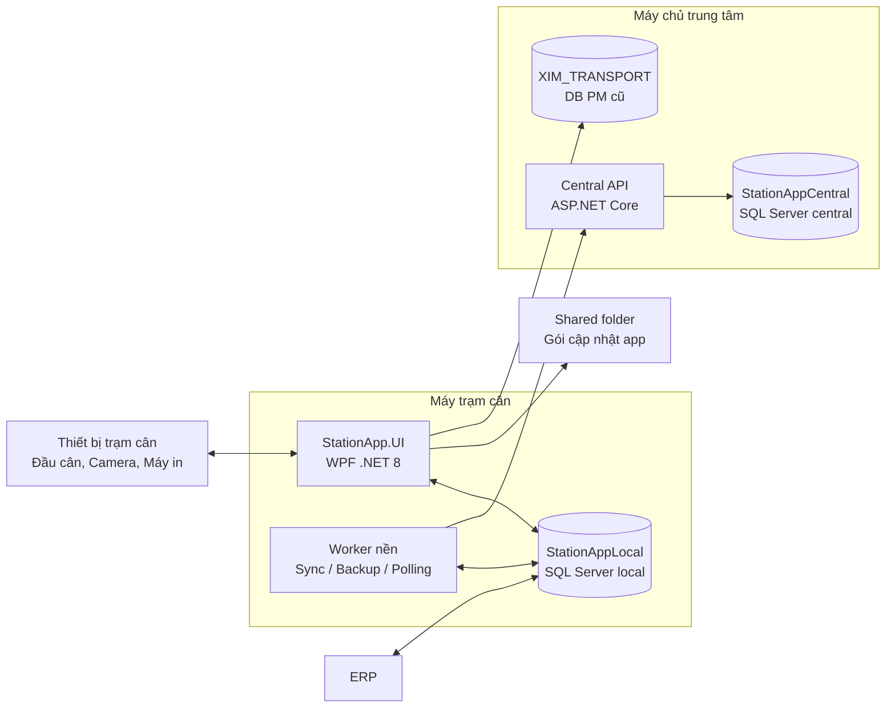
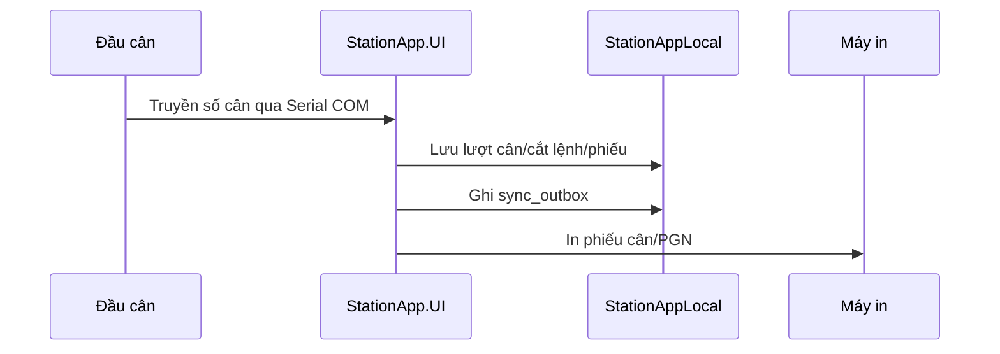
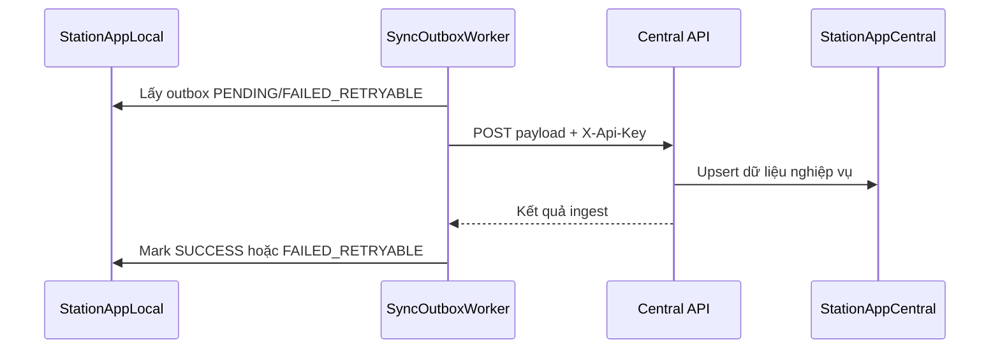
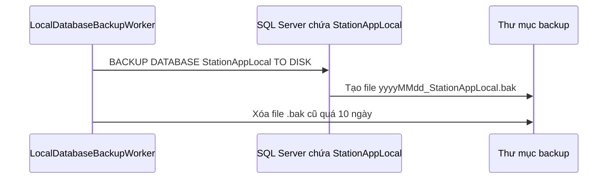

# Kiến trúc hạ tầng ứng dụng trạm cân

## 1. Sơ đồ tổng quan

## 2. Các vùng hạ tầng chính

### Máy trạm cân

- Chạy ứng dụng `StationApp.UI` trên Windows.
- Kết nối đầu cân qua Serial COM.
- Kết nối camera qua RTSP để xem live preview/chụp ảnh.
- Ghi toàn bộ nghiệp vụ trước vào SQL Server local `StationAppLocal`.
- Có worker nền xử lý đồng bộ, backup, polling dữ liệu ERP và các tác vụ định kỳ.
- In phiếu cân/PGN trực tiếp từ máy trạm.

### Database local `StationAppLocal`

- Là nguồn dữ liệu vận hành chính tại trạm.
- Lưu cắt lệnh, lượt cân, dòng phân bổ, phiếu cân, phiếu giao nhận, cấu hình, user, outbox đồng bộ.
- Cho phép trạm cân tiếp tục vận hành khi Central API hoặc mạng server bị lỗi.
- Backup `.bak` được tạo bởi SQL Server Engine. Vì vậy file backup nằm trên máy đang chạy SQL Server chứa `StationAppLocal`, không nhất thiết là máy đang mở app nếu DB đặt remote.

### Central API và Central DB

- `StationApp.CentralApi` nhận dữ liệu đồng bộ từ các trạm qua HTTP.
- Xác thực bằng header `X-Api-Key`.
- Ghi dữ liệu vào `StationAppCentral`.
- Log API lưu trên ổ local server, mặc định: `C:\ProgramData\StationApp\CentralApi\logs`.
- Không để app trạm ghi trực tiếp vào database central.

### ERP

- ERP truyền cắt lệnh/đăng ký phương tiện xuống `StationAppLocal` qua stored procedure.
- ERP gọi stored procedure để lấy số lượng thực xuất và thời gian cân lần 1/lần 2.
- ERP gọi stored procedure RA/CO cắt lệnh. Với luồng xuất khẩu, hệ thống giữ chuyến xe đã cân bằng cách gắn sang cắt lệnh tạm khi cần.

### Shared folder cập nhật ứng dụng

- Dùng để phát hành bản cập nhật app nội bộ.
- Chứa `latest.json` và gói cập nhật.
- App trạm đọc metadata, tải gói update và chạy updater.
- Central API không nên chạy trực tiếp từ shared folder để tránh lỗi file lock/log lock.

### Database PM cũ `XIM_TRANSPORT`

- Chỉ dùng cho màn **Lịch sử cân (PM cũ)**.
- App trạm đọc trực tiếp `dbo.Datacan` ở chế độ read-only.
- Chỉ Admin được xem.
- Không đồng bộ dữ liệu PM cũ vào hệ thống mới, không dùng cho KPI/báo cáo/chứng từ hiện tại.

## 3. Luồng dữ liệu chính

### 3.1 Luồng cân vận hành

### 3.2 Luồng đồng bộ server

### 3.3 Luồng backup DB local

Ghi chú: file `.bak` được tạo bởi SQL Server, nên đường dẫn backup được hiểu theo máy SQL Server, không phải luôn theo máy đang mở WPF app.

## 4. Cổng/kết nối cần mở

| Kết nối | Giao thức | Chiều | Ghi chú |
|---|---|---|---|
| App -> SQL Local | TDS/SQL Server | Máy trạm -> SQL Server local/remote | Theo `DefaultConnection` |
| App -> Central API | HTTP | Máy trạm -> Server | Mặc định `http://<server>:5000` |
| Central API -> Central DB | TDS/SQL Server | Server API -> SQL Server Central | Theo `CentralConnection` |
| App -> Camera | RTSP | Máy trạm -> Camera IP | Theo cấu hình camera |
| App -> Đầu cân | Serial COM | Máy trạm -> Thiết bị cân | COM vật lý/USB-RS232 |
| App -> Shared folder | SMB | Máy trạm -> File server/share | Dùng kiểm tra và tải update |
| App -> PM cũ | TDS/SQL Server | Máy trạm -> SQL Server `10.0.0.1` | Chỉ màn Lịch sử cân (PM cũ) |

## 5. Nguyên tắc triển khai

- Ưu tiên local-first: mọi thao tác cân phải ghi được vào DB local trước.
- Không để mất dữ liệu khi mất mạng: sync chạy nền, retry qua outbox.
- Không ghi trực tiếp từ app trạm vào Central DB: phải đi qua Central API.
- Không dùng tài khoản SQL quyền cao cho kết nối read-only PM cũ; nên tạo user chỉ có quyền `SELECT`.
- Log Central API lưu trên ổ local server, không lưu trong shared folder publish.
- Backup `.bak` cần lưu ở ổ đĩa mà SQL Server service account có quyền ghi.
- App update dùng shared folder, nhưng runtime app/API nên chạy ở thư mục local máy tương ứng.
