# ER Diagram database ứng dụng cân

Ngày lập: 19/08/2026  
Nguồn rà soát: `StationDbContext`, các entity trong `src/StationApp.Domain/Entities`, các mapping EF trong `src/StationApp.Infrastructure/Persistence/Configurations`.

## Ghi chú đọc sơ đồ

- Database hiện tại có nhiều liên kết bằng `Guid`/mã nghiệp vụ nhưng không khai báo FK cứng trong EF.
- FK vật lý rõ nhất trong mapping hiện tại là `user_station_assignments.UserId -> users.Id`.
- Các quan hệ còn lại dưới đây là quan hệ nghiệp vụ đang được code sử dụng, ví dụ `CutOrderId`, `WeighingSessionId`, `WeighingSessionLineId`, `DeliveryTicketId`, `StationCode`, `ProductCode`, `CustomerCode`, `VehiclePlate`.

## ERD tổng quan

```mermaid
erDiagram
    STATIONS ||--o{ USER_STATION_ASSIGNMENTS : "StationCode (logic)"
    USERS ||--o{ USER_STATION_ASSIGNMENTS : "UserId (FK)"
    STATIONS ||--o{ STATION_FEATURE_FLAGS : "StationCode"
    STATIONS ||--o{ STATION_OPERATION_SETTINGS : "StationCode"

    STATIONS ||--o{ VEHICLES : "StationCode"
    STATIONS ||--o{ CUSTOMERS : "StationCode"
    STATIONS ||--o{ PRODUCTS : "StationCode"
    STATIONS ||--o{ INCOMING_SEED_VEHICLES : "StationCode"

    CUSTOMERS ||--o{ CUT_ORDERS : "CustomerCode (logic)"
    PRODUCTS ||--o{ CUT_ORDERS : "ProductCode (logic)"
    VEHICLES ||--o{ CUT_ORDERS : "VehiclePlate/MoocNumber (logic)"
    CUT_ORDERS ||--o{ CUT_ORDERS : "MappedReal/MappedTemporary"

    CUT_ORDERS ||--o{ WEIGHING_SESSION_LINES : "CutOrderId"
    WEIGHING_SESSIONS ||--o{ WEIGHING_SESSION_LINES : "WeighingSessionId"
    WEIGHING_SESSIONS ||--o{ WEIGHING_SESSION_IMAGES : "WeighingSessionId"

    CUT_ORDERS ||--o{ WEIGH_TICKETS : "CutOrderId"
    WEIGHING_SESSIONS ||--o{ WEIGH_TICKETS : "WeighingSessionId"
    DELIVERY_TICKETS ||--o{ WEIGH_TICKETS : "DeliveryTicketId"
    WEIGH_TICKETS ||--o{ WEIGH_TICKETS : "SourceTicketId/SplitGroupId"

    CUT_ORDERS ||--o{ DELIVERY_TICKETS : "CutOrderId"
    WEIGHING_SESSIONS ||--o{ DELIVERY_TICKETS : "WeighingSessionId"
    WEIGHING_SESSION_LINES ||--o{ DELIVERY_TICKETS : "WeighingSessionLineId"
    DELIVERY_TICKETS ||--o{ DELIVERY_TICKETS : "SourceDeliveryTicketId/SplitGroupId"

    STATIONS ||--o{ AUDIT_LOGS : "StationCode"
    STATIONS ||--o{ SYNC_OUTBOX : "StationCode"
    STATIONS ||--o{ PRINT_TEMPLATE_PROFILES : "Template config"
    STATIONS ||--o{ DOCUMENT_COUNTERS : "CounterKey convention"

    STATIONS {
        guid Id PK
        string StationCode UK
        string StationName
        bool IsActive
        int SortOrder
    }

    USERS {
        guid Id PK
        string Username UK
        string DisplayName
        string RoleCode
        string PasswordHash
        bool IsActive
        datetime LastLoginAt
    }

    USER_STATION_ASSIGNMENTS {
        guid Id PK
        guid UserId FK
        string StationCode
        bool IsDefault
        bool IsActive
    }

    VEHICLES {
        guid Id PK
        string StationCode
        string VehiclePlate
        string MoocNumber
        string DriverName
        string TransportMethod
        decimal TtcpWeight
        bool IsInternalVehicle
        string StandardTareSource
        datetime StandardTareUpdatedAt
        bool IsActive
    }

    CUSTOMERS {
        guid Id PK
        string StationCode
        string CustomerCode
        string CustomerName
        string CustomerBusinessRole
        bool IsActive
    }

    PRODUCTS {
        guid Id PK
        string StationCode
        string ProductCode
        string ProductName
        string ProductType
        string TransactionScope
        bool IsActive
    }

    INCOMING_SEED_VEHICLES {
        guid Id PK
        string StationCode
        string TransactionType
        string CustomerCode
        string CustomerName
        string ProductCode
        string ProductName
        string ProductType
        int SortOrder
        bool IsActive
    }

    CUT_ORDERS {
        guid Id PK
        string StationCode
        string ErpCutOrderId
        string ErpRegistrationCode
        string CutOrderSource
        string CutOrderStatus
        string TransactionType
        string TransportMethod
        string VehiclePlate
        string MoocNumber
        string ReceiverName
        string CustomerCode
        string CustomerName
        string ProductCode
        string ProductName
        string ProductType
        string OrderCode
        string LoadingPlace
        string PackagePrinterName
        decimal PlannedWeight
        int BagCount
        decimal TareWeightKg
        decimal BagWeightKg
        string ExportPackageType
        string Notes
        string ProcessingStage
        guid WeighingSessionId
        guid CurrentPrimaryWeighTicketId
        guid CurrentPrimaryDeliveryTicketId
        bool IsExportScale
        bool IsTemporaryExport
        decimal ExportUnweighedWeight
        decimal ExportFinalizedWeight
        bool IsCancelled
        bool IsDeleted
        string SyncStatus
    }

    WEIGHING_SESSIONS {
        guid Id PK
        string StationCode
        string SessionNo UK
        string TransactionType
        string VehiclePlate
        string MoocNumber
        string DriverName
        string ProductCode
        string ProductName
        string CustomerCode
        string CustomerName
        string SessionStatus
        decimal Weight1
        datetime Weight1Time
        decimal Weight2
        datetime Weight2Time
        decimal NetWeight
        string WeighingMode
        bool IsOverweight
        bool IsNoLoad
        bool IsReturnedBrokenTrip
        bool IsCancelled
        bool IsDeleted
        string SyncStatus
    }

    WEIGHING_SESSION_LINES {
        guid Id PK
        string StationCode
        guid WeighingSessionId
        guid CutOrderId
        int SequenceNo
        string CustomerCode
        string CustomerName
        string ProductCode
        string ProductName
        decimal PlannedWeight
        int PlannedBagCount
        decimal ActualAllocatedWeight
        int ActualAllocatedBagCount
        bool IsReturnedBrokenTrip
        string LineStatus
        guid DeliveryTicketId
        bool IsDeleted
        string SyncStatus
    }

    WEIGHING_SESSION_IMAGES {
        guid Id PK
        string StationCode
        guid WeighingSessionId
        string CaptureStage
        string CameraCode
        string CameraName
        bytes ImageBytes
        datetime CapturedAt
        string CapturedBy
        bool IsDeleted
        string SyncStatus
    }

    WEIGH_TICKETS {
        guid Id PK
        string StationCode
        guid CutOrderId
        guid WeighingSessionId
        guid DeliveryTicketId
        string TicketNo UK
        string ErpCutOrderId
        string VehiclePlate
        string MoocNumber
        string CustomerCode
        string CustomerName
        string ProductCode
        string ProductName
        decimal PlannedWeight
        int BagCount
        decimal Weight1
        datetime Weight1Time
        decimal Weight2
        datetime Weight2Time
        decimal NetWeight
        string RecordRole
        bool IsPrimaryDisplay
        bool IsOverWeight
        bool IsPrinted
        bool IsDeleted
        string SyncStatus
    }

    DELIVERY_TICKETS {
        guid Id PK
        string StationCode
        guid CutOrderId
        guid WeighingSessionId
        guid WeighingSessionLineId
        string DeliveryNo UK
        string ErpCutOrderId
        string CustomerCode
        string ProductCode
        decimal AllocatedWeight
        int AllocatedBagCount
        string RecordRole
        bool IsOverWeight
        bool IsPrinted
        bool IsDeleted
        string SyncStatus
    }

    AUDIT_LOGS {
        guid Id PK
        string StationCode
        string Actor
        string Action
        string EntityType
        guid EntityId
        string DetailJson
        datetime CreatedAt
    }

    SYNC_OUTBOX {
        guid Id PK
        string StationCode
        guid AggregateId
        string AggregateType
        string PayloadJson
        guid IdempotencyKey
        string Status
        int RetryCount
        datetime NextRetryAt
        string LastError
    }

    STATION_FEATURE_FLAGS {
        guid Id PK
        string StationCode
        string FeatureKey
        string FeatureValue
    }

    STATION_OPERATION_SETTINGS {
        guid Id PK
        string StationCode
        string SettingKey
        string SettingValue
    }

    PRINT_TEMPLATE_PROFILES {
        guid Id PK
        string TemplateKind
        string ProfileKey
        string DisplayName
        bool IsDefault
        decimal OffsetXmm
        decimal OffsetYmm
        int TemplateVersion
        string LayoutJson
    }

    DOCUMENT_COUNTERS {
        string CounterKey PK
        int LastValue
        datetime UpdatedAt
    }
```

## Nhóm bảng lõi

| Bảng | Vai trò |
| --- | --- |
| `cut_orders` | Cắt lệnh/đăng ký ERP hoặc cắt lệnh tạm, giữ thông tin xe, khách hàng, hàng hóa, trạng thái xử lý, chốt tổng xuất khẩu. |
| `weighing_sessions` | Lượt cân/chuyến xe thực tế, lưu cân lần 1, cân lần 2, TL hàng, trạng thái quá tải/hoàn/không lấy hàng. |
| `weighing_session_lines` | Dòng phân bổ cắt lệnh vào một lượt cân, dùng khi một lượt cân có một hoặc nhiều cắt lệnh. |
| `weigh_tickets` | Phiếu cân đã sinh/in, có thể là phiếu tổng hoặc phiếu tách tải. |
| `delivery_tickets` | Phiếu giao nhận, gắn với cắt lệnh/lượt cân/dòng phân bổ. |
| `weighing_session_images` | Ảnh camera chụp theo lượt cân và giai đoạn cân. |

## Nhóm master/config

| Bảng | Vai trò |
| --- | --- |
| `vehicles` | Danh mục xe, mooc, TTCP, thông tin đăng kiểm, TL bì chuẩn/hiệu lực. |
| `customers` | Danh mục khách hàng/NCC/NPP theo trạm. |
| `products` | Danh mục sản phẩm theo trạm, loại sản phẩm và phạm vi nhập/xuất. |
| `incoming_seed_vehicles` | Xe nhập mẫu của QN01 để tạo nhanh xe nhập hàng. |
| `users` | Tài khoản đăng nhập, role Operator/Manager/Admin. |
| `stations` | Danh mục trạm cân. |
| `user_station_assignments` | Phân quyền user theo một hoặc nhiều trạm. |
| `app_config` | Tham số cấu hình hệ thống lưu trong DB. Một số cấu hình local như cổng COM đã chuyển sang `appsettings.json`. |
| `station_feature_flags` | Bật/tắt tính năng theo trạm. |
| `station_operation_settings` | Thiết lập nghiệp vụ theo trạm. |
| `print_template_profiles` | Cấu hình mẫu in, version mẫu in và offset in. |
| `document_counters` | Bộ đếm số phiếu/số chứng từ. |

## Nhóm audit/sync

| Bảng | Vai trò |
| --- | --- |
| `audit_logs` | Lịch sử chỉnh sửa/audit theo trạm, actor, action, entity và `DetailJson`. |
| `sync_outbox` | Hàng đợi sync dữ liệu lên Central API/BackupSync. |

## Index/constraint đáng chú ý

| Bảng | Constraint/index |
| --- | --- |
| `cut_orders` | Trigger `TR_cut_orders_enforce_active_erp_cut_order_id`; index theo `StationCode`, `ErpCutOrderId`, `ErpRegistrationCode`, `ProcessingStage`, `WeighingSessionId`, trạng thái xuất khẩu/tạm. |
| `weighing_sessions` | Unique `StationCode + SessionNo`; index theo xe, trạng thái, ngày tạo. |
| `weighing_session_lines` | Unique filtered `WeighingSessionId + CutOrderId` với `IsDeleted = 0`; index theo session/cut order. |
| `weigh_tickets` | Unique `StationCode + TicketNo`; unique `IdempotencyKey`; index theo `WeighingSessionId`, `VehiclePlate`, `Status`, `SyncStatus`. |
| `delivery_tickets` | Unique `StationCode + DeliveryNo`; index theo `CutOrderId`, `WeighingSessionId`, `WeighingSessionLineId`, `SyncStatus`. |
| `vehicles` | Unique `StationCode + VehiclePlate + MoocNumber`. |
| `customers` | Unique `StationCode + CustomerCode`. |
| `products` | Unique `StationCode + ProductCode`. |
| `user_station_assignments` | Unique `UserId + StationCode`; FK vật lý đến `users.Id`. |
| `station_feature_flags` | Unique `StationCode + FeatureKey`. |
| `station_operation_settings` | Unique `StationCode + SettingKey`. |
| `print_template_profiles` | Unique `TemplateKind + ProfileKey`. |

