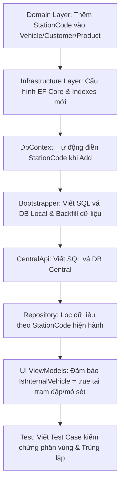

# Kế hoạch phân vùng dữ liệu Master Data theo Trạm cân (StationCode)

Tài liệu này mô tả chi tiết kế hoạch thiết kế và triển khai phân vùng dữ liệu Master Data (bao gồm Xe/Mooc, Khách hàng, Sản phẩm) theo trạm cân (`StationCode`). Việc phân vùng này giúp mỗi trạm cân chỉ hiển thị và thao tác với dữ liệu master data thuộc riêng trạm đó, tránh việc hiển thị các thông tin không liên quan của trạm khác và cho phép các trạm đăng ký độc lập mã/biển số xe trùng nhau.

---

## 1. Loại Dự Án & Công Nghệ Sử Dụng

- **Loại dự án**: Desktop App (WPF) + Backend (ASP.NET Core API) + Database (SQL Server).
- **Công nghệ sử dụng**:
  - C#, .NET 8
  - Entity Framework Core (EF Core)
  - SQL Server
  - XUnit (Integration Tests)

---

## 2. Tiêu Chỉ Thành Công (Success Criteria)

1. **Database Schema**:
   - Cột `StationCode` được bổ sung vào các bảng `vehicles`, `customers`, `products` (dạng `nvarchar(50) NOT NULL`, giá trị mặc định mặc định `'QN01'`).
   - Các ràng buộc duy nhất (Unique Index) cũ được chuyển đổi thành ràng buộc duy nhất phức hợp (Composite Unique Index) chứa thêm trường `StationCode`.
2. **DbContext Automation**:
   - Tự động điền `StationCode` của trạm hiện hành khi thêm mới bản ghi master data thông qua `StationDbContext`.
3. **Repository Filtering**:
   - Tất cả các phương thức truy vấn và tìm kiếm dữ liệu master data trong repository đều được lọc theo `StationCode` hiện hành.
4. **Central API Compatibility**:
   - CentralApi đồng bộ dữ liệu bình thường, tự động vá cấu trúc database tương ứng để hỗ trợ trường `StationCode` mới.
5. **UI & Business Scopes**:
   - Khi tạo mới hoặc cập nhật xe từ màn hình Cân trạm đập/Cân mỏ sét, thuộc tính `IsInternalVehicle` bắt buộc được gán thành `true` để đảm bảo hoạt động bình thường cho luồng cân đặc thù của các màn hình này.
6. **Testing & Verification**:
   - Toàn bộ các test case tích hợp (integration tests) hiện tại vẫn chạy thành công (no regression).
   - Thêm các test case tích hợp mới kiểm thử việc phân vùng dữ liệu master data và đảm bảo tính hoạt động của các chỉ mục phức hợp mới.

---

## 3. Cấu Trúc File & Các Tệp Tin Ảnh Hưởng

Dưới đây là danh sách chi tiết các tệp tin sẽ thay đổi trong quá trình thực hiện:

- **Domain Layer (Entities)**:
  - [Vehicle.cs](file:///g:/Source-code/pmcan_C%23/src/StationApp.Domain/Entities/Vehicle.cs)
  - [Customer.cs](file:///g:/Source-code/pmcan_C%23/src/StationApp.Domain/Entities/Customer.cs)
  - [Product.cs](file:///g:/Source-code/pmcan_C%23/src/StationApp.Domain/Entities/Product.cs)

- **Infrastructure Layer (Persistence & Repositories)**:
  - [MasterDataEntityConfigurations.cs](file:///g:/Source-code/pmcan_C%23/src/StationApp.Infrastructure/Persistence/Configurations/MasterDataEntityConfigurations.cs)
  - [SchemaCompatibilityBootstrapper.cs](file:///g:/Source-code/pmcan_C%23/src/StationApp.Infrastructure/Persistence/SchemaCompatibilityBootstrapper.cs)
  - [StationDbContext.cs](file:///g:/Source-code/pmcan_C%23/src/StationApp.Infrastructure/Persistence/StationDbContext.cs)
  - [MasterDataRepositories.cs](file:///g:/Source-code/pmcan_C%23/src/StationApp.Infrastructure/Repositories/MasterDataRepositories.cs)

- **Central Api Layer**:
  - [Program.cs](file:///g:/Source-code/pmcan_C%23/src/StationApp.CentralApi/Program.cs)

- **WPF UI Presentation Layer (ViewModels)**:
  - [CrusherWeighingViewModel.cs](file:///g:/Source-code/pmcan_C%23/src/StationApp.UI/ViewModels/CrusherWeighingViewModel.cs)
  - [ClayWeighingViewModel.cs](file:///g:/Source-code/pmcan_C%23/src/StationApp.UI/ViewModels/ClayWeighingViewModel.cs)

- **Test Layer**:
  - [SmokeTests.cs](file:///g:/Source-code/pmcan_C%23/tests/StationApp.IntegrationTests/SmokeTests.cs)

---

## 4. Chi Tiết Phương Án Triển Khai



### Bước 4.1: Cập nhật Thực thể (Domain Entities)

Thêm thuộc tính `StationCode` vào cả 3 thực thể master data:
- **Vehicle**: `public string StationCode { get; set; } = string.Empty;`
- **Customer**: `public string StationCode { get; set; } = string.Empty;`
- **Product**: `public string StationCode { get; set; } = string.Empty;`

### Bước 4.2: Cập nhật Cấu hình EF Core (Configurations)

Trong [MasterDataEntityConfigurations.cs](file:///g:/Source-code/pmcan_C%23/src/StationApp.Infrastructure/Persistence/Configurations/MasterDataEntityConfigurations.cs):
- Cấu hình thuộc tính `StationCode` có độ dài 50, bắt buộc và có giá trị mặc định mặc định là `'QN01'`.
- Thay đổi các chỉ mục `Unique`:
  - Bảng `vehicles`: Đổi từ chỉ mục duy nhất trên `(VehiclePlate, MoocNumber)` thành chỉ mục phức hợp duy nhất trên `(StationCode, VehiclePlate, MoocNumber)` với tên là `UX_vehicles_station_plate_mooc`.
  - Bảng `customers`: Đổi từ chỉ mục duy nhất trên `CustomerCode` thành chỉ mục phức hợp duy nhất trên `(StationCode, CustomerCode)` với tên là `UX_customers_station_code`.
  - Bảng `products`: Đổi từ chỉ mục duy nhất trên `ProductCode` thành chỉ mục phức hợp duy nhất trên `(StationCode, ProductCode)` với tên là `UX_products_station_code`.

### Bước 4.3: DB Bootstrapper & Vá Cơ Sở Dữ Liệu Tự Động

Trong [SchemaCompatibilityBootstrapper.cs](file:///g:/Source-code/pmcan_C%23/src/StationApp.Infrastructure/Persistence/SchemaCompatibilityBootstrapper.cs):
- Thêm cột `StationCode` với kiểu dữ liệu `nvarchar(50) NULL` vào `VehicleColumnPatches` và `ProductColumnPatches`.
- Định nghĩa mới `CustomerColumnPatches` tĩnh chứa `StationCode`.
- Gọi `await EnsureTableColumnsAsync(db, logger, "customers", CustomerColumnPatches, ct);` trong hàm `EnsureAsync`.
- Trong phương thức `EnsureStationCodeBackfillAndIndexesAsync`, thực hiện:
  - Cập nhật giá trị cột `StationCode` của các dòng cũ trong 3 bảng `vehicles`, `customers`, `products` thành giá trị `@StationCode` (ví dụ `'QN01'`) nếu trường này bị null/trống.
  - Chuyển kiểu dữ liệu cột `StationCode` thành `NOT NULL` thông qua lệnh SQL `ALTER TABLE [table] ALTER COLUMN [StationCode] nvarchar(50) NOT NULL;`.
  - Kiểm tra và drop các index duy nhất cũ (`UX_vehicles_plate_mooc`, `UX_customers_code`, `UX_products_code`) nếu chúng tồn tại.
  - Tạo các index duy nhất phức hợp mới (`UX_vehicles_station_plate_mooc`, `UX_customers_station_code`, `UX_products_station_code`) nếu chưa tồn tại.

### Bước 4.4: DB Central API Compatibility

Trong CentralApi [Program.cs](file:///g:/Source-code/pmcan_C%23/src/StationApp.CentralApi/Program.cs), tại hàm `EnsureCentralSchemaCompatibilityAsync`:
- Gọi `EnsureColumnAsync` cho `vehicles`, `customers`, `products` để thêm cột `StationCode` dạng `nvarchar(50) NOT NULL CONSTRAINT [DF_..._station_code_bootstrap] DEFAULT (N'QN01')`.
- Thực hiện chạy lệnh SQL Drop Index cũ và Create Index duy nhất phức hợp mới trên cơ sở dữ liệu của Central API tương tự như database local.

### Bước 4.5: Gán Tự động StationCode Trong DbContext

Trong [StationDbContext.cs](file:///g:/Source-code/pmcan_C%23/src/StationApp.Infrastructure/Persistence/StationDbContext.cs) phương thức `ApplyStationCodeAsync`:
- Bổ sung các `case` kiểm tra đối tượng Entity thêm mới nếu là `Vehicle`, `Customer`, hoặc `Product` và trường `StationCode` đang trống, sẽ tự động gán bằng `stationCode` hiện hành được phân giải từ scope trạm cân đang chạy.

### Bước 4.6: Cập nhật Repository Lọc theo StationCode

Trong [MasterDataRepositories.cs](file:///g:/Source-code/pmcan_C%23/src/StationApp.Infrastructure/Repositories/MasterDataRepositories.cs):
- Trong mỗi phương thức truy vấn của `VehicleRepository`, `CustomerRepository`, và `ProductRepository`:
  - Phân giải mã trạm hiện hành: `var stationCode = await StationScopeQuery.GetCurrentStationCodeAsync(_context, ct);`.
  - Thêm điều kiện lọc `.Where(x => x.StationCode == stationCode)` vào các câu truy vấn cơ sở dữ liệu.

### Bước 4.7: Đảm bảo IsInternalVehicle = true tại các màn hình cân chuyên dùng

Tại màn hình Cân trạm đập ([CrusherWeighingViewModel.cs](file:///g:/Source-code/pmcan_C%23/src/StationApp.UI/ViewModels/CrusherWeighingViewModel.cs)) và Cân mỏ sét ([ClayWeighingViewModel.cs](file:///g:/Source-code/pmcan_C%23/src/StationApp.UI/ViewModels/ClayWeighingViewModel.cs)):
- Đảm bảo khi người dùng nhập biển số và bấm xác nhận tạo mới xe, đối tượng `Vehicle` được khởi tạo sẽ luôn gán `IsInternalVehicle = true`.
- Đặc biệt, trong trường hợp biển số xe nhập vào **đã tồn tại dưới dạng xe ngoài** (`IsInternalVehicle = false`), hệ thống sẽ thực hiện **cập nhật chuyển đổi** xe đó thành xe nội bộ (`IsInternalVehicle = true`) thay vì cố gắng Insert bản ghi mới (tránh việc ném ngoại lệ trùng lặp index `UX_vehicles_station_plate_mooc` trong DB).

---

## 5. Phân Rã Nhiệm Vụ (Task Breakdown)

| Mã Task | Tên Nhiệm Vụ | Agent Phụ Trách | Kỹ Năng / Hướng Dẫn | Độ Ưu Tiên | Phụ Thuộc | Tiêu Chỉ Xác Minh (INPUT &rarr; OUTPUT &rarr; VERIFY) |
|---|---|---|---|---|---|---|
| **TASK-01** | Cập nhật các Domain Entities | `backend-specialist` | `clean-code` | P0 | None | **IN**: Các lớp Vehicle, Customer, Product hiện tại.<br>**OUT**: Thêm thuộc tính `StationCode` vào cả 3 lớp.<br>**VERIFY**: Biên dịch mã nguồn thành công. |
| **TASK-02** | Cập nhật EF Core configurations | `database-architect` | `database-design` | P0 | TASK-01 | **IN**: File `MasterDataEntityConfigurations.cs` cũ.<br>**OUT**: Định nghĩa cột `StationCode` và các chỉ mục phức hợp mới.<br>**VERIFY**: Biên dịch mã nguồn thành công. |
| **TASK-03** | Viết DB Bootstrapper SQL vá dữ liệu | `database-architect` | `database-design` | P0 | TASK-02 | **IN**: File `SchemaCompatibilityBootstrapper.cs` hiện tại.<br>**OUT**: Thêm các cột patch, backfill logic và logic chuyển đổi index.<br>**VERIFY**: Chạy chương trình, kiểm tra DB local tự động tạo cột `StationCode` và thay đổi chỉ mục thành công. |
| **TASK-04** | Cập nhật Central API Schema Bootstrapper | `database-architect` | `database-design` | P0 | TASK-01 | **IN**: Hàm `EnsureCentralSchemaCompatibilityAsync` trong CentralApi `Program.cs`.<br>**OUT**: Thêm logic tạo cột và chỉ mục phức hợp tương ứng trên DB Central.<br>**VERIFY**: Biên dịch và chạy thử CentralApi, kiểm tra DB Central cập nhật đúng cấu trúc. |
| **TASK-05** | Tự động gán StationCode tại DbContext | `backend-specialist` | `clean-code` | P1 | TASK-01 | **IN**: Hàm `ApplyStationCodeAsync` trong `StationDbContext.cs`.<br>**OUT**: Thêm 3 case tự động gán `StationCode` cho Vehicle, Customer, Product.<br>**VERIFY**: Thêm mới Entity mà không truyền StationCode, kiểm tra DB xem trường này có tự động được lưu mã trạm không. |
| **TASK-06** | Lọc dữ liệu Repository theo trạm cân | `backend-specialist` | `clean-code` | P1 | TASK-03 | **IN**: Các phương thức tìm kiếm và get trong `MasterDataRepositories.cs`.<br>**OUT**: Bổ sung filter `.Where(x => x.StationCode == stationCode)`.<br>**VERIFY**: Biên dịch thành công. |
| **TASK-07** | Đảm bảo chuyển đổi/gán IsInternalVehicle trên UI | `frontend-specialist` | `clean-code` | P1 | TASK-06 | **IN**: Phương thức `EnsureInternalVehicleForWeighingAsync` và `ConfirmInternalVehicleAsync` trong 2 ViewModels cân.<br>**OUT**: Thêm logic chuyển đổi xe ngoài thành xe nội bộ khi bấm chọn/xác nhận tại màn cân đập/sét.<br>**VERIFY**: Nhập một xe ngoài hiện có tại màn Cân trạm đập, kiểm tra xem xe đó có được chuyển thành xe nội bộ thành công không bị lỗi trùng index. |
| **TASK-08** | Bổ sung Integration Tests & Xác minh | `backend-specialist` | `testing-patterns` | P0 | TASK-07 | **IN**: File `SmokeTests.cs` hiện hành.<br>**OUT**: Viết các kiểm thử tích hợp cho Master Data Partition.<br>**VERIFY**: Chạy lệnh `dotnet test` và toàn bộ các test case mới và cũ đều xanh. |

---

## 6. Giai Đoạn X: Xác Minh & Kiểm Thử (Verification Plan)

### Kiểm thử Tự động (Automated Tests)
Chạy toàn bộ các test case tích hợp bằng PowerShell:
```powershell
dotnet test tests/StationApp.IntegrationTests/StationApp.IntegrationTests.csproj
```

### Các Test Case cần bổ sung trong `SmokeTests.cs`:
1. **TestPartitioning**:
   - Thêm 2 Customer: Mã `KH001` thuộc trạm `QN01`, và Mã `KH002` thuộc trạm `QN02`.
   - Với Runtime Scope trạm là `QN01`, tìm kiếm khách hàng phải chỉ thấy `KH001`.
   - Với Runtime Scope trạm là `QN02`, tìm kiếm khách hàng phải chỉ thấy `KH002`.
2. **TestDuplicateMasterDataAcrossStations**:
   - Thêm mới Vehicle biển số `30A-99999` tại trạm `QN01` -> thành công.
   - Thêm mới Vehicle biển số `30A-99999` tại trạm `QN02` -> thành công (kiểm chứng Composite Index hoạt động).
   - Thêm mới Vehicle biển số `30A-99999` tại trạm `QN01` lần thứ 2 -> phải ném lỗi Duplicate Key Exception.

### Kiểm thử Thủ công (Manual Verification)
1. Chạy ứng dụng WPF local:
   ```powershell
   dotnet run --project src\StationApp.UI\StationApp.UI.csproj
   ```
2. Mở màn hình quản lý xe/khách hàng/sản phẩm hoặc các luồng cân.
3. Thực hiện thêm mới một bản ghi master data từ giao diện.
4. Truy vấn database SQL Server local để kiểm tra cột `StationCode` của bản ghi vừa thêm có tự động được gán đúng mã trạm hiện hành hay không.
5. Đổi mã trạm trong cấu hình hệ thống và kiểm tra xem danh sách hiển thị master data có tự động được cập nhật lọc theo trạm mới hay không.
